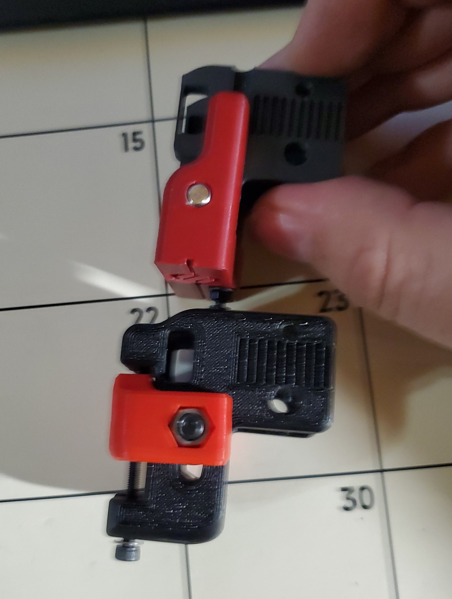
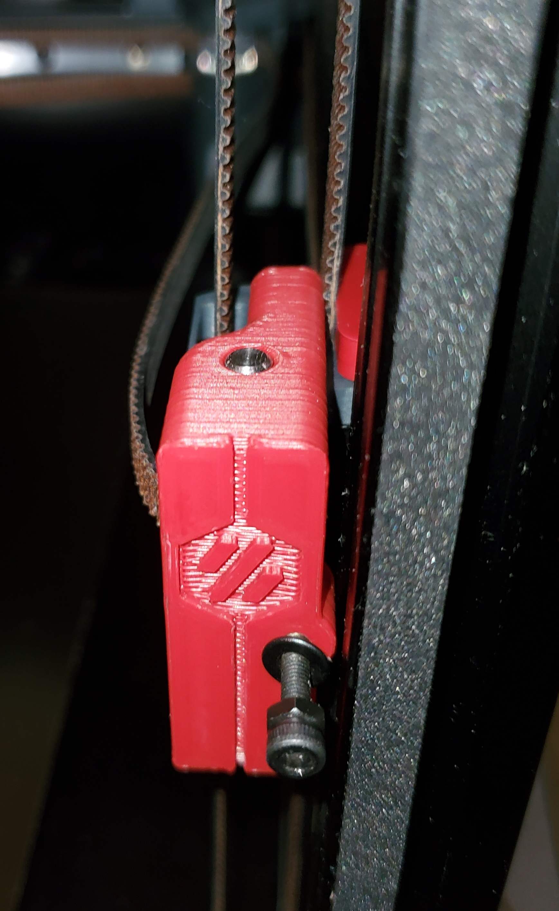
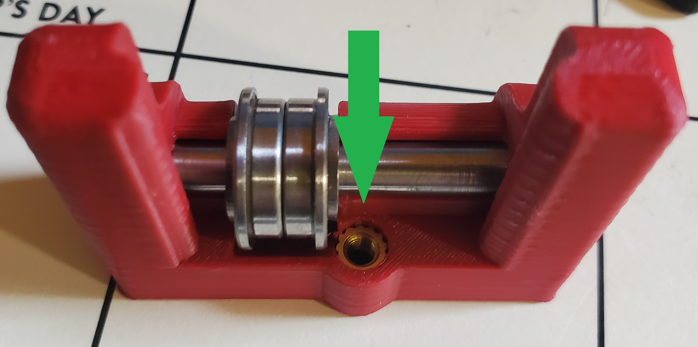
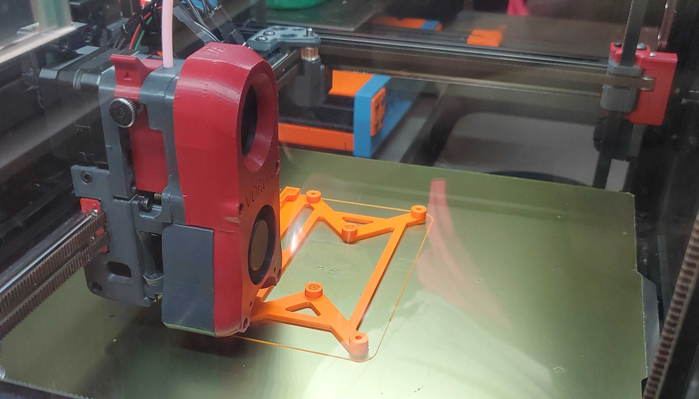
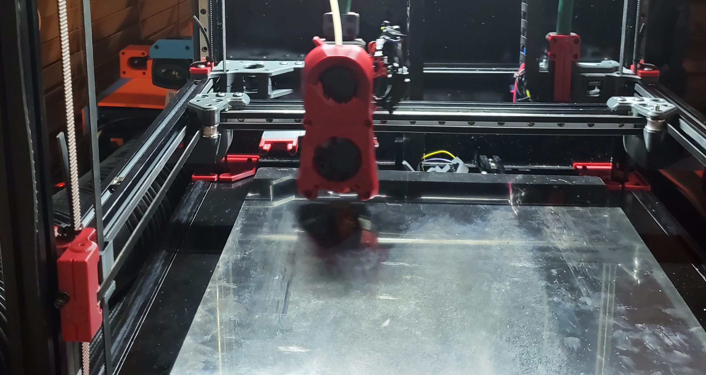

# "Other" V2 Idlers
 Alternative Idlers that allow the usage of "Full-Figured" toolheads without the 10mm loss of travel at the front corners of the bed.

These idlers were developed with the goal to allow the usage of wider toolheads with the Voron V2, better align the tensioning screw to the centerline of the idler shaft, add guides to the parts to allow them to interlock and provide a robust tensioning system, all while streamlining the process of making fine adjustments to tensioning. 
This design iteration has been running on my machine for 50+ hrs with no issues or print quality degradation.  

The idler design is ambidextrous to allow simplified batch printing. All parts are converted to stl in optimal printing orientation with quantities specified per Voron standards.

# Print Settings:
All parts should be printed to standard Voron print settings for durability.

-Note: If your printer is not properly tuned i.e. printing dimensionally-accurate parts free from functional defects, the slide mechanism WILL NOT work proerly. 

# BOM:
- 2 ea. 5mm OD x 45mm L pins - may need to be polished down to fit the bearings depending on source. 
- 4 ea. F695 bearings
- 4 ea. 0.5mm thick 5mm shims
- 2 ea. M3x35mm length SHCS - Stock 40mm may be run if not using the bolted door hinge mod. **NOTE: This screw should be fully threaded!!!.  
- 2 ea. M3 flat washer
- 2 ea. M3 nut
- 2 ea. Voron - standard heat set
- 2 ea. M3 x 16 SHCS

These components are being offered as a kit by https://formosissima.com/products/other-v2-idlers-kit

This mod also requires that you run https://github.com/VoronDesign/Voron-2/blob/Voron2.4/STLs/VORON2.4/Gantry/%5Ba%5D_z_belt_clip_lower_x4.stl
on both top and bottom as belt clips, so that the design is not handed. 

"Other" Idlers Thickness vs. stock V2.4 idlers

Be sure to fully insert the m3 heat set insert so that it doesn't interfere with the bearings!

