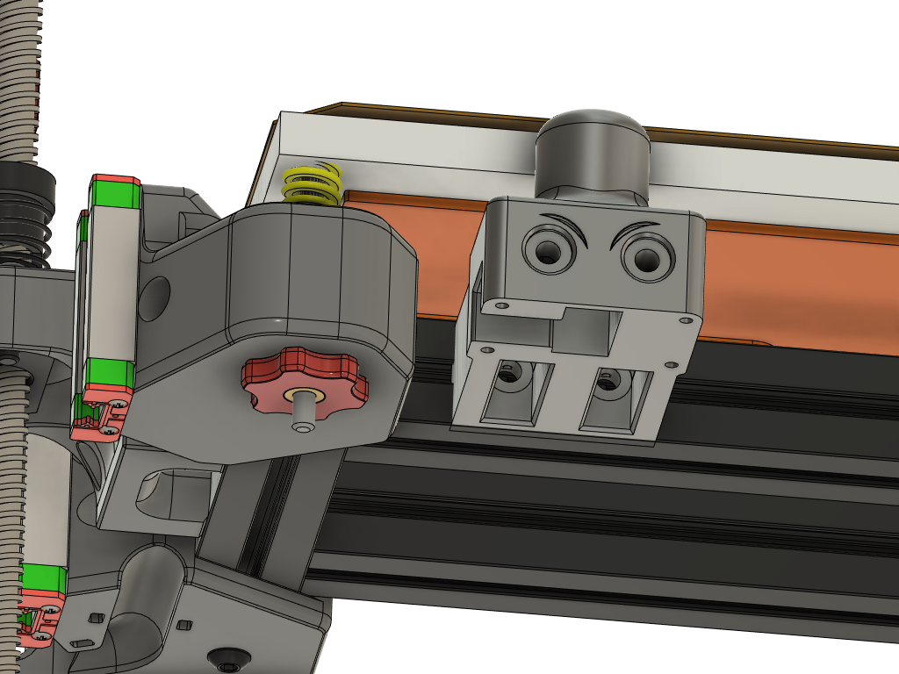
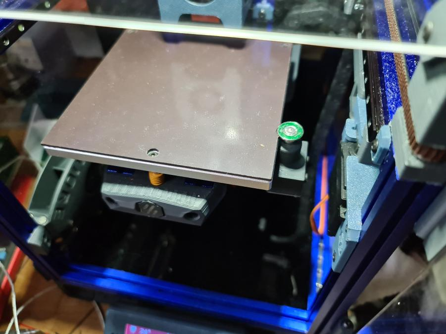
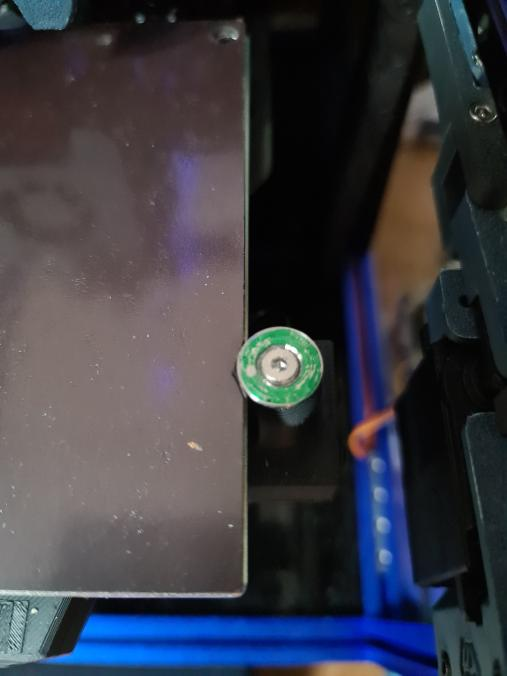
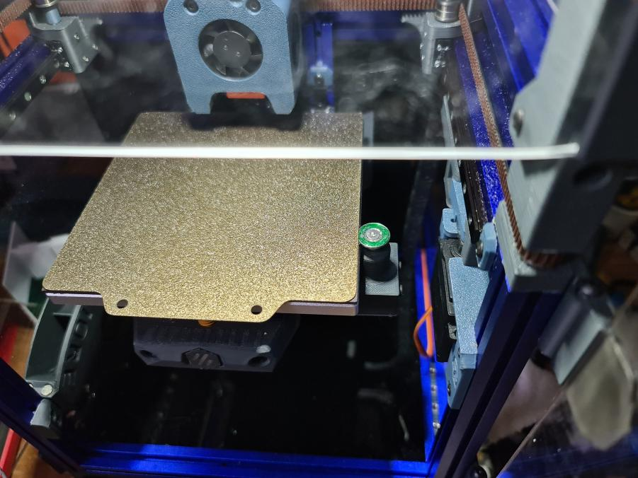

[Video of probing action](https://youtu.be/bdxmqTDDsMM)

**BOM**

 1 x HeartK Voron 2.4 Endstop switch      
 4 x M2x8 Self Tapping screws      
 3 x 5x7x8 Sleeve Bearing      
 1 x M3 x 20mm round amuminum standoff post ( 5MM od)   
      [Example of what to look for](https://www.aliexpress.com/item/2251832695751106.html). I did not buy from this store.. Just using them as a reference for the type of post you need.    
 2 x M3 x 8mm Flat CAP screw      
 1 X M5 Stainless Fender Washer 15mm OD      
 2 x M3 standard washer      
 2x M3 x 8mm or 10mm button head screws      
 2x M3 square or hex nuts      
 220 and 400 grit sandpaper for deburing the fender washer and sizing the standoff post if needed.      
 
 I like the Deepfriedhero [endstop super kit for the switch and bearings](https://deepfriedhero.in/products/voron-2-4-sexbolt-z-endstop-super-kit) if you are in the USA      
 
 You will want to deburr the stamped fender washer.. I sanded it flat on a smooth surface with the 220 then bolted it to the standoff post, chucked it in my drill and polished the edges with 400 grit. You may also like to chamfer the ID so the M3 flat cap screw sits flush.  No impact to performance if you don't but you won't have to worry about the klicky switch body hitting the screw head instead of the washer when running [Self Calibrating Z Offset](https://github.com/protoloft/klipper_z_calibration).           
 
Out of a 20 pack of M3 standoff posts I bought from Amazon only 3 were the proper 5mm OD. you may need to chuck the post lightly in a drill and sand with 400 grit till the post slides smoothly in the sleeve bearing. 
 
 **Assembly notes**
 It builds like a standard Voron endstop switch except you have to assemble the plunger.
 Put the M3 Flat cap screw through the Fender washer.. stack on a M3 washer or two to keep the standoff from falling through the hole in the fender washer and tighten the screw into the M3 standoff post. I chucked the post lightly in my drill and used it as a vice to hold the post while I tightend the screw. 
 
 Use the 2nd M3 flat cap screw  on the inside of the switch to click the microswitch. 
 
 I use this switch in combination with [Zruncho3d's  Zeroclick Z probe.](https://github.com/zruncho3d/ZeroClick)          
 
 I slid my magnetic bed plate over a few mm to give the plunger more room. Adjust it as low as possible while still clicking the switch reliably. You want it to be low enough to clear the MiniAfterburner fan ducts. See the alternate Dingushippo method of placing the washer under the build plate below. 
 
**Dingushippo's method**       
place the switch washer between the bed and build plate by notching the bad magnet.

      

 **Links**

[Protoloft- Self Calibrating Z Offset](https://github.com/protoloft/klipper_z_calibration)      

[Zruncho3d - Zeroclick Z probe for V0.](https://github.com/zruncho3d/ZeroClick)      

[HeartK1213 - Sexbolt Z Endstop](https://github.com/VoronDesign/VoronUsers/tree/master/printer_mods/hartk1213/Voron2.4_SexBolt_ZEndstop)    

