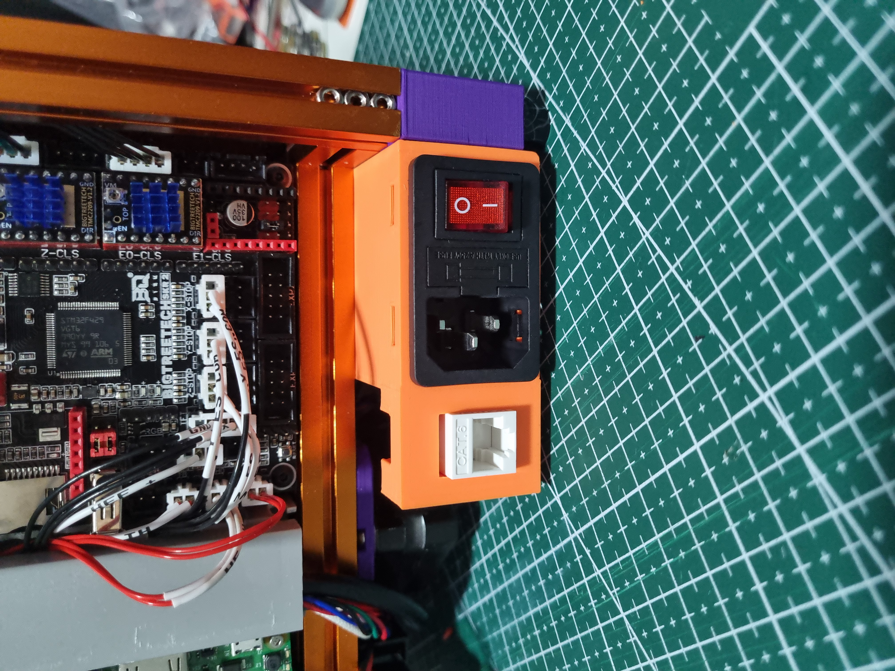

# Power-Inlet-w-Keystone-Insert
For Voron 0.1

## Description
Adds a keystone slot for the v0.1 Power Inlet. This does not change the way the inlet mounts onto the frame. 
_This was remixed in TinkerCad, using the original v0.1 power inlet, as well as a section of the v2.4 power inlet (the keystone insert portion)._

## BOM
1. Keystone insert x1
2. LAN cable x1
3. Heatset insert x1

## Installation
1. Install heatset insert (per the original assembly instructions)
2. Cut LAN cable to required length
3. Crimp it onto the keystone insert
    - I used a toolless keystone insert
4. Insert keystone insert into the inlet slot
5. Slide in the prepared power inlet 
6. Mount the power inlet per assembly instructions

