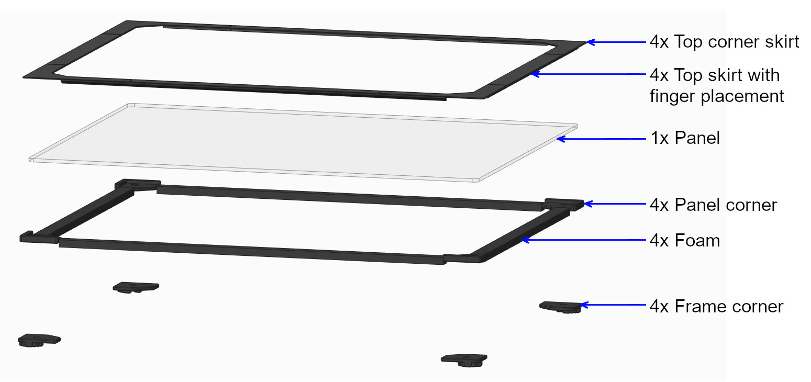
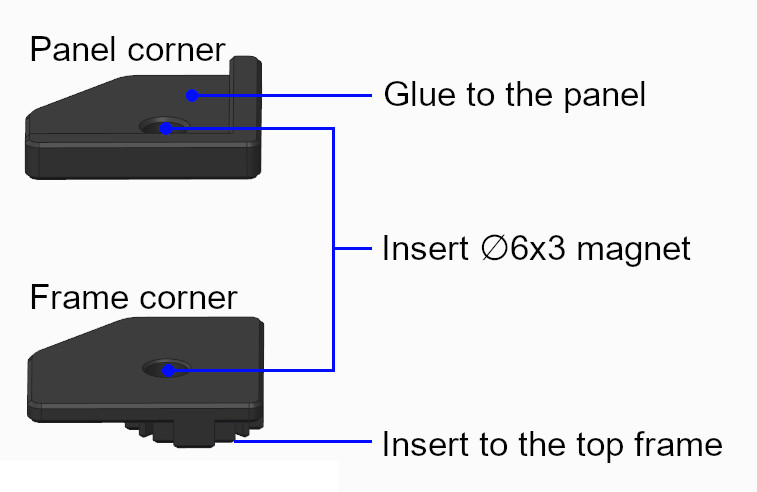

# Magnetic top panel
# Overview
This top panel can be easily removed for printer maintenance or giving more cooling.
3D models are designed to match your buildplate size.
For versions 1.8 and 2.4 in 250, 300 and 350mm.

https://user-images.githubusercontent.com/85416803/124365758-a2454180-dc0f-11eb-9ac9-38a180425a46.mp4

# BOM
250:  
400 x 400 x 3mm acrylic panel sheet  
4x 344mm of 6 x 11,7mm [1/2” x 1/4”] High density foam

300:  
450 x 450 x 3mm acrylic panel sheet  
4x 394mm of 6 x 11,7mm [1/2” x 1/4”] High density foam

350:  
500 x 500 x 3mm acrylic panel sheet  
4x 444mm of 6 x 11,7mm [1/2” x 1/4”] High density foam

Core:  
8x Ø6 x 3mm neodymium magnet

Acrylic sheet with abrasion resistant coating may be considered for V1.8 to prevent micro scratch caused by the reverse bowden tube. This may also appear with full height prints on V2.4.
I don’t recommend using glass plate because of its weight, this may result in broken top skirt and broken glass!

# Instructions
1. Insert magnets into panel corner and frame corner respecting their polarity.
2. Insert frame corner on top of the 4 vertical 2020 extrusions.
3. Put panel corner on frame corner, sides should be flush.
4. Glue* the acrylic panel sheet on panel corners, be sure to keep panel corner and frame corner sides flush while gluing the acrylic panel.
5. Remove the panel from the frame, adjust foam length and glue it under the acrylic panel sheet (same side as panel corner).
6. Glue* top corner skirt on the acrylic panel sheet.
7. Adjust top skirt length and glue* on the acrylic panel sheet. You can easily adjust the length in your slicer.

 * Any liquid super glue works fine, be sure to not use VHB tape as you will add an extra height that will cancel the foam seal.
#

#

#

