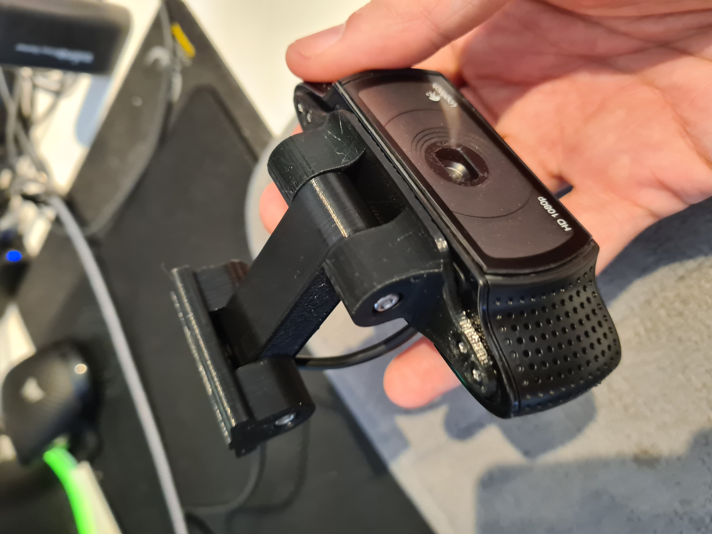
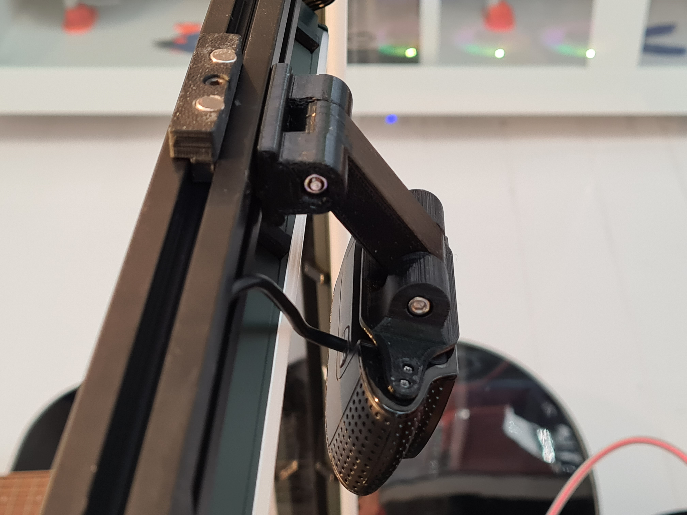
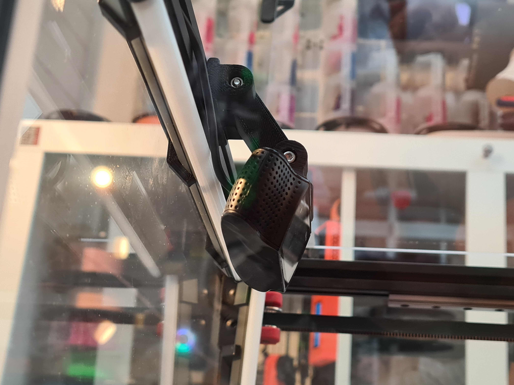
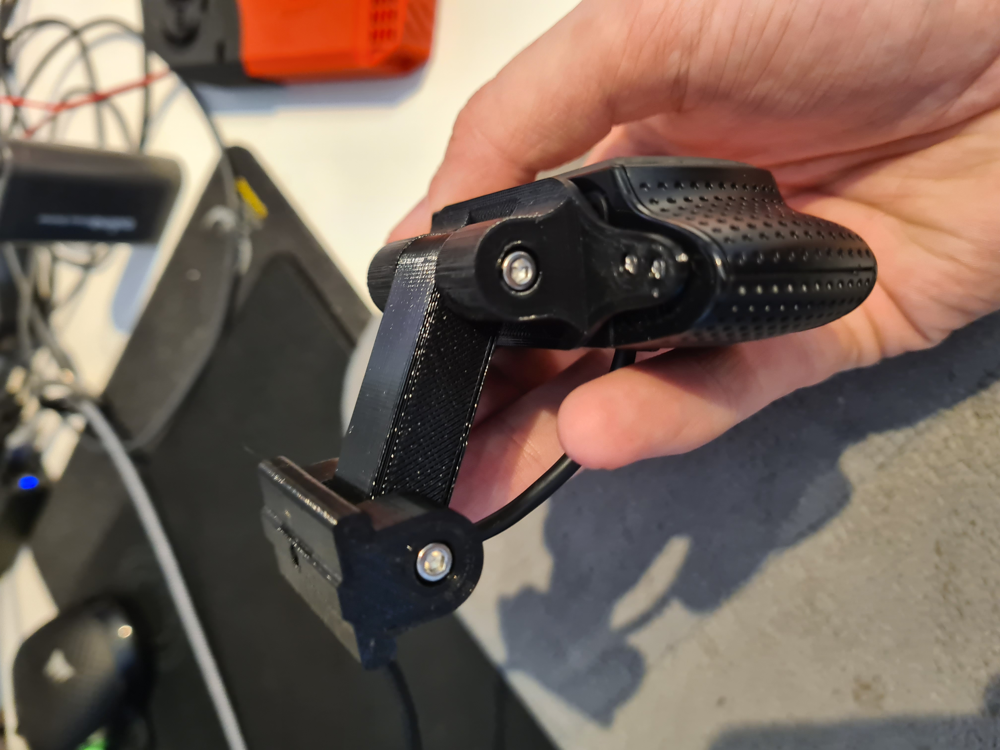

# Important Notes

Hello everyone,

Here is my C920 camera mod, please follow the disasembly guide below to remove the current mount off the camera. Please keep the 4 bottom screws from the mount as you will need them for my mod.

# Instructions For Disassembly

[Found Here!](https://www.ifixit.com/Guide/Logitech+C920+Webcam+Disassembly/115077)
#

This mod allows you to set 2 point postion for your camera, 

## BOM

Qty | Item
:-- | :--
2 | M3x40mm
1 | M3x10mm
2 | Nuts
1 | M3 Hammerhead nut

# Photos of finished build below

 
 
 
 
