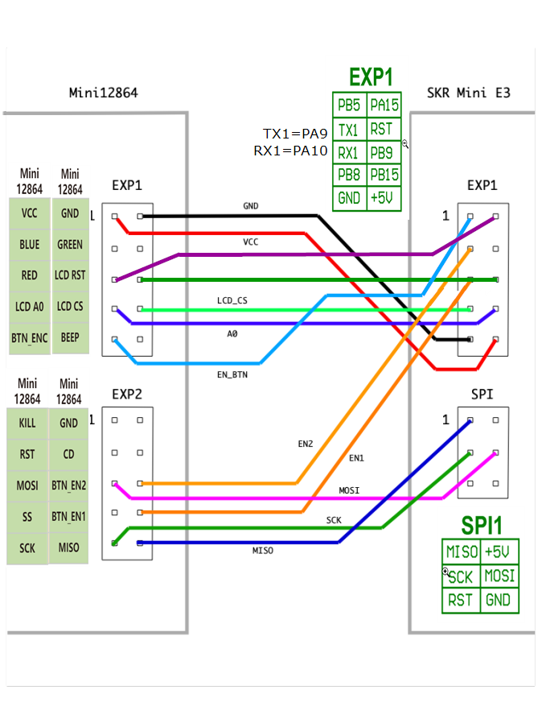

This is my Skirt Mod to add a FYSETC-Mini-12864-Panel Display, Version 2.1 to the V0
 


- The cut-out in the Back Skirt is for a 
Schaffner FN282-2-06 DC Power Connector with filter:
https://uk.rs-online.com/web/p/iec-filters/1704958/

- The back skirt is also designed for a Raspberry Pi 4

- All parts are also available as a step file if you need to modify or adapt them

- Add this display chapter to your printer.cfg in klipper:

```
[display]
#    FYSETC mini12864 LCD Display v2.1
lcd_type: uc1701
cs_pin: PB8
a0_pin: PB15
rst_pin: PB9
encoder_pins: ^PA9,^PA10
click_pin: ^!PB5
contrast: 63
spi_software_sclk_pin: PA5
spi_software_mosi_pin: PA7
spi_software_miso_pin: PA6

[neopixel fysetc_mini12864]
#    To control Neopixel RGB in mini12864 display
pin: PA15
chain_count: 3
initial_RED: 1.0
initial_GREEN: 0.0
initial_BLUE: 0.0
color_order: RGB
```

- Use this schematic for the wiring:



- The small bottom acrylic panel in the back is not used

- The acrylic backpanel is cut to a height of 240mm

- The Display Case (case.stl) needs a little bit of support 
