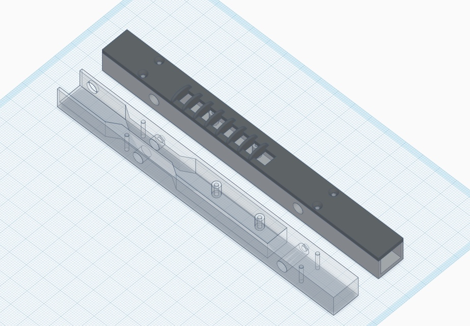
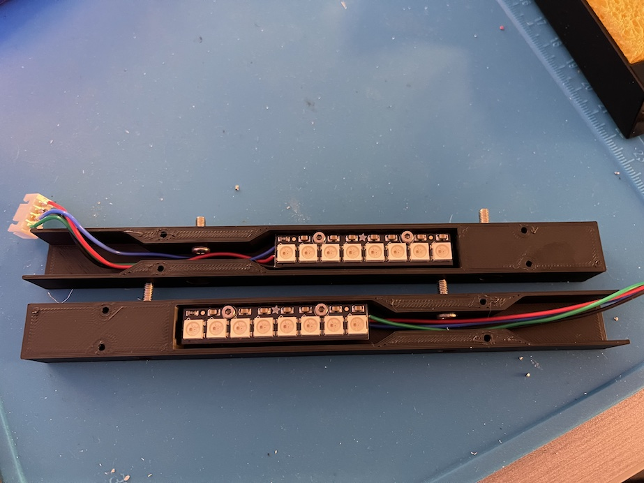
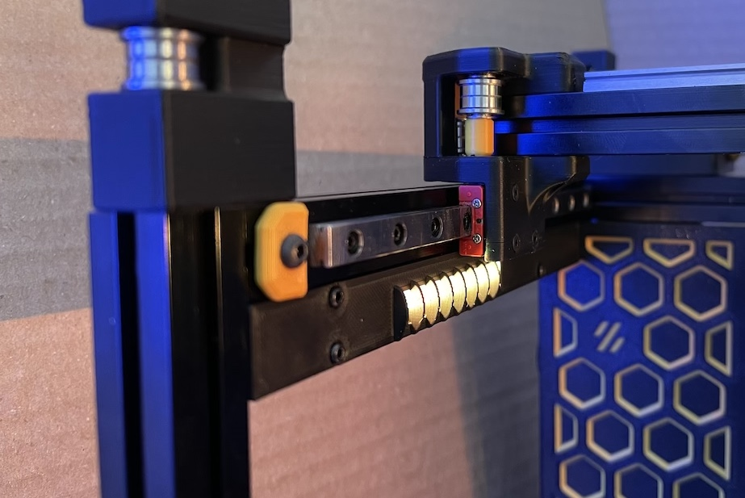

# Mount Adafruit NeoPixel Sticks on the V0 Y-rail Extrusions
* Add controllable RGB(W) LEDs to your V0
* No heatset inserts required
* Compatible with [NeoPixel Sticks](https://www.adafruit.com/product/1426) from Adafruit
* Large cavity inside the body makes wire management easier
* Light guides prevent LEDs from blinding you
* Designed with [Timmit99's V0 Umbilical](https://github.com/timmit99/Voron-Hardware/tree/V0-Umbilical/V0-Umbilical) in mind (not required)



_Inspired by the mod [from JNP](https://github.com/VoronDesign/VoronUsers/tree/master/printer_mods/JNP/Neopixel-Y_Rails)_

## BOM
* Printed parts
* (2) [Adafruit NeoPixel Stick](https://www.adafruit.com/product/1426)
* (8) M2x6 flat head - to mount covers
* (4) M2x8 SHCS/BHCS - to mount the PCBs
* (4) M3x6 SHCS/BHCS - to mount the assemblies to the Y-rail extrusions
* (4) M3 nuts - to mount the assemblies to the Y-rail extrusions
* (2) JST-XH connector plug 4-position - to allow for easy disconnection (optional)
* 22awg wire

## Assembly
* Solder wires of appropriate length onto the back of each PCB (VDC, GND, DIN, and DOUT)
* If using JST-XH as disconnects, solder the other ends of the wires to 4-position (male) connectors - the connector should fit inside the body cavity once assembled
* Mount the PCBs inside the printed bodies using M2x8s
* Don't install the printed covers at this stage



## Installation
* Insert 2x M3 nuts on the bottom side of each Y-rail extrusion - requires partial frame disassembly if already assembled
* For the wire path, you have two choices:
  * Drill 1/4" holes in the midpanel where the printed bodies comes into contact with the midpanel and route the wires through that
  * Route the wires through the opening on the "top" of the printed body, through the slot of the extrusion, and over the midpanel
* Install the printed and assembled body to the Y-rail extrusions using 2x M3x6s and the previously inserted M3 nuts
* Route wires and fold excess wire inside the body cavity (see wiring below)
* Install the printed covers using 4x M2x6 flatheads (SHCS/BHCS might also work - *check clearance with the gantry* )



## Wiring
* If using [Timmit99's V0 Umbilical](https://github.com/timmit99/Voron-Hardware/tree/V0-Umbilical/V0-Umbilical) create JST-XH jumpers that route between the left and right connectors on the Umbilical Frame PCB and the printed assemblies
  * Pay attention to pin ordering!
* If connecting directly to a compatible Controller you have to chain the data signal between the left and right assemblies
  * Choose either the left or right assembly to be the first in the chain
  * The Controller's neopixel data output pin will connect to the DIN of that "first" assembly
  * The DOUT of the "first assembly" must connect to the DIN of the "second" assembly
  * VDC and GND of both assemblies must be connected to the Controller's neopixel VDC and GND pins
* Some Controller boards (e.g. SKR) require a capacitor and resistor - [SKR Neopixel Breakout Board](https://github.com/codiac2600/Neopixel-Breakout-Board) [link1](https://www.printedsolid.com/products/skr-neopixel-breakout-board) [link2](https://sparta3d.ca/products/ldo-skr-neopixel-breakout-board)

## Klipper Config
* Create a "neopixel" section in printer.cfg and give it a name
* Refer to your Controller documentation to find the pin name that controls the neopixel data signal
* Example:
```
[neopixel lights]
pin: PA8
chain_count: 16
color_order: GRB
```
* Refer to [Klipper](https://www.klipper3d.org/Config_Reference.html#neopixel) for more information