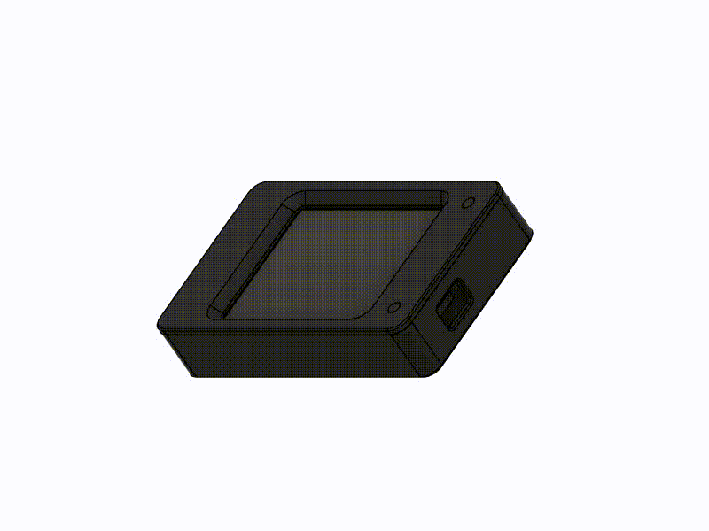

# Description

I've always wanted to add a screen to my VORON Switchwire conversion (Aquilawire), but the prospect of the multitude of cables and parts for KlipperScreen or using the Mini 12864 screen with it's limited functionality left much to be desired.

Then I found CYD-Klipper which uses the amazing Cheap Yellow Display from Brian Lough. It's an incredibly simple setup which uses local wireless communication to interface with Klipper and Moonraker to give you all of the functionality with a straightforward installation.

Since there was no existing designs for a simple mount for the Switchwire, I created this.

 

# Purchasables

* 1x Cheap Yellow Display
* 4x M3x12 SHCS DIN 912
* 2x M3x20 SHCS DIN 912
* 6x M3xD5xL4 Threaded Inserts

# Assembly

```console
Materials Needed:

    1x switchwire_cyd_case_front
    1x switchwire_cyd_case_back
    4x M3x12 SHCS DIN 912
    2x M3x20 SHCS DIN 912
    6x M3xD5xL4 Threaded Inserts

Printing Instructions:

    - Orient parts with largest face to the bed.
    - Print all parts with 0.2mm layer height, >10% gyroid infill.
    - No supports needed.

Assembly Steps:

    1. Insert the 4x threaded inserts into the holes on switchwire_cyd_case_front.
    2. Insert the 2x threaded inserts into the holes on switchwire_cyd_case_back from the inside of the part.
    3. With switchwire_cyd_case_front facing down on a flat surface, place the CYD ontop aligning the holes.
    4. Place switchwire_cyd_case_back ontop of the assembly (be sure to have the orientation correct for the USB cutout).
    5. Secure both parts in place with 4x M3x12 SHCS.
    6. Attach the whole assembly to the Switchwire front grill with 2x M3x20 SHCS.
```