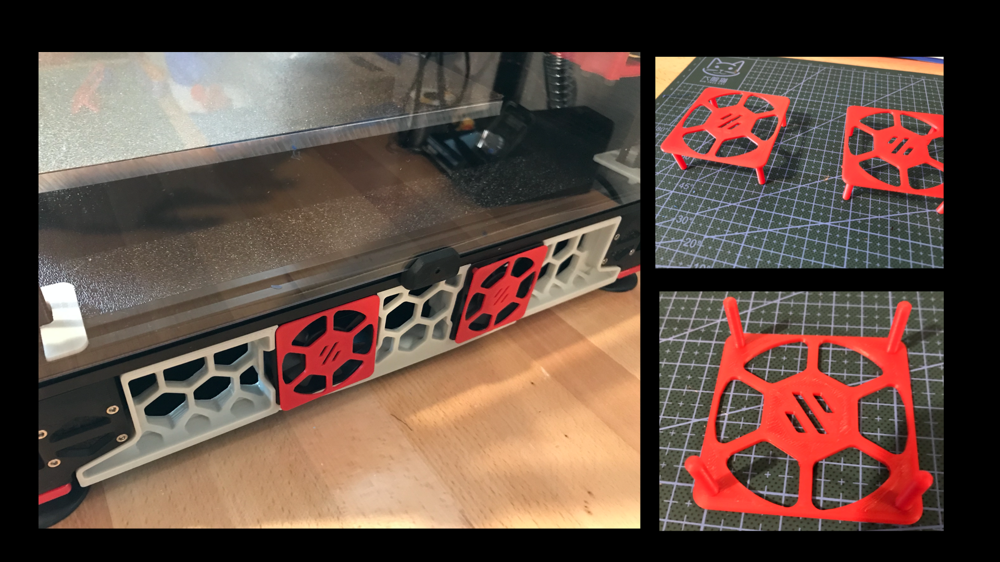

60mm Fan Cover for Controller Fans
=========

 

I took inspiration from StvPtrsn to create an accent cover for the 60mm fans cooling the electronics enclosure.  His design is integrated with the skirts and would likely be much more structrually sound; my goal was to make a simple cover that you can insert from the outside without flipping the printer over.  It is attached with a small quantity of 3M VHB tape in each of the corners.

## Installation:
1. Apply a small piece of VHB tape on the body of the fan in each of the four corners
2. Insert the pegs of the cover into the fan holes
3. Hold for 30 seconds to give the VHB tape time to bond
