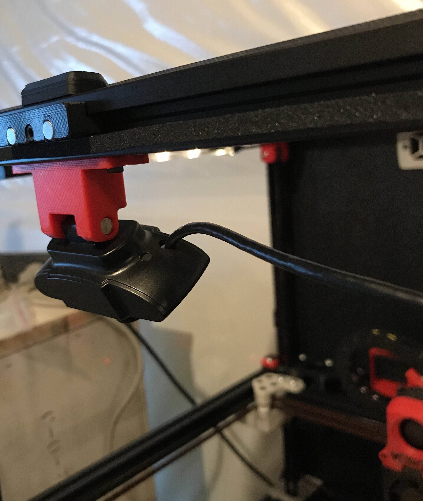
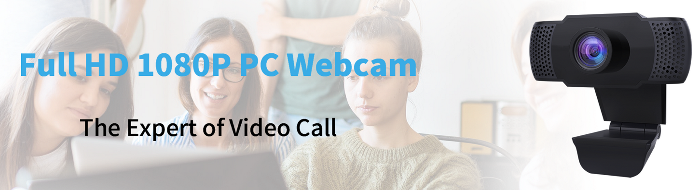
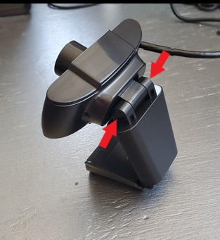
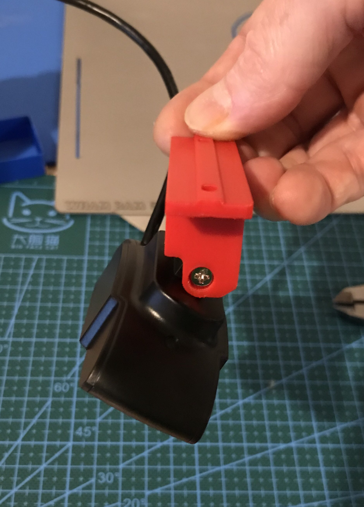
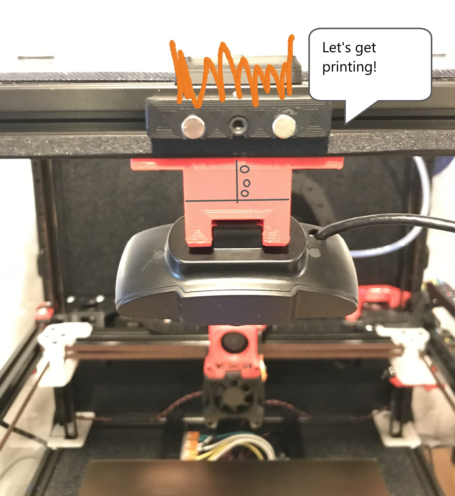

Wansview 1080p Webcam Mount
=========

 

This is a mount designed for a resonably priced webcam that's an alternative to the common Logitech choices.  The mount is designed to interface with the Voron 2.4 spec extrusions and uses common mounting hardware (2x m3x8 SHCS or BHCS, 2x m3 spring nuts).

 

## Installation:
1. Remove the black sticky covers indicated by the two arrows
2. Remove the mounting hardware with a phillips head screwdriver

 

3. Install the new mount reusing the OEM hardware; position as indicated so your image is oriented correctly (note: get the screw snug enough to hold the camera in place by friction yet still allow you to make small adjustments after install).

 

4. install centered on top extrusion with your choice of m3 spring nuts and m3x8 screws.
5. Enjoy seeing your printer printing

 
