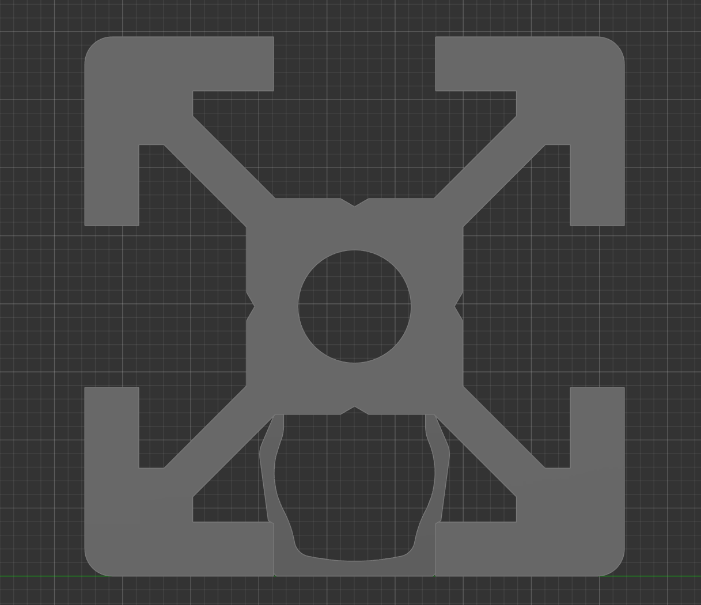
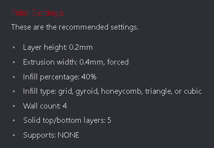
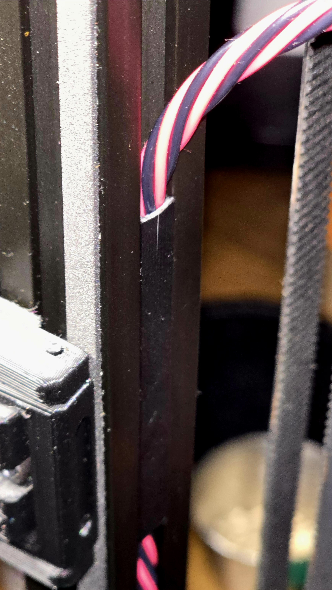
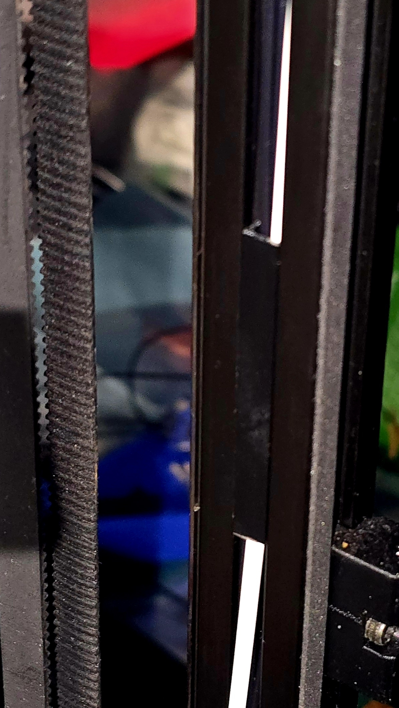

# Gantry And Wire Friendly Flush Extrusion Cover

This extrusion cover was designed with clearance of the V2.4r2 gantry in mind while also being able to use the vertical extrusion channels to stow wiring for things like chamber illumination, thermal probe, even some CANbus umbilical cables! YES, these are a thinner walled, more delicate design than most other options, but that's the trade-off that must be made in the interest of achieving it's primary goals. Especially for larger cables like the CAN umbilical pictured, place the cable in the channel of the extrusion cover and then carefully work it into the extrusion slot, working from one end of the cover to the other. These are intentionally left a little loose by design so they can be slid into correct position (with wires stowed inside) once inserted into the extrusion. These can probably simply be scaled a bit in slicer if a tighter, or otherwise adjusted fit is desired for using them elsewhere or with different manufacturers extrusions. As is, these fit my Misumi extrusions as desired, it was a careful dance to specialize these to function as intended.

Before running off a batch of these, I recommend printing a short test section, confirm proper fitment in your extrusions, adjust as necessary until satisfied with fit and function, THEN modify these to the desired length in slicer for final printing.

Notes:

While designed and only tested on the V2.4r2 thus far, it seems these may be functional and useful for V1.8, VT, and VSW printers.

Ignore the split in the cover in the CAN umbilical picture, it split when I cut down a longer test print for checking fitment. Enjoy!

## Printing

Use standard Voron print settings.

