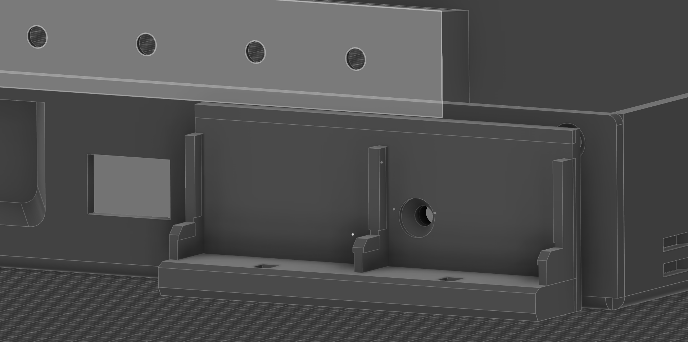
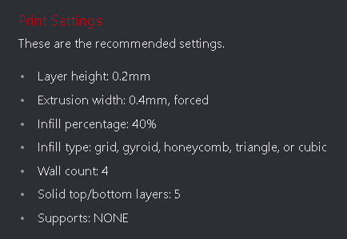
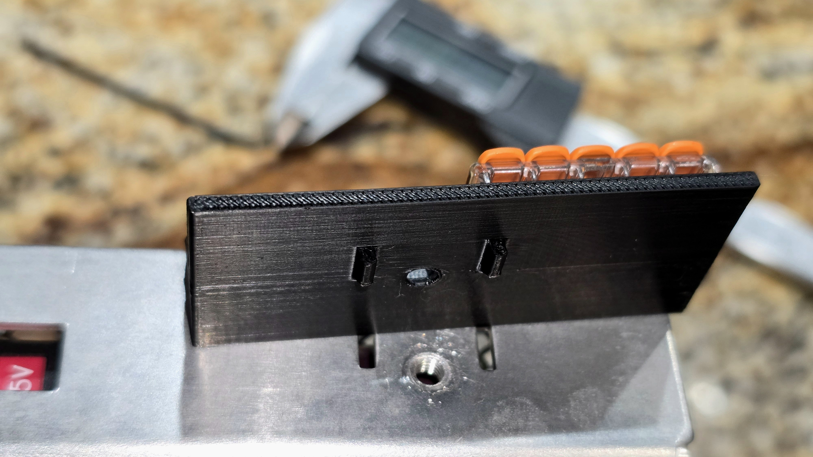
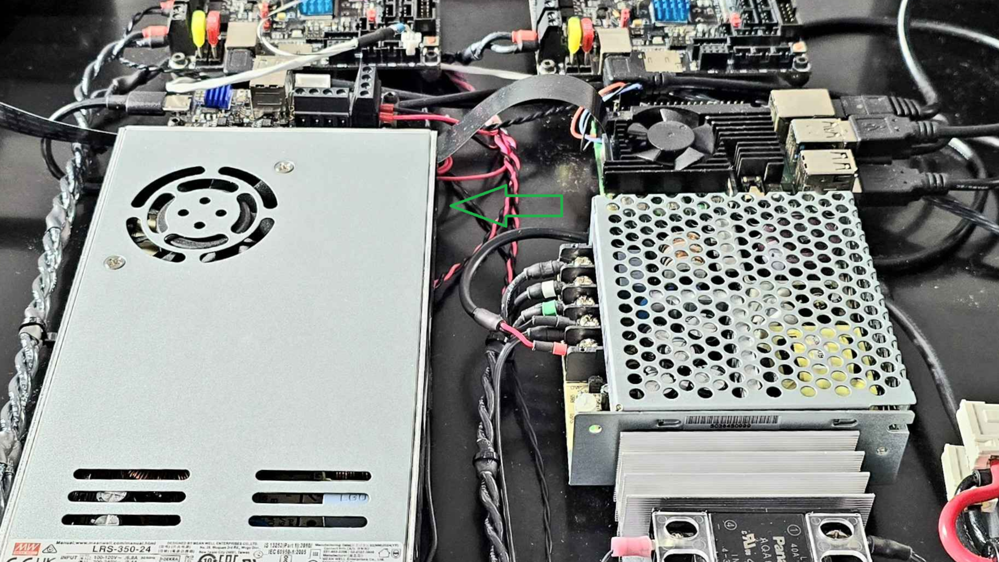

# Mean Well Side Mount 5V Distribution Block

5V +/- distribution blocks for multiple Mean Well PSUs

Tired of crowding the one positive and negative terminal on your 5V PSU? Want to add chamber LEDs and more? Then this mod is just for YOU! This WAGO 221-415 based distribution block is intended to locate and fasten to the slots and threaded well feature on many Mean Well power supplies such as the LRS and RSP series so that it can sit in proximity to your 5V PSU, making for easier wiring of 5V devices. Simply mirror the .STL in slicer if you'd like to mount to the same feature elsewhere on the PSU. The green arrow in the electronics bay picture indicates the corner where I will be mounting this, in proximity to the 5V PSU. Credit goes to Boingomw and DeepFriedHeroin for their similar designs, thanks for the inspiration and the borrowed tolerances for the WAGO retention.

Materials Needed:

2x WAGO 221-415

1x M4 x 5mm or 6mm FHCS

## Printing

Use standard Voron print settings.

