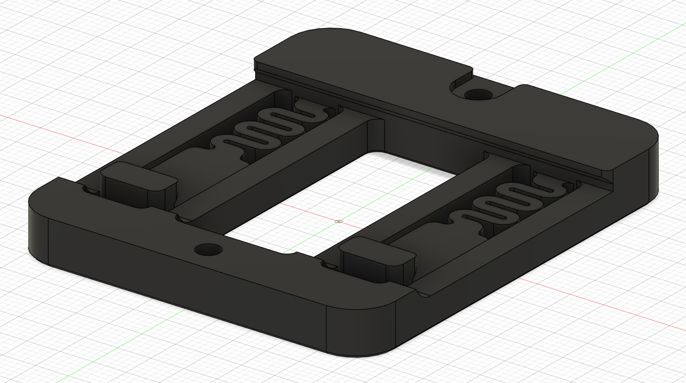
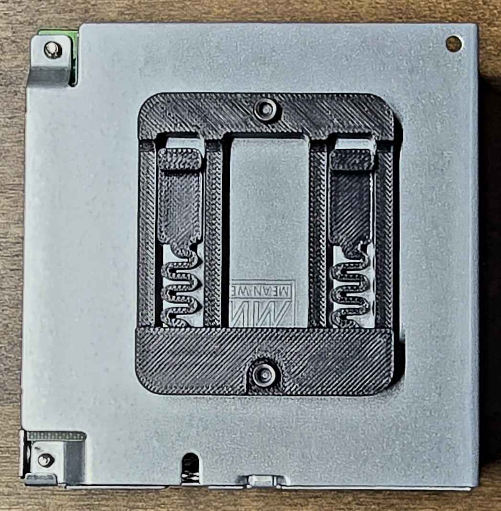

# RS-50-5 PSU Bracket

This is a bracket for mounting an RS-50-5 PSU to the DIN rail in your electronics bay, it will probably work with other printers using DIN rails given there is space for the RS-50-5.

It was made to resemble the original RS-25-5 PSU bracket from Voron Design.  

## Printing

Use standard voron print settings. 4 walls, 5 top & bottom laters, 40% infill.

