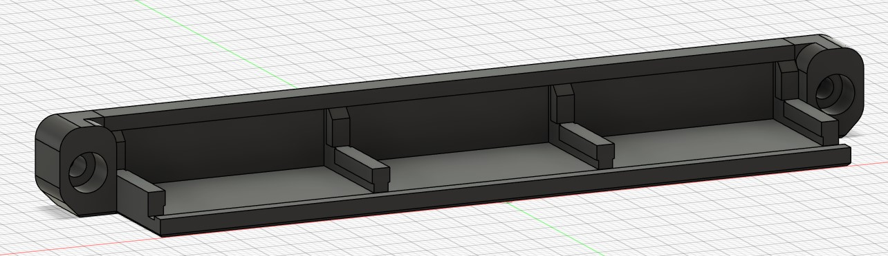
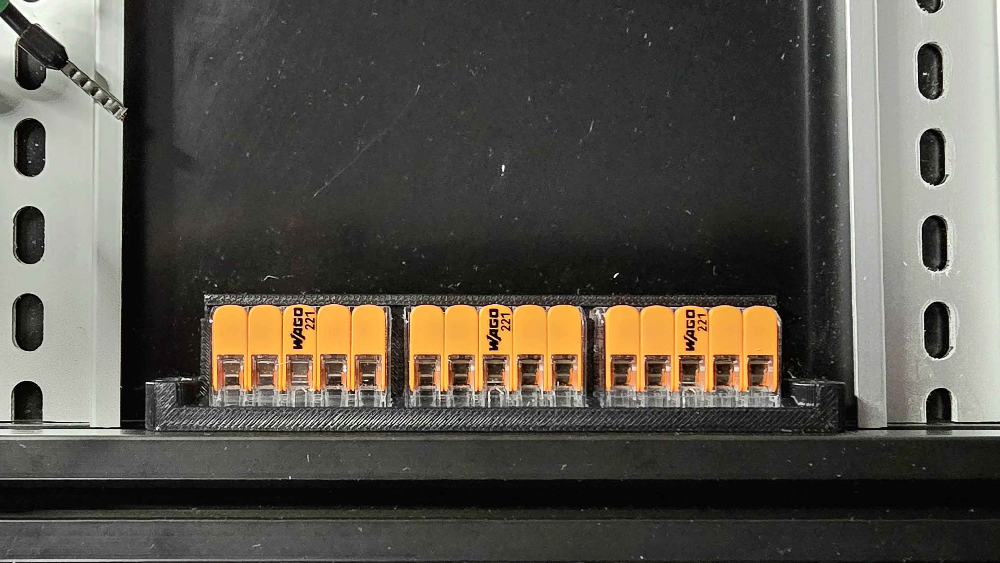

# WAGO 221-415 mount 3x5 M3 fasteners

This is a rework of the WAGO 221-415 mount that you can find in the official Voron 2.4r2 CAD file.

This rework replaces the M5 fasteners with M3 SHCS, reducing the overall width to make placement between the electronics bay DIN rails easier primarily, and you'll likely already have the M3 hardware on hand! This mod will likely work with other printers using 2020 extrusions.

## Printing

Use standard voron print settings. 4 walls, 5 top & bottom laters, 40% infill.

![photo](./Images/WAGO-221-415_3x5_M3_CAD.jpg

![photo](./Images/too_wide.jpg