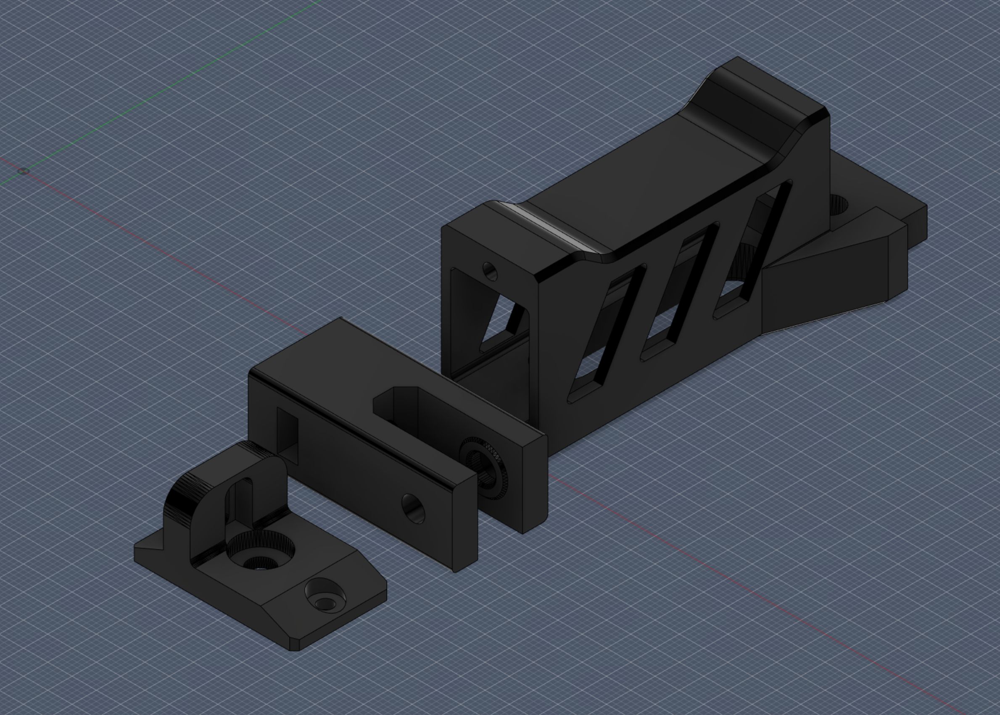

# Voron Switchwire Y Belt Tensioner Mod

After failing to print the [McKurt Y tensioner mod](https://github.com/VoronDesign/VoronUsers/tree/master/printer_mods/Mckurt/Switchwire_Y_Belt_Tensioner) a ton of times, I set out to make my own version (heavily inspired by the McKurt mod) that could be printed flat on the bed without any dramas.

This is not an edit or remix of the McKurt mod, this is a full 'from scratch' design.

This tensioner reuses your existing idler bearings, however you will need some additional hardware to assemble it:

* 1pc m5 x 30mm button head cap screw (thru the endcap and into the bearing guide)
* 1pc m5 x 15mm button head cap scre (thru the bearing guide to secure the idler bearings)
* 1pc m5 nut (no nylock!) (slips into the bearing guide)
* 2pcs m3 x 8mm button head cap screws (for the endcap)

Since it's a structural part, you'll want to print with as high an infill as you are comfortable with.

Also, your bridging better be good because this thing needs to be able to print 20mm bridges.

## Print Orientation

For best results, orient your printed parts as shown below, or thereabouts:

