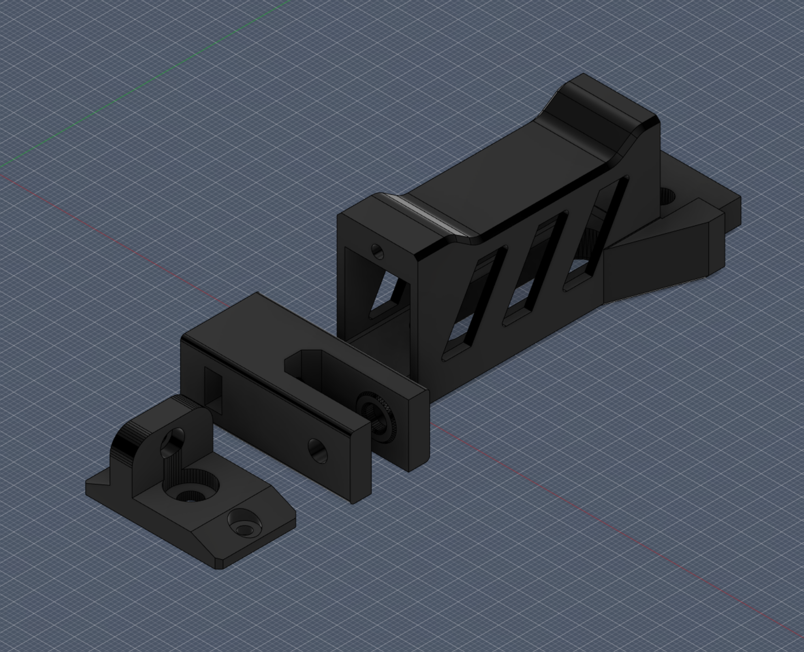

# Voron Switchwire Y Belt Tensioner Mod

### About:

After failing to print the [McKurt Y tensioner mod](https://github.com/VoronDesign/VoronUsers/tree/master/printer_mods/Mckurt/Switchwire_Y_Belt_Tensioner) a ton of times, I set out to make my own version that could be printed flat on the bed without any dramas.

This is not an edit or remix of the McKurt mod, this is a full 'from scratch' design. (Link to my GitHub Version)

### Reusable Parts:

* This tensioner reuses your existing idler bearings
* 1pc m5 x 30mm button head cap screw (thru the endcap and into the bearing guide)

### Additional Parts Required:

* 1pc m5 x 15mm button head cap scre (thru the bearing guide to secure the idler bearings)
* 1pc m5 nut (no nylock!) (slips into the bearing guide)
* 2pcs m3 x 8mm button head cap screws (for the endcap)

Since it's a structural part, you'll want to print with as high an infill as you are comfortable with.

Also, your bridging better be good because this thing needs you to be able to print 20mm bridges.

### To Install:

* Remove your front grills (because the deck panels make it impossible otherwise).
* Remove your existing Y idler.
* Loosen the screws to remove all tension from the back Y motor mount and slide it all the way forward. (The m5 screw in the 2020, and the m3 screw in the grill)
* At the front, leave the belt wrapped around the idler bearings.
* Place the Bearing Guide part over the idler bearings, and install the m5 x 15 bolt.
* Place the m5 nut into the slot in the bottom of the Bearing Guide
* Slide the Main Body over the Bearing Guide
* Bolt the Main Body to the existing T Nut in the 2020 extrusion
* Feed the m5 x 30mm bolt thru the End Cap
* Feed the m3 x 8 screws into the End Cap so they are flush with the face
* Start feeding the m5 x 30mm bolt into the Bearing Guide so it engages the m5 nut threads, and tighten about 5-10 turns
* Push the End Cap onto the face of the Main Body, and tighten the m3 screws to secure the End Cap to the Main Body
* Once secured, you can finish screwing in the m5 x 30mm bolt until its snug, not tight
* Re-tighten your rear Y motor mount fully
* Reinstall your front grill assembly
* Use your existing m3 screw from the old idler assembly and secure the tab on the new End Cap to the front Grill
* Now you can add tension to your belt by tightening the m5 x 30mm bolt

(These instructions are off the top of my head so I might have missed a step, add a comment if any steps need to be changed or added)

## Print Orientation

For best results, orient your printed parts as shown below, or thereabouts:

