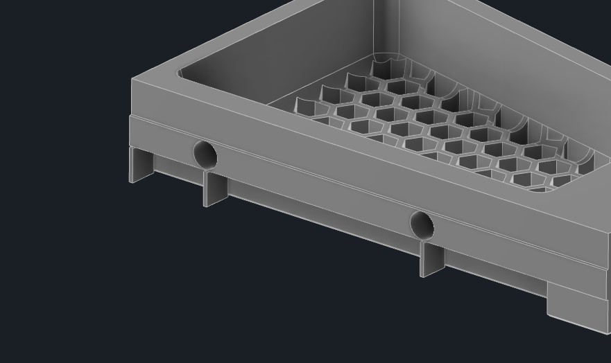

# RockNRoll - Rockers for Voron V2.4 #
This mod is intended to make access to the electronics compartment easier by enabling the printer to be rolled on its back without damaging cables or the exhaust system.
The rockers are mounted on the vertical extrusions in the back replacing the panel corners. Additionally they are braced against the horizontal back extrusion.
The mod is designed for and tested with a 350mm V2.4, but it might work with a V1 or Trident as well. Due to their higher center of gravity V1 and Trident might need additional feet higher up. If you tried this mod on a V1 or trident, let me know how it went on [discord](https://discordapp.com/channels/@me/RockNLol#5396/).

### Gallery: ###
To give you an example how this works, take a look at these pictures:

### Hardware needed: ###
| pcs. | name               |
|------|--------------------|
| 4    | M5x10 BHCS         |
| 4    | M3x12 SHCS         |
| 2    | M3x20 SHCS         |
| 4    | M5 T-nut           |
| 4    | M3 T-nut           |
| 2    | M3 Threaded Insert |

As all these are in the BOM of a V2.4 it is highly likely you can build this mod with leftovers from your printer.

### Printing: ###
#### Print Settings: ####
This mod needs rigidity and stiffness. Based on the Voron recommendations for structural printer parts these settings are recommended:
- 0.4mm Nozzle
- 5 Perimeters
- 40% Infill
- 10 top and bottom Layers

The test prints in the pictures are done with Formfutura rTitan ABS.

#### Support: ####
All the STLs are oriented correctly. The rockers themselves have overhangs where the backpanel is supposed to sit. Make sure to support them properly, especially the corner and under the M5 bolt holes, where the material gets thin to avoid voids as experienced in these test prints:

Recommended support placement:

### Assembly: ###
#### Threaded Inserts: ####
Start with melting the M3 threaded inserts into the braces:

If the support on the sides of the hole deforms from the heat, snip it off to prevent interference with the rocker:

#### Mounting the Braces: ####
Remove the bottom corner panel clips of the back panel and insert the T-nuts. Put two M5 T-nuts into each vertical extrusion and two M3 T-nuts on each side of the horizontal extrusion.
Put the braces roughly in place and screw them in lightly with two M3x12 SHCS bolts each.

#### Mounting the Rockers: ####
Make sure the T-nuts line up with the holes in the rockers and mount the rockers on their braces. They should slot right in. Bolt rocker and brace together with a M3x20 SHCS bolt before mounting the rocker on the vertical extrusion with two M5x10 BHCS bolts. Once every bolt is in place, tighten them all up.

#### Mounting the Base Plates: ####
To increase the support of the rockers you can swap out two of the original base plates of the rubber feet with the ones of this mod. They slot into the rockers tip and support it while tilting.
Start with playing your favorite Elvis song and rocking and rolling the printer on its back for the first time. Remove the rubber feet and the stock base plates:

Swap the M5 nut of the stock base plate to the new one and slot the fork tips of the new base plate into the rocker. Then screw everything back together:

