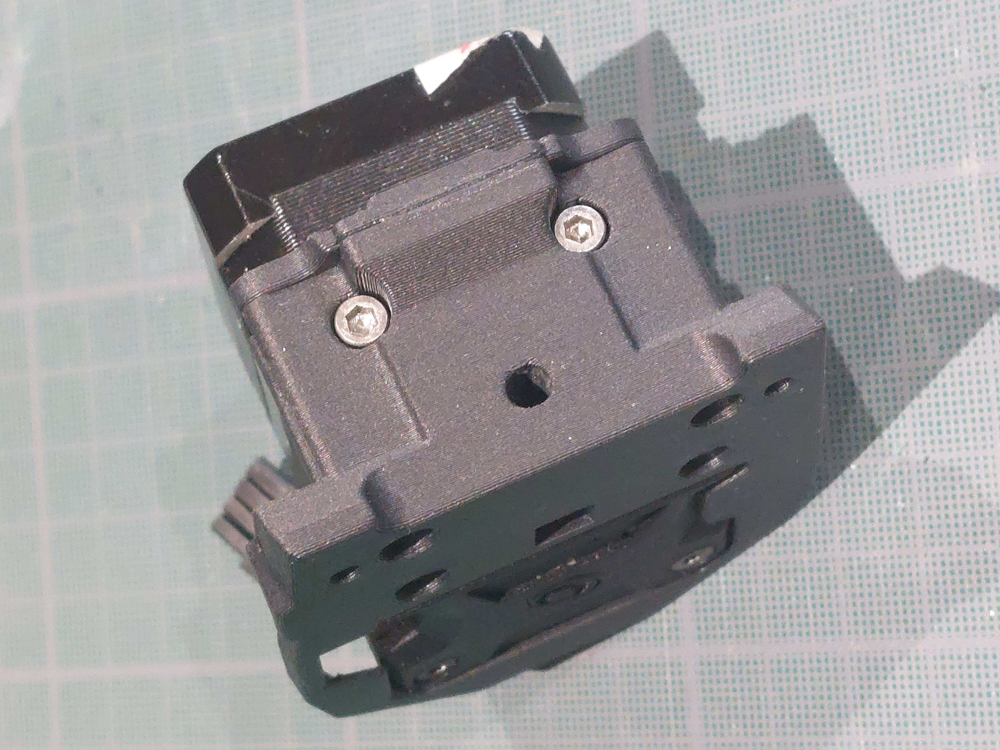

# Stealthburner_LGX_Mount
## Introduction

I didn't find a mounting with some bells and whistles I wanted to use my LGX with the Stealthburner. Then I designed my own.

It should be compatible with both versions of rail carriage. The one we screw on the back (Afterburner carriage with CW1) and the one we screw on the front (Stealthburner carriage with CW2). I only fully tested with the Stealthburner carriage.

The 3D printed parts may not follow the Voron design recommendations.

All photos are not of the same design iteration. I didn't want to shoot the whole sequence of the mounting each time I improved the parts.

## Parts
3D printed:
- LGX mount (2 objects)
- LGX wheel cover

Additional hardware:
- M3x20 (x2). SHCS / ISO 4762 recommended
- M3x30 (x2). SHCS / ISO 4762 recommended (M3x25 is enough for the screws on the back mounting)
- M3x6 (x1). FHCS / ISO 10642 recommended
- M3 Heat insert (x3).

## LGX Mounting

Put insert in the 3 holes.

Take care to get the insert quite well straight. It is for the Stealthburner to move easily along the M3x25 screws afterward when you want to swap the toolhead.

The insert on the left (of the photo) edge is to screw a future cover.

In case you want to use the rail carriage that has holes to screw on the back (CW1), add two more inserts in the back of the part.

    Add the back of the mounting. It should fit on the rectangular joint. Later, it doesn't have to be separated from the mounting. Then I choose to glue it but it is really not mandatory.

Screw the bottom with 2 M3x20.

Screw the front with the provided Bondtech LGX M3x27.

There is a hole in the front of the mounting to check if the PTFE tube go well to the top of the mounting.

Screw the mounting on the carriage with 2 M3x30.

In case you want to use the rail carriage that has holes to screw on the back (CW1), screw the mounting on the carriage with 2x M3x25 or 2x M3X30.

Pass the Stealthburner wires with their connectors in the right square hole.

All 3 connectors passed.

Screw few turns the Stealthburner M3x25 to hold it.

Once the connectors are passed, you can screw the LGX wheel cover with a M3x6. I use a FHCS one.

Mount the toolhead. Take attention to not pinch the toolhead wires between the Stealthburner and its mounting when tighning the whole.

Voilà.

## Cover
Based on wile.e1 cover for Stealthburner and CW1 (https://github.com/VoronDesign/VoronUsers/tree/master/printer_mods/wile-e1/Stealthburner_CW1_PCB_Cover)

Screw: M3x8. M3x6 works too.
Two version:
- One with a PCB feature. I need to be explained what this PCB feature is.
- One without PCB feature.