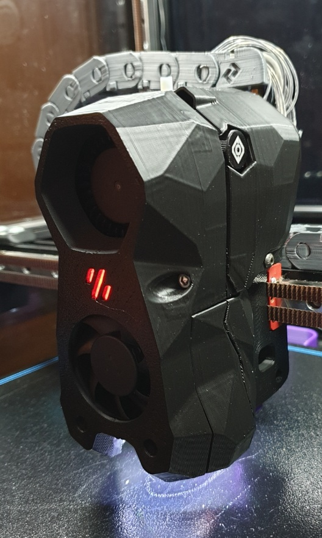
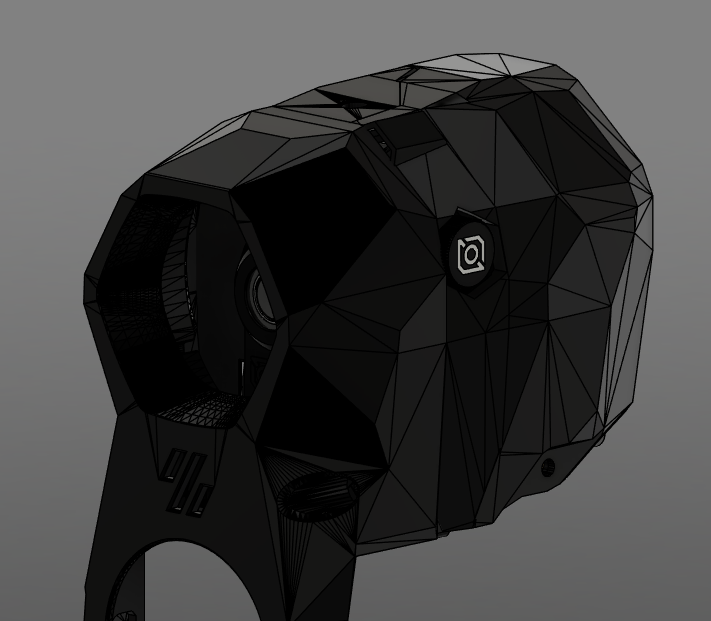
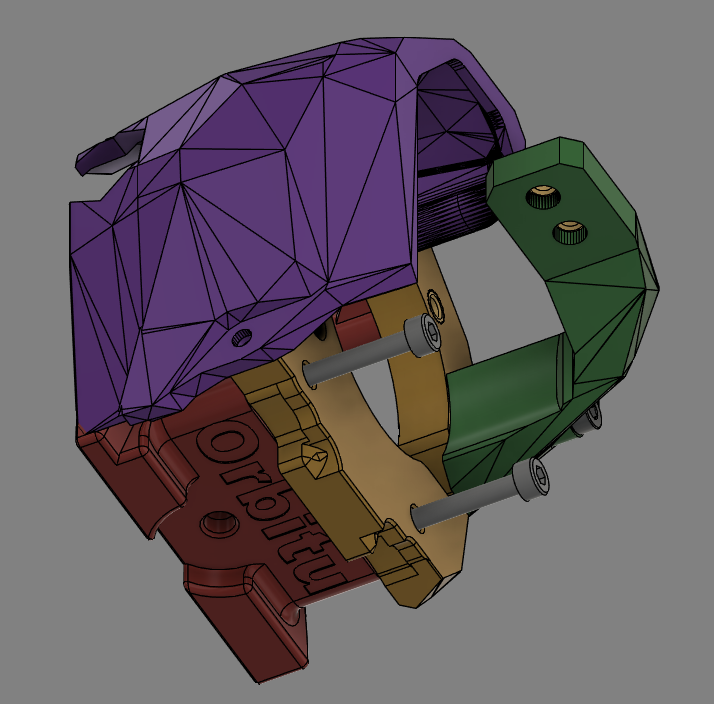
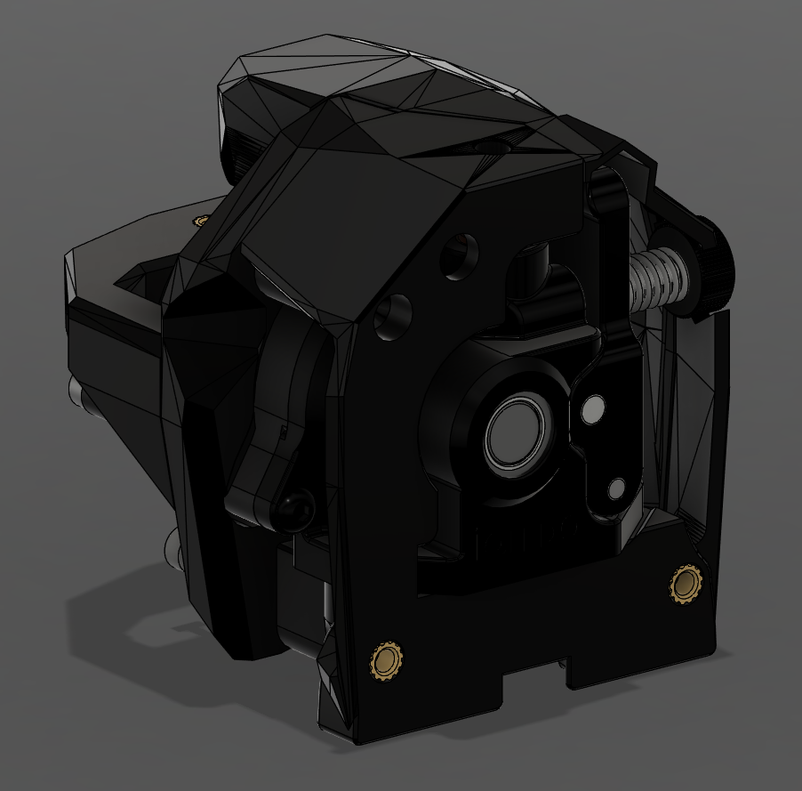
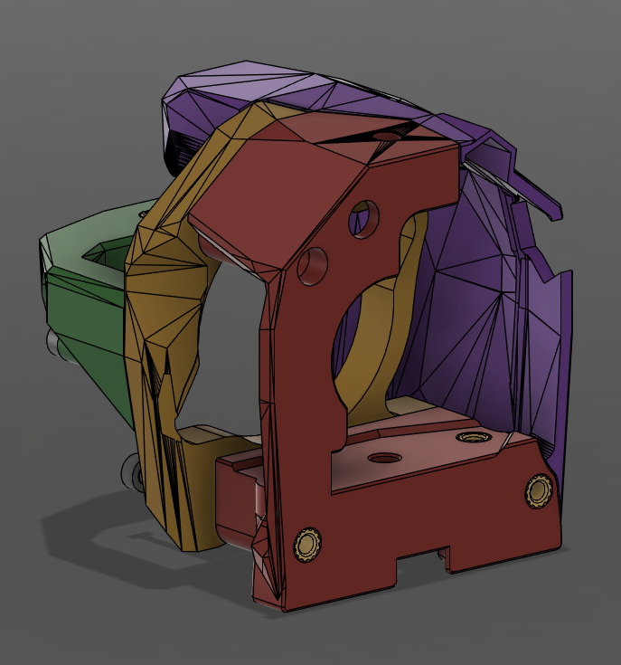
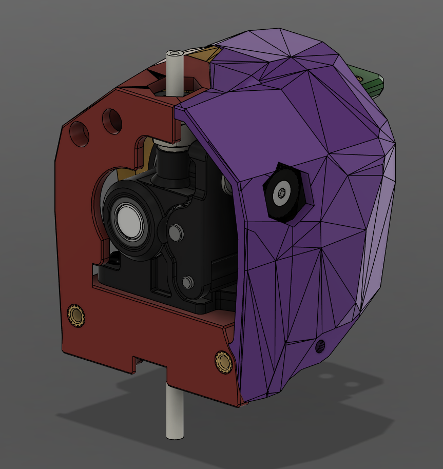
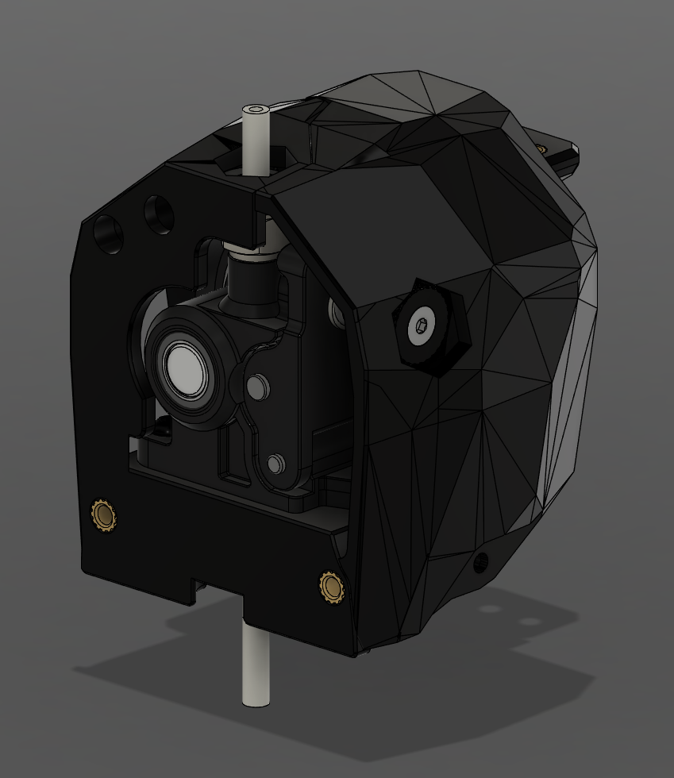
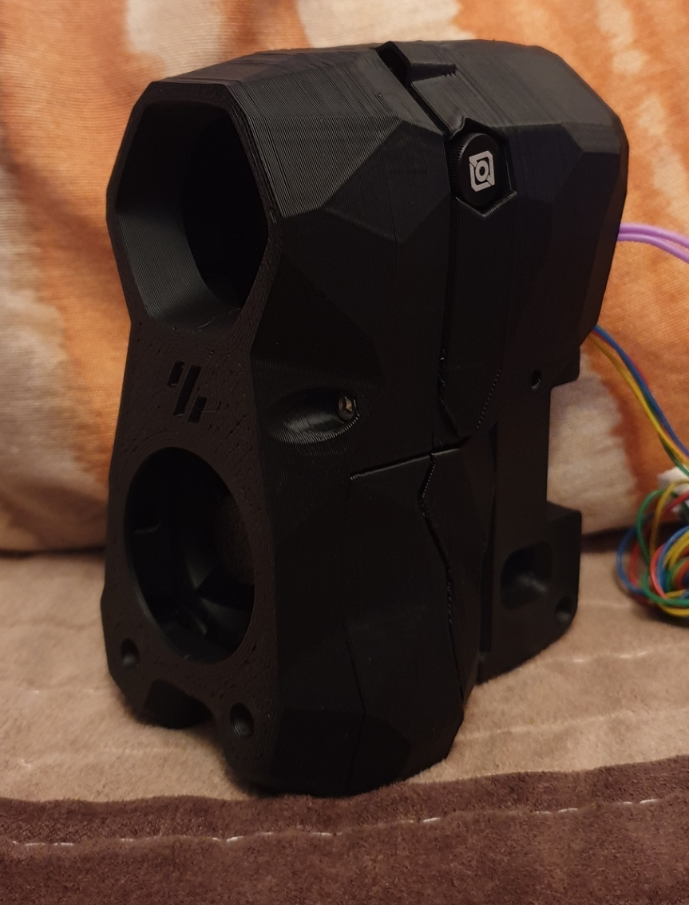
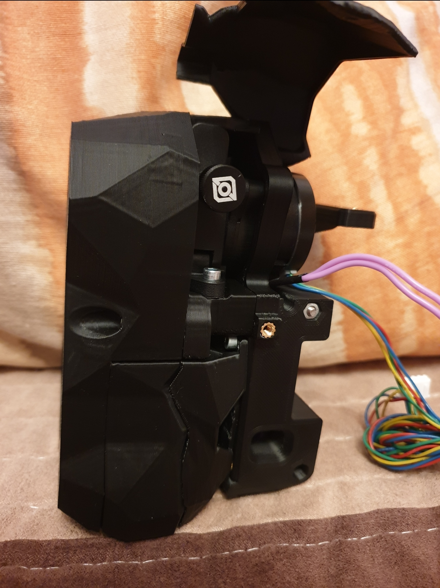
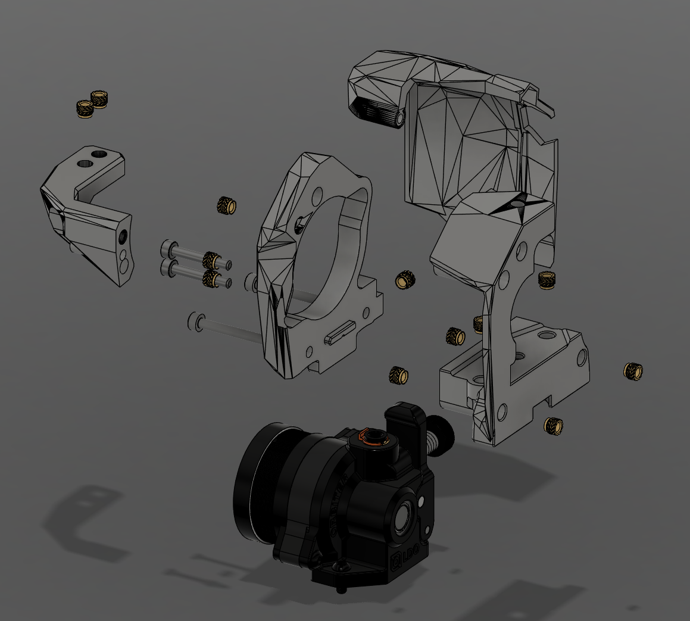

# **Orbitu Mount**

Mounting solution for the Orbiter 1.5/2.0 and the Voron CW1 carriage with. Everything was made out of the stls.
Goal was to mimic the looks of the new Stealthburner.

### **Printing instructions:**
- Voron default settings work fine

### **BOM**
- 2×M3×30mm for mounting on the carriage
- 2×M3×25mm to tighten the front and back piece
- 2×M3×20mm for mounting the anchor
- 1×M3×15mm for the cable cover
- 2×M3×8mm to mount the Orbiter 2.0
- 1×M3×6mm to fix the cable cover
- 13×M3 heat inserts (6×front; 4×back; 2/3×anchor)
- PTFE tube
- Orbiter 1.5/2.0 

### **Known issues**
- Door can't fully open if the PTFE is too long. - Will look into this after CAD release.
- Heat inserts under the Orbiter are a bit tricky to seat well.

### **Pictures 2.0**

### **Pictures 1.5**

### **Photos 2.0**

### **Exploded View**

* *Version 1.5 is similar* *
