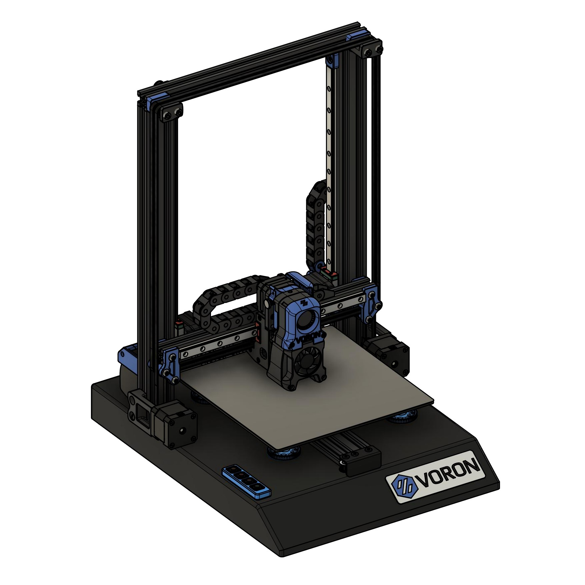
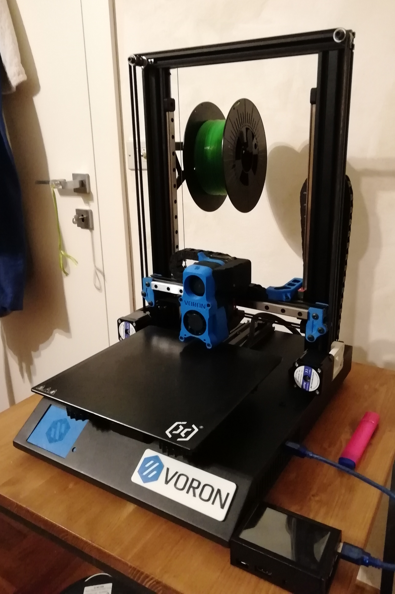
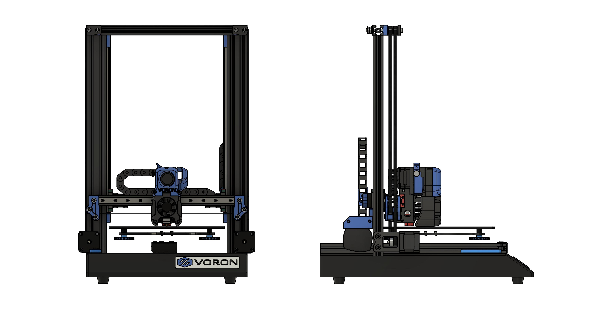
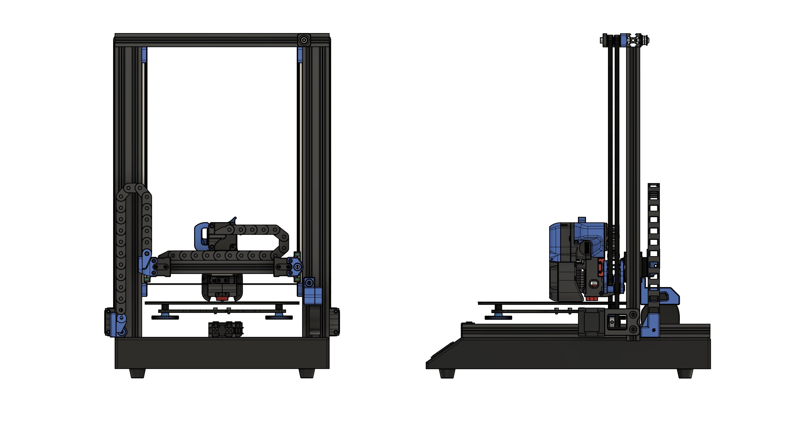
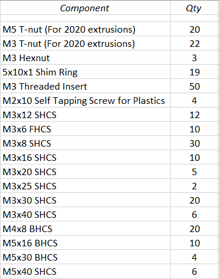
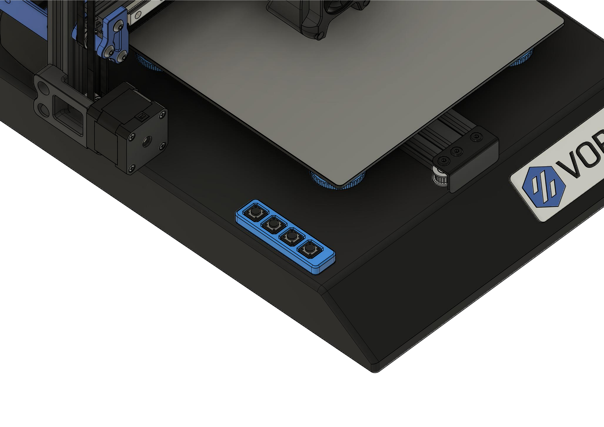
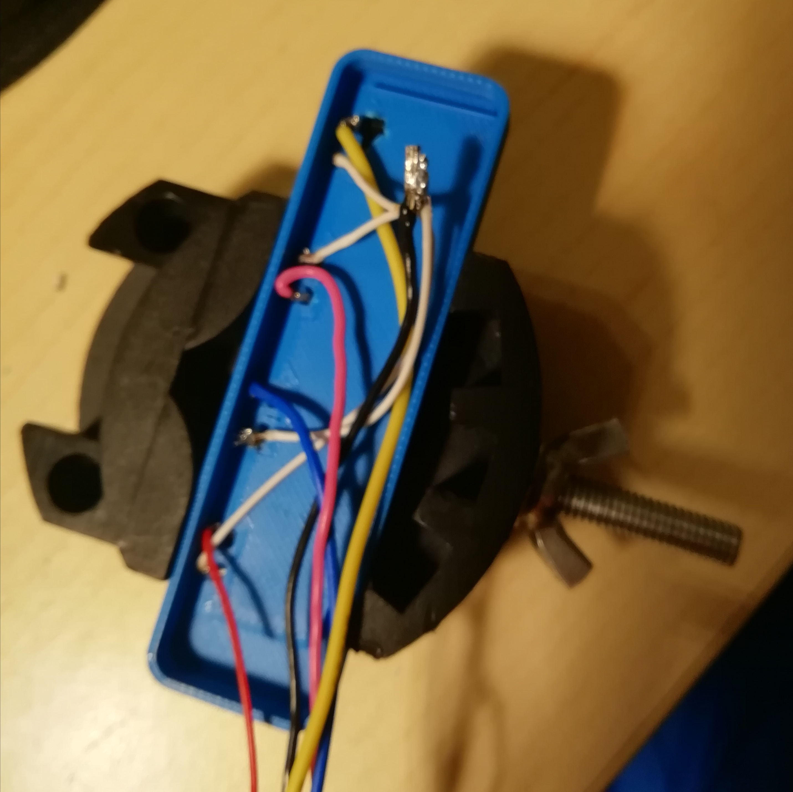
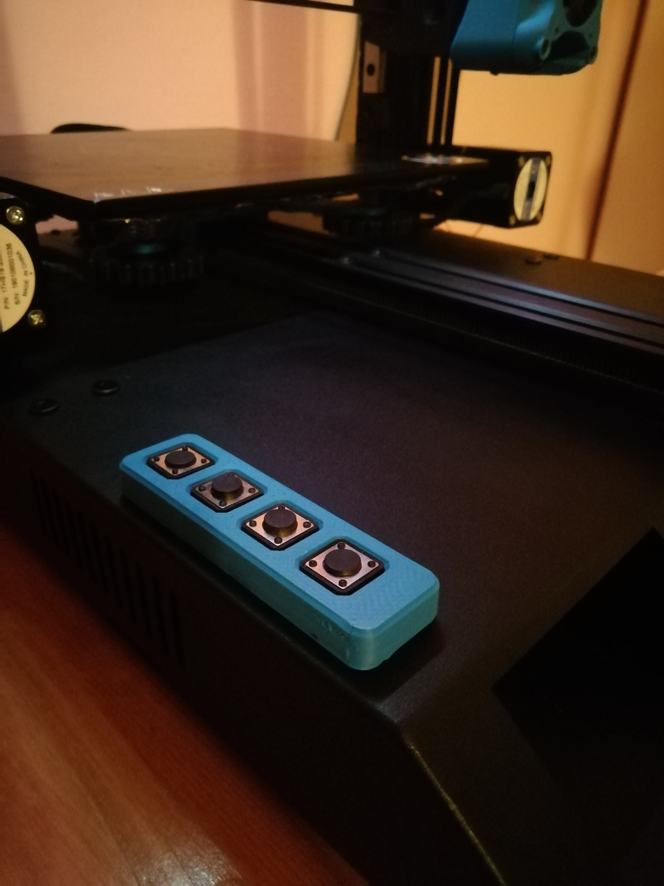
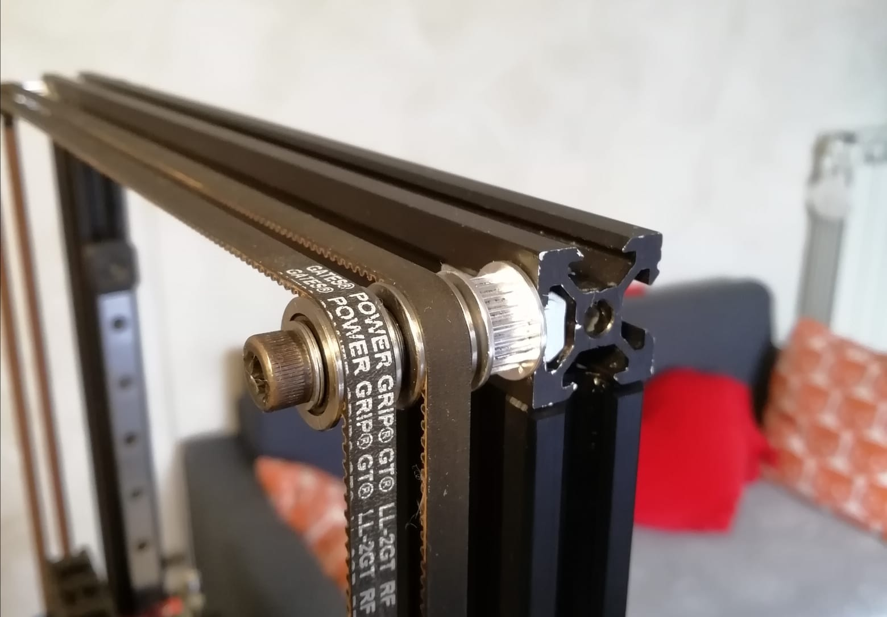

# Artillery Genius to Switchwire
This is my journey in converting an Artillery Genius to Switchwire. \
_discord salveo#6988 if you have any question_

  

## SW 193 ♥

  

## This conversion is based on [Gizzle’s Ender 3 conversion](https://github.com/VoronDesign/VoronUsers/tree/master/printer_mods/Gizzle/ender-3_(pro)_switchwire "Title")

I reused the following parts:
* motor mounts
* upper blocks assembly
* Z bearing blocks
* keybak mount

## Build information
This mod will shorten the X travel by 10mm because of the narrow vertical extrusions but you will gain 20mm of travel in Z. \
**The build volume is 220x230x270** \

## Build overview
_Front and Left_

  

_Back and Right_

  

## Reuse parts
You can reuse a good amount of parts from the Genius:
* MCU (Mks gen L)
* PSU
* Y assembly
* All the stepper motors except the extruder one
* 4020 blower
* 4010 fan
* 2040 vertical extrusions \
**At the moment, the TFT screen is not compatible with Klipper, you won’t be able to use it.**

## BOM
[See the Switchwire BOM for links to products](https://vorondesign.com/sourcing_guide?model=VS)

### Frame
* 2020 extrusion 320mm – 1pcs (top extrusion)
* 2020 extrusion 310mm – 1pcs (x axis extrusion)
### Motion
* MGN12H linear rail 330mm – 2pcs (z axis)
* MGN12H linear rail 270mm – 1pcs (x axis)
* GT2 belt – 5 meters
* GT2 20t pulley – 3 pcs
* F695 Bearing – 20 pcs
### Electronics
* Raspberry for running klipper
* SPDT KW10 Limit Micro Switch (for x-axis)
* Omron TL-Q5MC2 - NPN Inductive Probe (if you want bed mesh leveling,I reused the stock endstop for z)
* 20mm NEMA17 for the extruder (NEMA17 Motor 17HS08-1004S)
### Misc
* Loctite Blue Threadlocker (or nail polish)
* Key-Bak (you can use this cheaper alternative (https://it.aliexpress.com/item/1005001273995297.html)

### Cable Management	
* 24 AWG PTFE
* 20 AWG PTFE
* 10x11 Cable Chain
* connectors

### Fasteners
_Make sure you order spare fasteners in case I miscounted them_

  

### Extra
* hardware for the Afterburner (check sw bom)

## GCODE buttons mod
To cover the unused usb port I created a keyboard of 4 buttons that call a gcode macro. \
Buttons used: 12x12x4.3 => [aliexpress](https://it.aliexpress.com/item/32807507828.html)

  

Solder one side of the button to a data pin, the other goes to GND. \
Then close the lid and route the cables through the usb hole.

  

Product in action

  

## Full metal idlers
If you want your top idlers to be sturdier you can reuse the old pulley to act as an m5 spacer.

  

