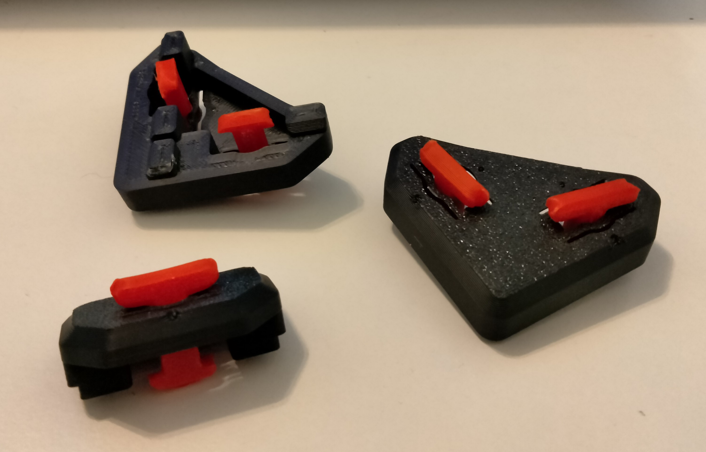
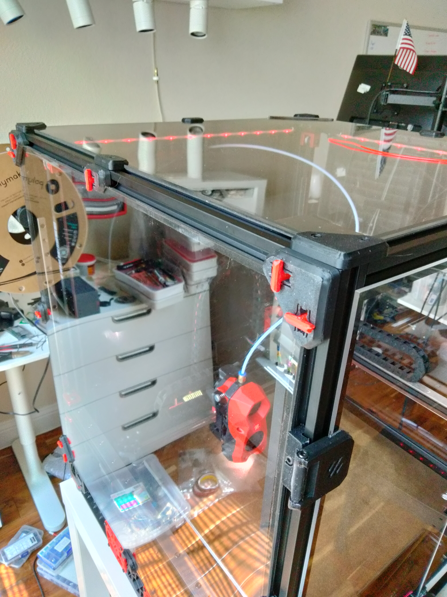
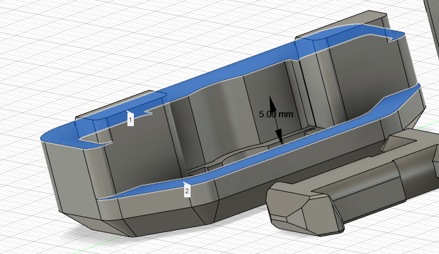
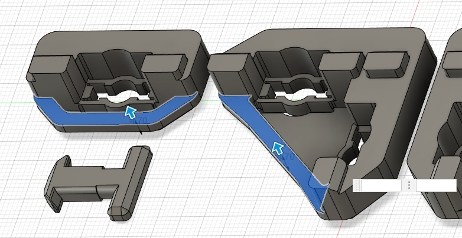

# Quick Release Panel Clips

Voron-style panel clips inspired by Annex-Engineering Denali printer's clips (https://github.com/Annex-Engineering/Denali/tree/master/STLs/Panel_Mounting/Side_Top_and_Rear_Panel_Quick_Release)

I really liked the idea of Denali's clips, but found them too bulky and not really fitting to the overall style of Voron printer, so I designed these.

## Parts Required

None! You can even free up a few M3x8 screws and hammerhead nuts you are currently using.

## Printing

Print parts with standard Voron spec:
* 0.2 mm layer
* 0.4 mm extrusion width
* 4 perimeter walls
* 5 top/bottom layers
* 40% infill (grid/gyroid/honeycomb/triangle/cubic)

For each side panel you will need:
* 2x clip_xxx_corner_a.stl
* 2x clip_xxx_corner_b.stl
* 4x clip_xxx_midspan.stl
* 12x [a]_key.stl

For back panel you will need:
* 2x clip_xxx_corner_a.stl
* 2x clip_xxx_corner_b.stl
* 3x clip_xxx_midspan.stl
* 11x [a]_key.stl
* 1x [a]_exhaust_filter_mount_a.stl
* 1x [a]_exhaust_filter_mount_b.stl

For top panel you will need:
* 4x clip_xxx_corner_top.stl
* 4x clip_xxx_midspan.stl
* 12x [a]_key.stl

where xxx is the combined width of your panel and a foam tape.

Also included are slightly shorter and slightly longer versions of the key:
[a]_key_s2.stl - 0.2mm shorter
[a]_key_s4.stl - 0.4mm shorter
[a]_key_l2.stl - 0.2mm longer
[a]_key_l4.stl - 0.4mm longer

If your clip feels too loose - use the shorter key. If you clip is too tight (the key doesn't turn) - use the longer version.

## Assembly and installation

Just press keys into the clips. Align keys with slots in aluminum extrusions, push the clip in and turn the keys 1/4 turn clockwise. Turn the keys 1/4 turn counter-clockwise to release.

## Customizing clips to your panel thickness

In case one of included thicknesses is too tight and the next is too lose, please feel free to create a custom set of clips.
Included .step file has all the clips for 5mm panel thickness. It is the dimension between 2 surfaces: one that contacts the frame and one that contacts the panel:

Since overall thickness of the clip is critical for the key fitment, the easiest way to adjust the thickness is to raise the surface that pushes on the panel:

Raise the surface by (5 - desired_thicness).

Another option is to make the clips themselves thinner. Keep in mind that you will need to shorten the key by the same length in the "neck" region.

Enjoy!
