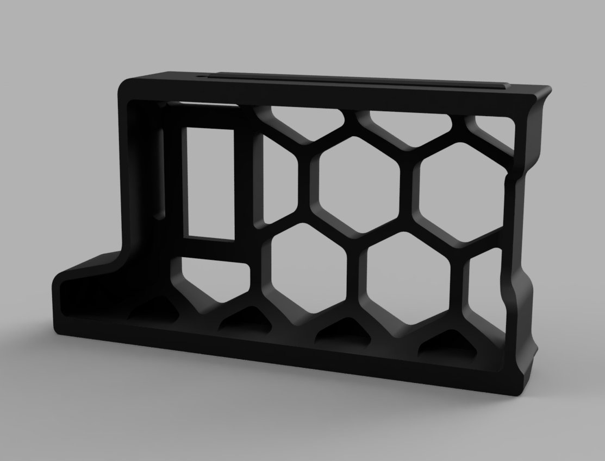
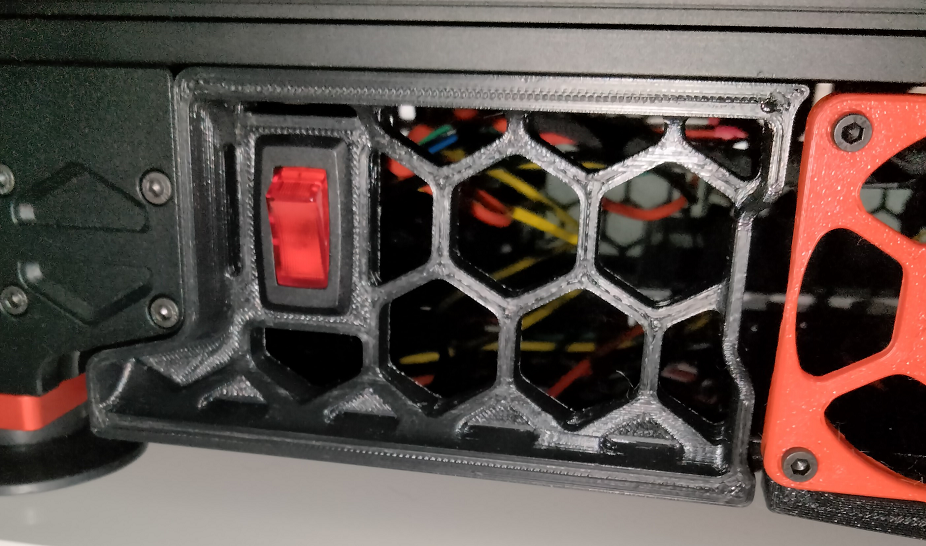

# Side Skirt Power Switch

A mount for the GSW-42 rocker switch in the skirt element to allow easy access to a power switch without reaching behind the printer and trying to find it by touch.
Can be substituted with GSW-41 if you don't want it to glow red when turned on.

## Parts Required

* (1) GSW-42 illuminated rocker switch
* Some mains wire
* Spade crimp connectors
* Butt crimp connectors

## Printing

* Print as is for the "a" skirt (rear left/front right) or mirror the part to get the "b" variant.

## Installation

* Remove existing skirt element.
* Attach the new skirt element re-using the same M3x8 screw.
* Prepare the wires to your liking (unplug from existing switch or splice into existing wiring). You will need 3 wires: line, load, neutral.
* Fish the wires through the hole.
* Connect the switch. The GSW-42 switch is connected like so: pin 1 goes to line (plug), pin 2 goes to load (power supply), pin 3 (brass pin) is connected to neutral.
* Snap the switch into the hole.
* Enjoy easy access to the power switch.

## Sourcing

* Switch is available in Home Depot (https://www.homedepot.com/p/Gardner-Bender-16-Amp-Single-Pole-Rocker-Switch-GSW-42/206061064) or Amazon (https://www.amazon.com/Gardner-Bender-GSW-42-Electrical-Illuminated/dp/B00004WLKI) or even in Walmart.
* Wires/connectors you most likely already have from building the printer :)

