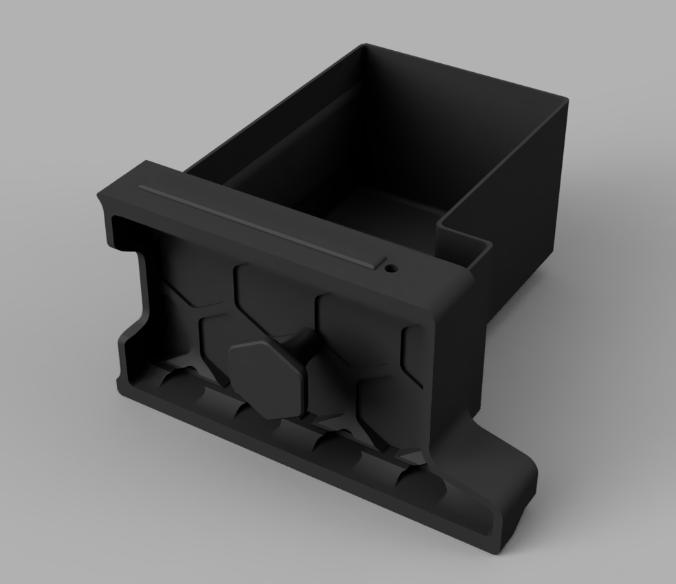
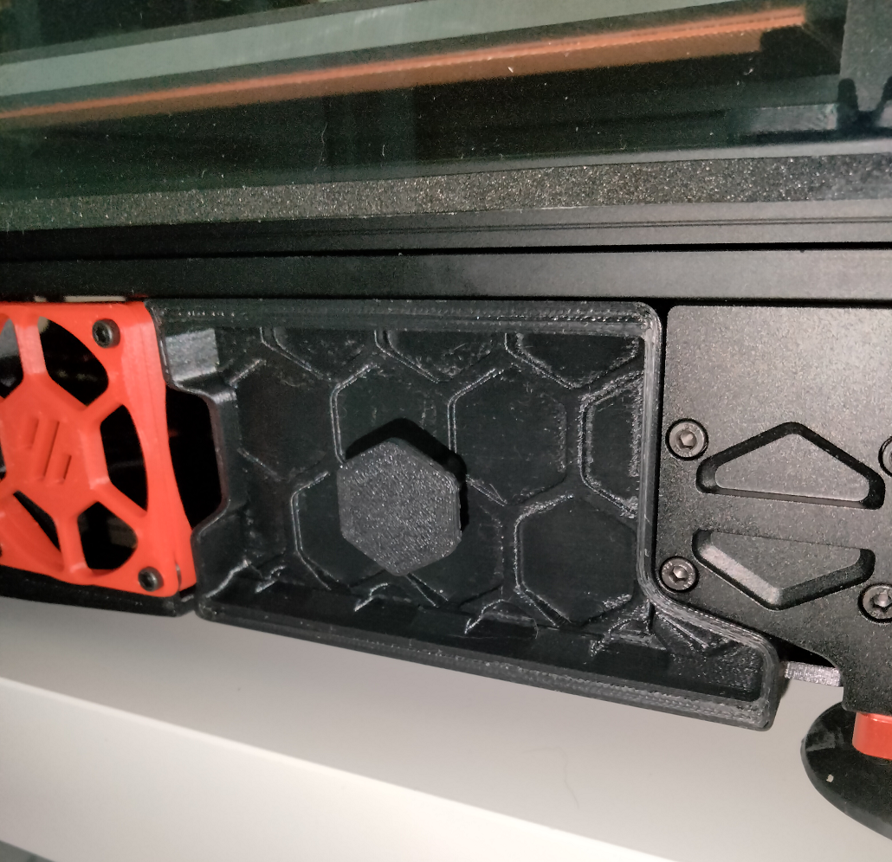
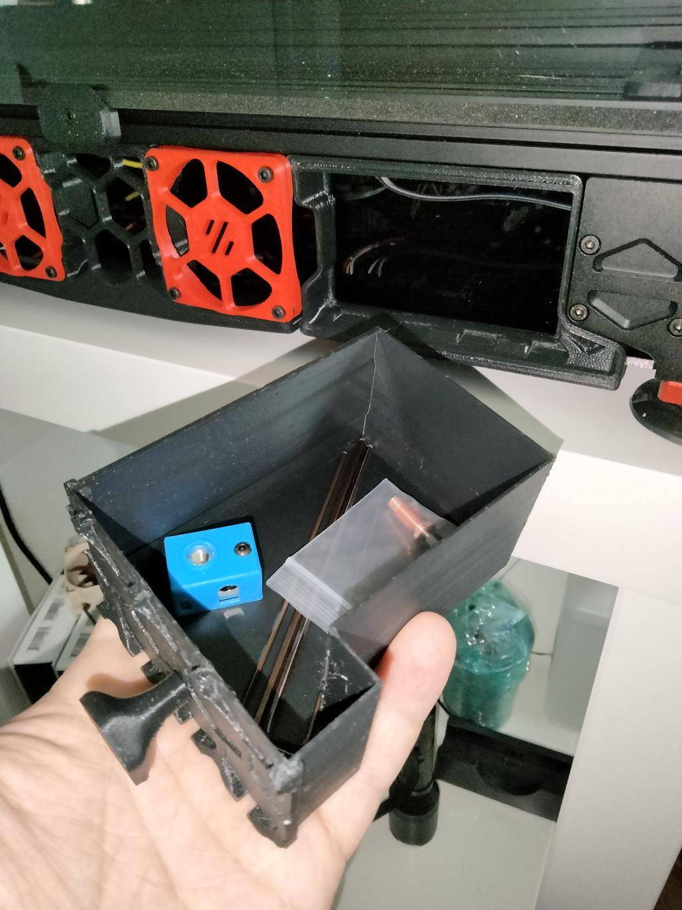

# In-skirt storage compartment

A little storage compartment nicely fitted into one of the corner skirt pieces of Voron 2.4 350.

Unfortunately 250/300 have smaller skirts which results in a very small compartment, so not very useful. Maybe just to hold a few spare nozzles. Therefore only 350 mm version is included in this mod.

As a long-time user of the Ender 3 V2 printer I got used to having a drawer where I store most commonly used tools and spares. I missed it a lot ever since I built my Voron. The solution? Make your own! I found there is a lot of wasted space in the front left corner of the electronics bay (where the Pi resides) and used it for my drawer. I had to clear the stepper motor, hence the funny shape of the box. Initially I planned to cut this appendix off and go with just a rectangular box, but this appendix actually adds a little bit of very valuable space, making it possible to fit all the allen keys (except the one for beefiest of the screws).

## Parts Required:

* (1) M3x12 BHCS screw to mount the knob. Almost any length will do as long as it fits inside the knob and holds it securely. SHCS is OK too.
* (1) M3x10 FHCS screw to mount the skirt piece (optional).

## Printing:

Print parts using standard Voron spec:

* 1x knob.stl
* 1x skirt_350.stl
* 1x drawer:
  * If using FSCH screw to mount the skirt, print the regular drawer.stl - this option gives you the best look.
  * If reusing the existing SHCS, print the drawer_notched.stl - doesn't look as good, but allows some clearance for protruding screw cap.

## Installation:

* Remove the existing skirt piece.
* Install the replacement skirt piece.
* Attach the knob to the drawer using the screw (threads right into plastic).
* Make sure you have enough space free of wires to fit the drawer. Move the Pi and tidy up your wiring if needed.
* Slide the drawer in.
* Enjoy.

