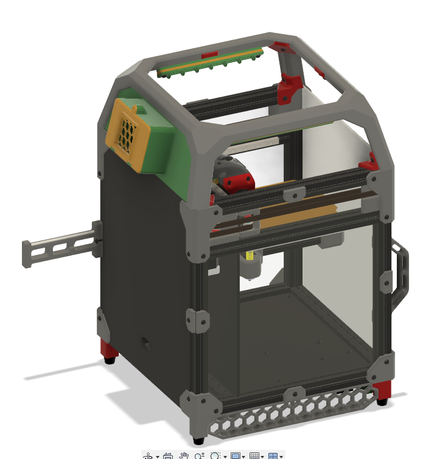
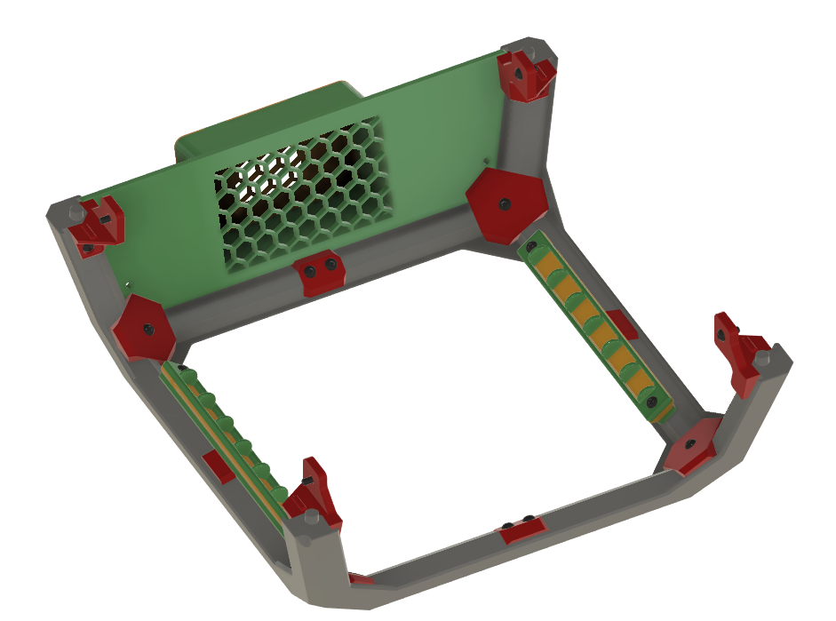
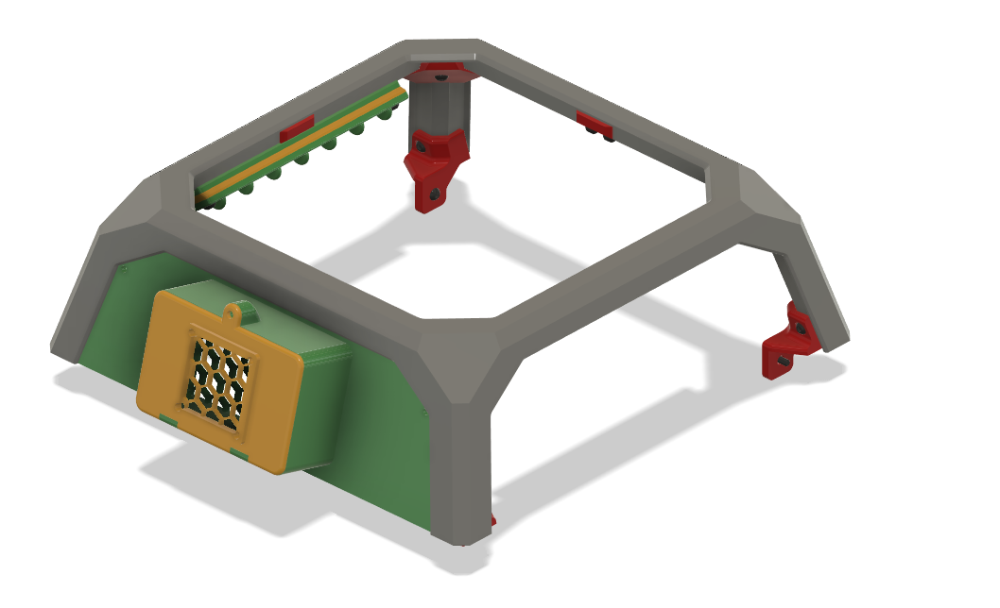
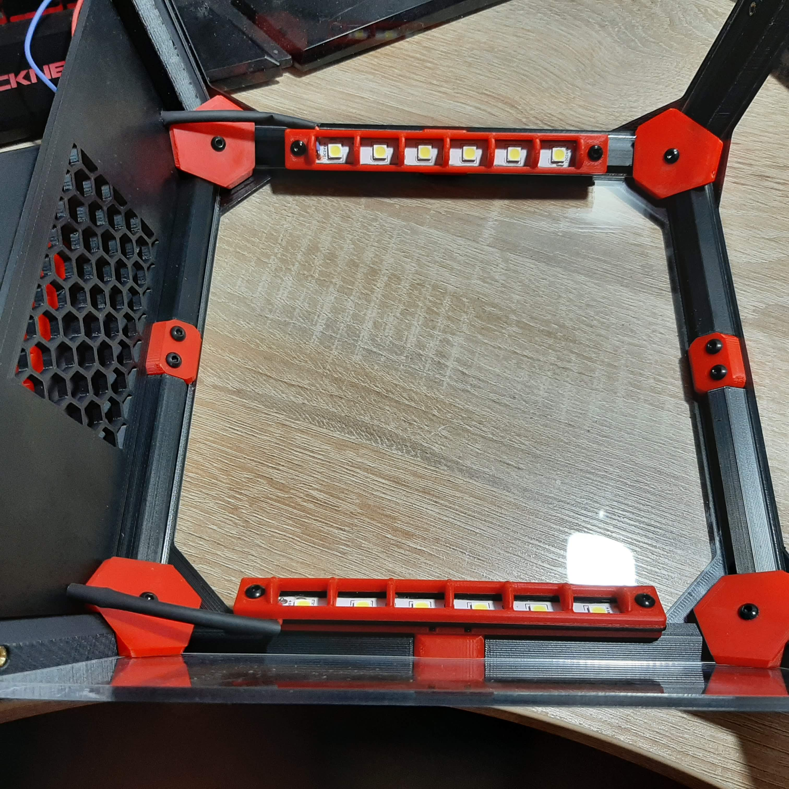
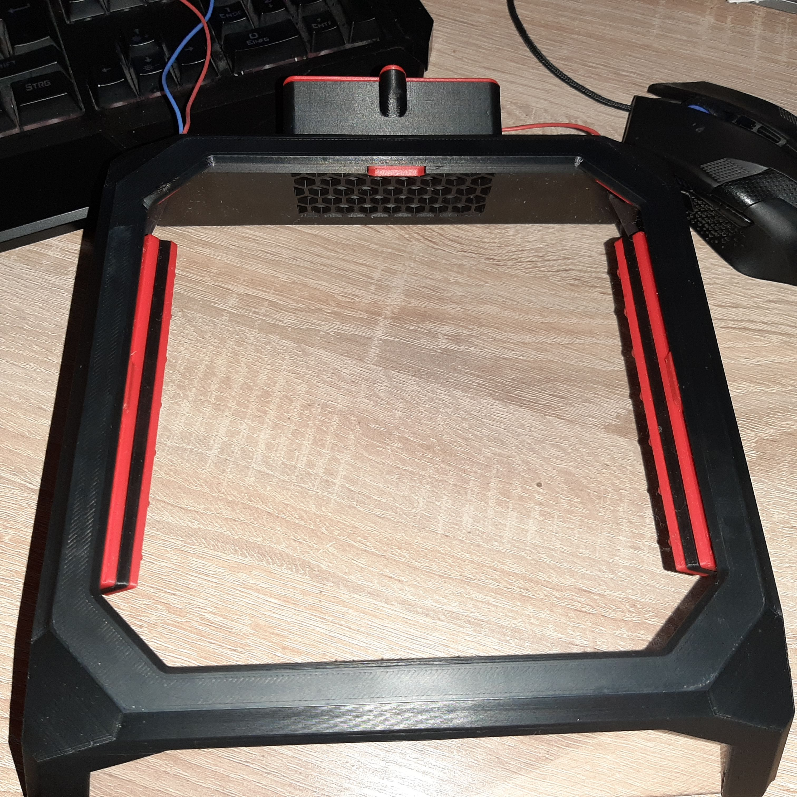

# Voron V0 Exhaust and LED Mod
## _No stink, good light_

Since the lack of suction on the VO bothered me and, in my opinion, printers should always have light, I developed this mod.

- no more stink
- bright, even light
- Extraction even without LED lighting

## BOM
## _Exhaust_

- 1 (5 optional) Heatset Insert M3
- 4 Nuts M3 (optional)
- 1 Screw M3x8 BHCS
- 1 Fan 40x40x X (10 or 20mm tail)
- 4 scrwe M3x X (depending on the fan)
 
## _LED Light_

- 4 Heatset Insert M3
- 4 Screw M3x12 BHCS
- 4 Screw M3x10 BHCS
- 2 x 10cm LED Stripe 24V 60LED/Meter

## Build

## _Exhaust_

The exhaust can be exchanged "plug & play" for the rear TopHat panel. A heatset insert is inserted into the panel to attach the cover. The exhaust carries 30mm filter material. 
It is recommended to use both activated carbon filters and HEPA air filter mats. The lid is closed with an M3 * 8mm screw.
Heatset inserts can be used to mount the fan, but four M3 nuts do the same. The four holes in the corners allow both types of installation.

There are 2 back panels in the folder. One with holes to pull the cables of the LED lamps through and one without, if you don't want to install LED lamps.

## _LED Light_

The LED mounting plate is provided with two heatset inserts at the outer holes. The two inner holes are used for mounting on the TopHat. To do this, the original M3x10 screws are exchanged for M3x12.

The LED strips are mounted into the LED carrier after 24 AWG cables have been soldered to them. Cheap LED strips can become detached from the heat. To be on the safe side, these can be glued firmly, even if they cannot fall off. 
There is a separate carrier for each side with a recess to pull the cables out of the lamp.
Finally, the carriers are screwed between the LED cover and the mounting plate with two M3x10mm screws each.

A 12mm 24V switch can be used as a [switch](https://de.aliexpress.com/item/32903566664.html). I have included an adapted skirt for this.

