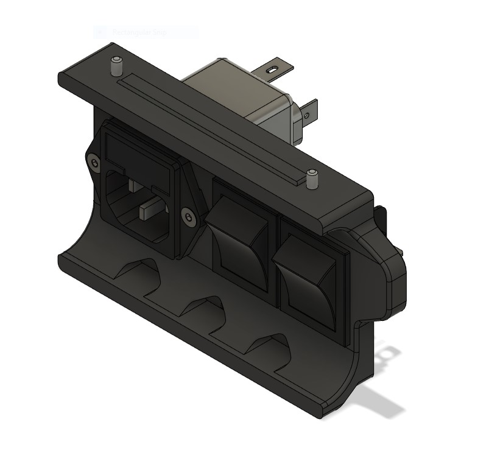

# Trident dual power switch

This is a simple mod to allow mounting two switches along side the filtered inlet, rather than one.  
The intention is to wire this so that the Raspberry Pi remains powered, even when the rest of the system is off

## Hardware
This mod only works with the filtered inlet from the sourcing guide, not any of the all-in-one options.  
It should work with any switch that works in the stock skirt, you just need 2 of them now.
