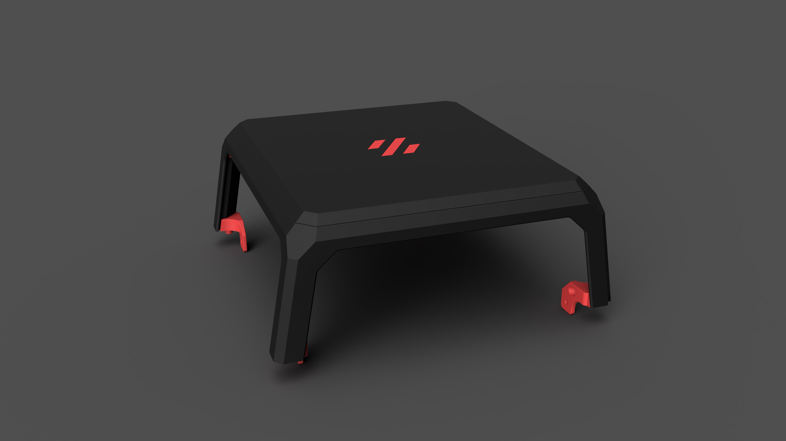
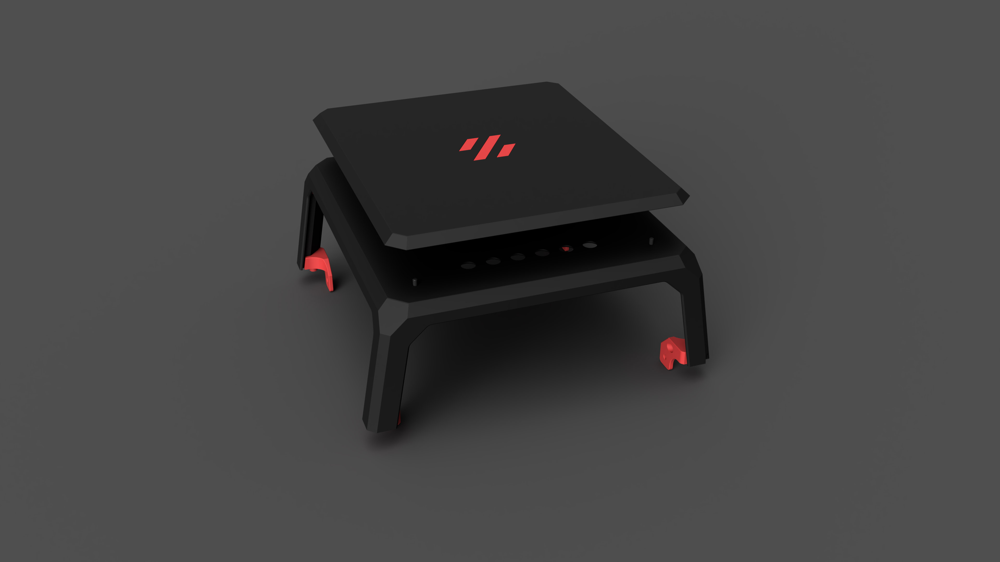
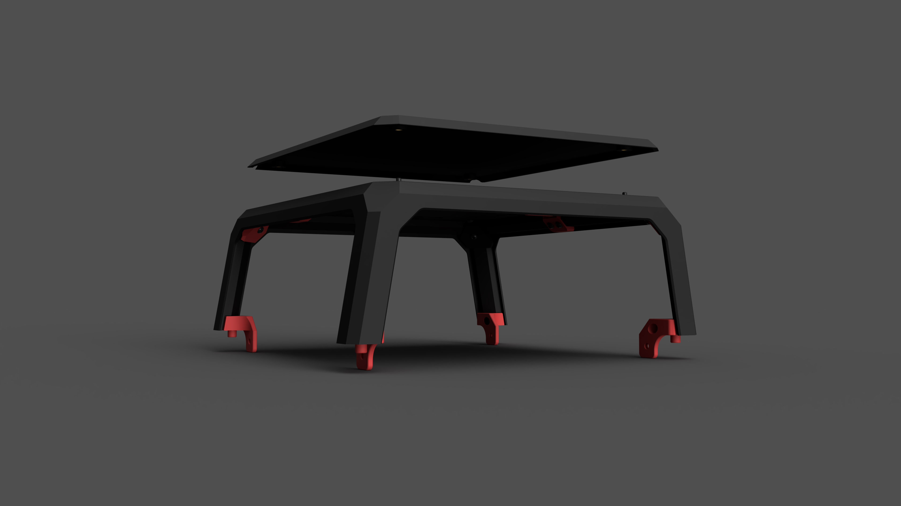
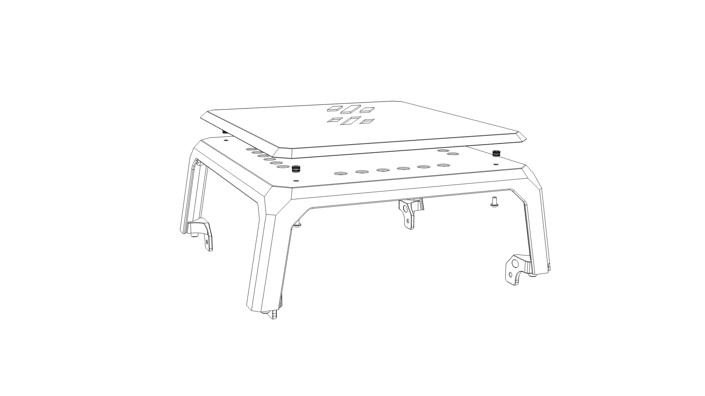
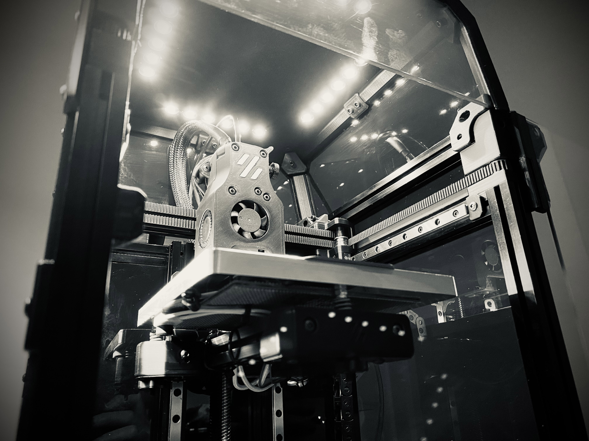

# V0.1 LED Tophat



## Printed Parts:
1. LED Tophat - Main Body
2. LED Tophat - Top Cover
3. LED Tophat - Logo Insert

## Parts:
1. 4x M3x6 BHCS
2. 4x M3x5x4 Heat Inserts
3. 24V LED Lightstrip \\\ URL: https://www.amazon.ca/gp/product/B074XCKJYB/
4. 22 AWG Wire

## Printer Config:
```
[output_pin caselight]
pin: PC9
pwm:true
shutdown_value: 0
value: 1.0
cycle_time: 0.01

[gcode_macro LEDOFF]
gcode:  SET_PIN PIN=caselight VALUE=0

[gcode_macro LEDMIN]
gcode:  SET_PIN PIN=caselight VALUE=.25

[gcode_macro LEDMAX]
gcode:  SET_PIN PIN=caselight VALUE=1
```

### Note -- I am using AC Bed with SSR. SSR output on PC12 (PWR-DET) and LED Lights are running off PC9 (BED)

## Pictures



