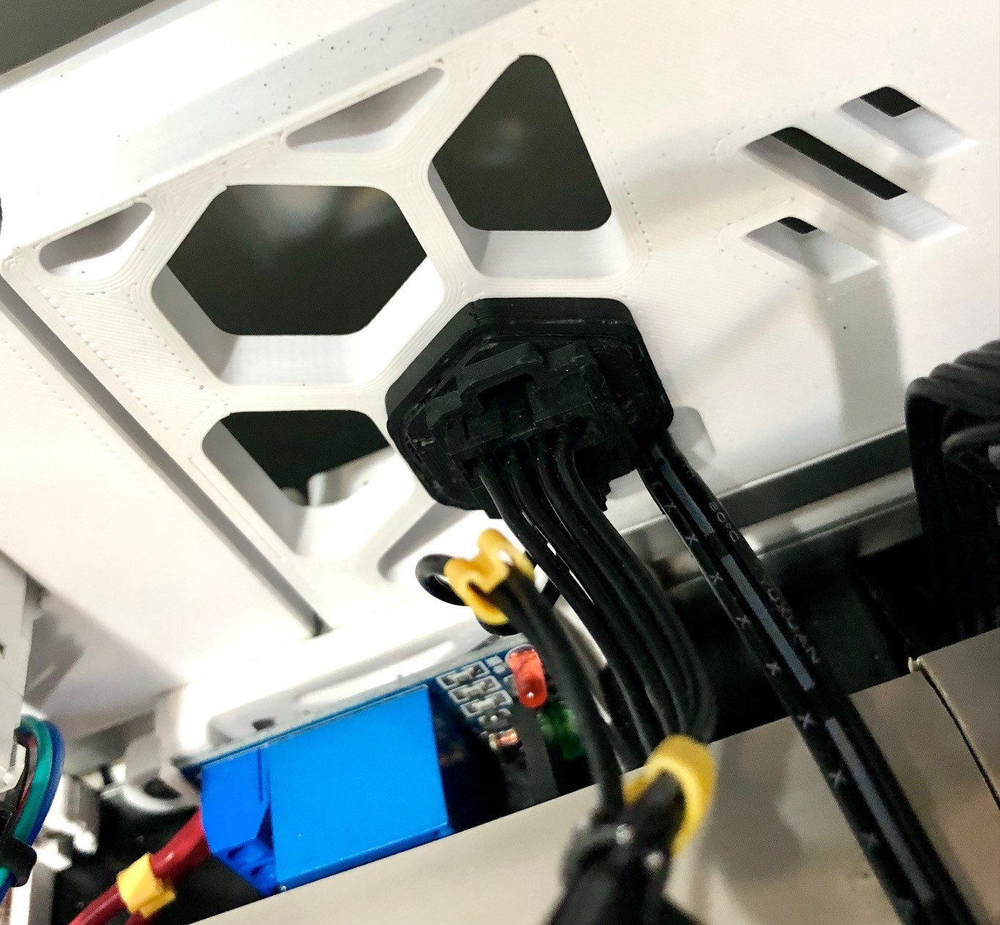
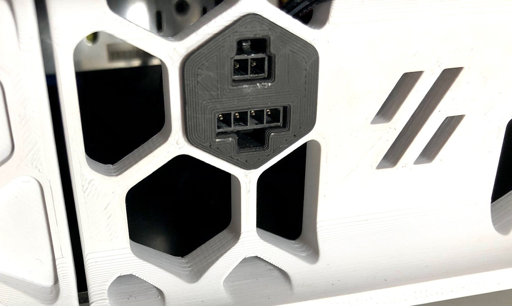

This is handful if you use external sensors, like smoke detectors or an emergency stop button.

_Back connector with microfit_

_Back connector with microfit_

It's based on an old version of this mod: https://github.com/EtteGit/EnragedRabbitProject/tree/main/usermods/Skirt-Microfit-Inserts/

### BOM
1x microfit.connector.keystone.stl (printed)\
1x lock.stl (printed)\
1x rear_center_skirt_300.stl (printed - Note)\
1x microfit 3.0 2 way connector male (for emergency button)\
1x microfit 3.0 2 way connector female\
1x microfit 3.0 4 way connector male (for emergency smoke detector)\
1x microfit 3.0 4 way connector female

**Note**: This STL is for Voron 2.4 300mm only. You will need a different size if your printer is different.
