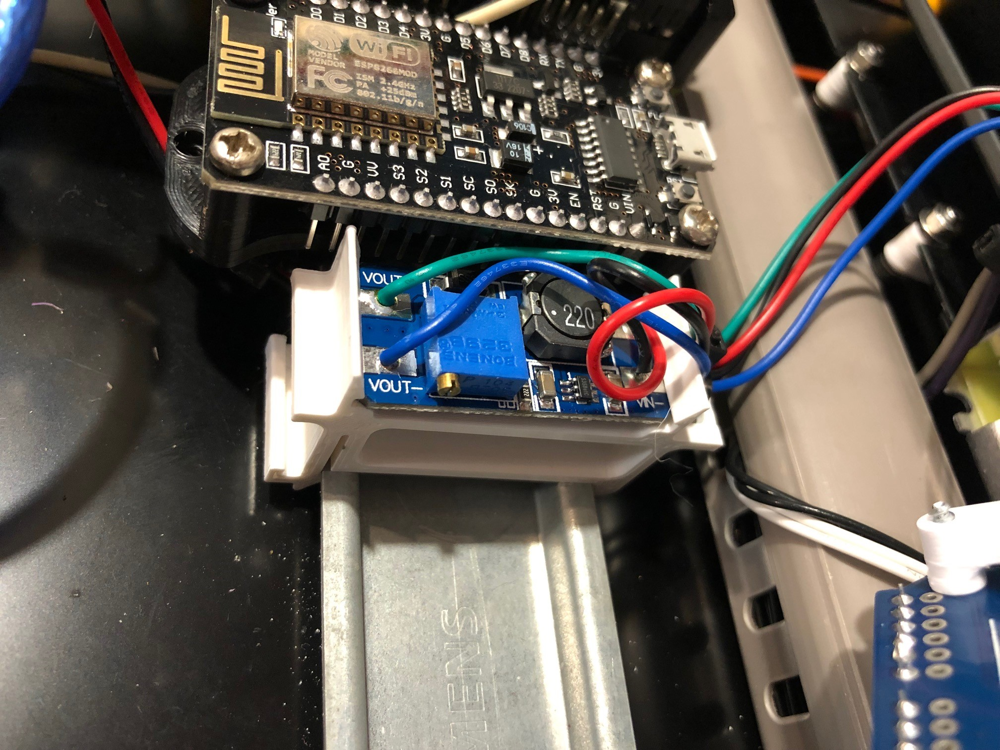

Din rail support for setp up buck converter needed for most of 12V dry contact smoke detectors.

\
_Buck converter din support_

Designed for Mt3608 (37x18 mm) boards with no screw holes.</>

<b>BOM</b>

1x buck_converter.stl (printed)\
1x Step up DC-DC buck converter ([Affiliate Link](https://s.click.aliexpress.com/e/_Ddy07Sb))
