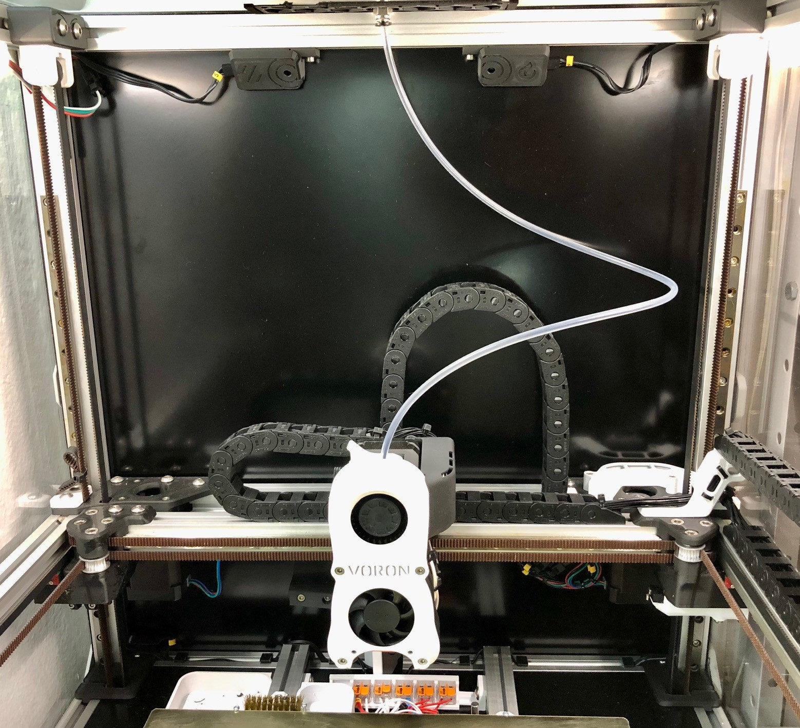
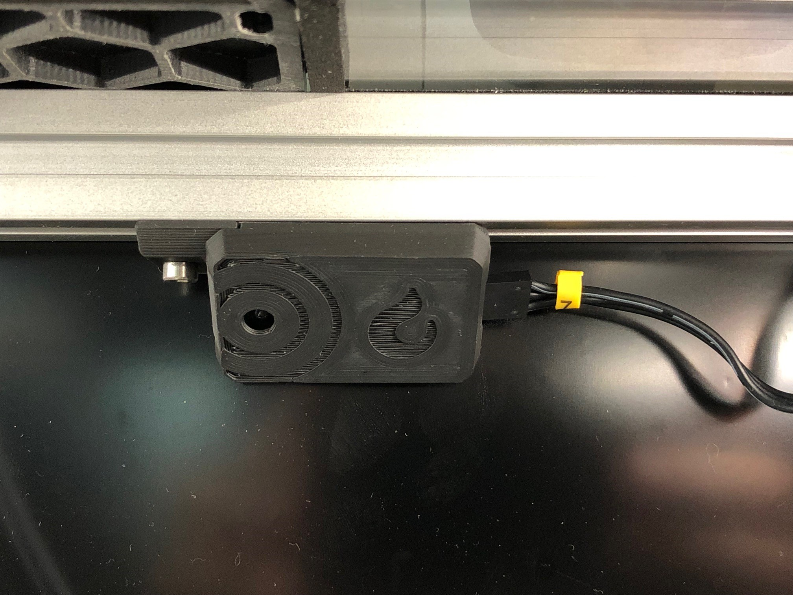
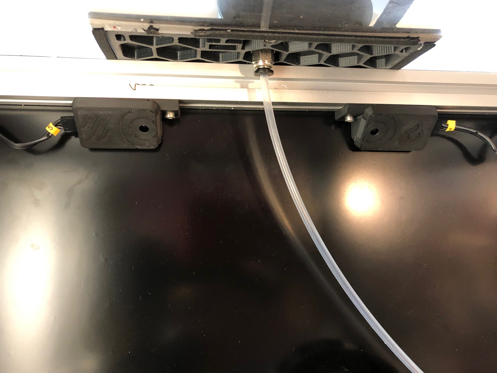

Designed to fit 20x20 extrusions and be located at the rear top of the frame.

\
_IR flame detectors recommended location_

\
_IR flame detector detail_

\
_IR flame detector assembly_

It's recommended to use 2x flame sensors due to its low reliability.

<b>BOM:</b>

1 x cover_left.stl (printed) 
1 x cover_right.stl (printed) 
2 x plug_x2.stl (printed) 
1 x support_left.stl (printed) 
1 x support_right.stl (printed) 
2 x M3 Hammerhed nuts or m3 t-nuts 
2 x M3x8 SHCS 
2 x IR sensor module * (https://www.aliexpress.com/item/1005001579535254.html) 

 * Note: You need to resolder the IR LED perpendiculary to the board

