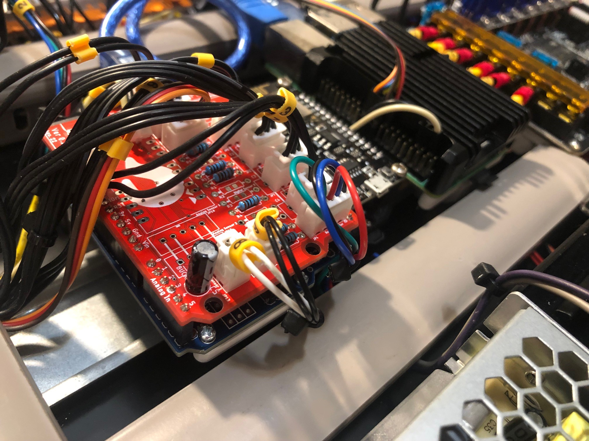

Safety Printer MCU (arduino UNO or sfety printer PCB) bracket to DIN rail in electronics bay.

\
_Safety Printer MCU_

\
_Safety Printer MCU_

<b>BOM:</b> 
1x Arduino_bracket.stl (printed) 
1x pcb_din_clip_x3.stl (printed) (https://github.com/VoronDesign/Voron-2/blob/Voron2.4/STLs/Electronics_Bay/pcb_din_clip_x3.stl) 
6x M2x10 self tapping screws 
1x Arduino UNO or Nano 
1x SafetyPrinter PCB (https://github.com/SinisterRj/SafetyPrinter/wiki/3.-Electronics) 

