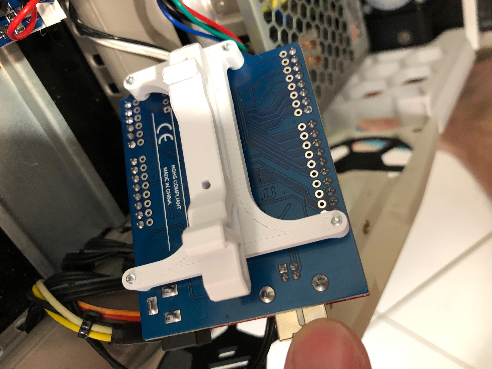

Safety Printer MCU (arduino UNO or sfety printer PCB) bracket to DIN rail in electronics bay.

_Safety Printer MCU_

_Safety Printer MCU_

### BOM:
1x arduino_bracket.stl (printed)\
1x pcb_din_clip.stl (printed) (https://github.com/VoronDesign/Voron-2/blob/Voron2.4/STLs/Electronics_Bay/pcb_din_clip_x3.stl) \
6x M2x10 self tapping screws\
1x Arduino UNO or Nano\
1x SafetyPrinter PCB (https://github.com/SinisterRj/SafetyPrinter/wiki/3.-Electronics)
