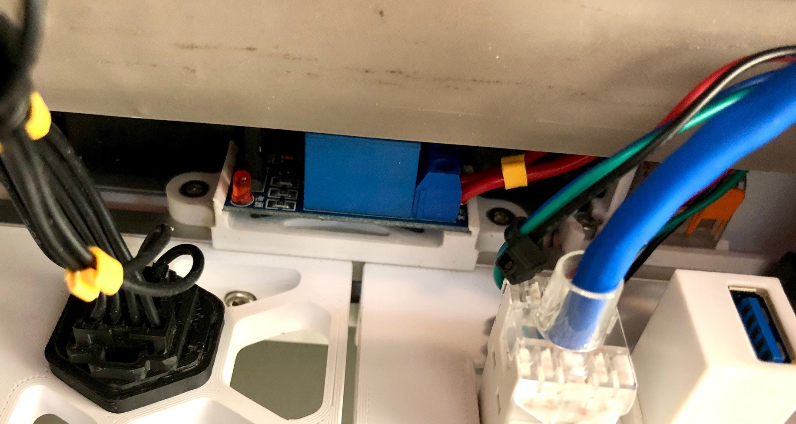
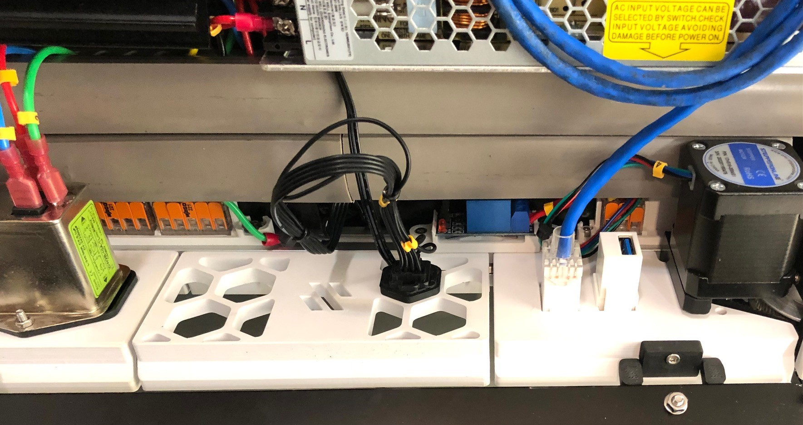

Designed to 1 way 5v electromechanic relay board with 18x43 mm.

This relay was designed to be screwed in the 20x20 extrusions, on the electronics bay, near the power inlet.

\
_Relay detail_

\
_Relay recommended assembly position_

<b>BOM</b>

1x 5v relay board (https://pt.aliexpress.com/item/32649659086.html?gatewayAdapt=glo2bra) 
1x relay_support.stl (printed) 
2x M3 hammerhead nut or t-nuts 
2x M3x8 SHCS screws 
