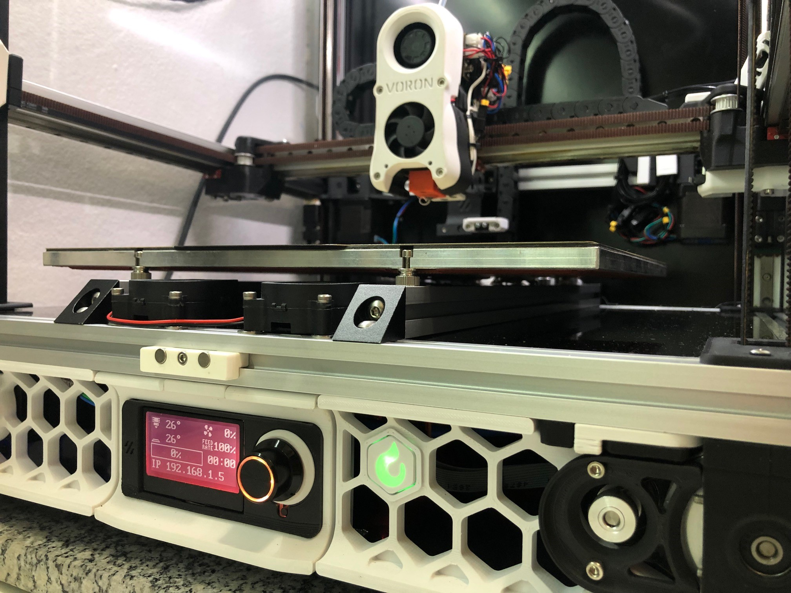

A reset button with a RGB status led to be attached to the skirt os your printer.

_Reset button with status LED detail_

Its based on someone work, but i lost track from where I found it. If you are the original creator of this mod or knows who is, please send me a message to help me to include the proper credits here.

### BOM:

1 x base.stl (printed)\
1 x [o]cover_safety_printer_snapon.stl (printed in a opaque filament)\
1 x LED_holder.stl (printed)\
1 x lock.stl (printed)\
1 x [c]shade_pressfit.stl (printed in translucent filament)\
1 x Omron Romer-G switch\
1 x NeoPixel RGBW Mini Button PCB ([Affiliate link](https://s.click.aliexpress.com/e/_DDmimzN))
