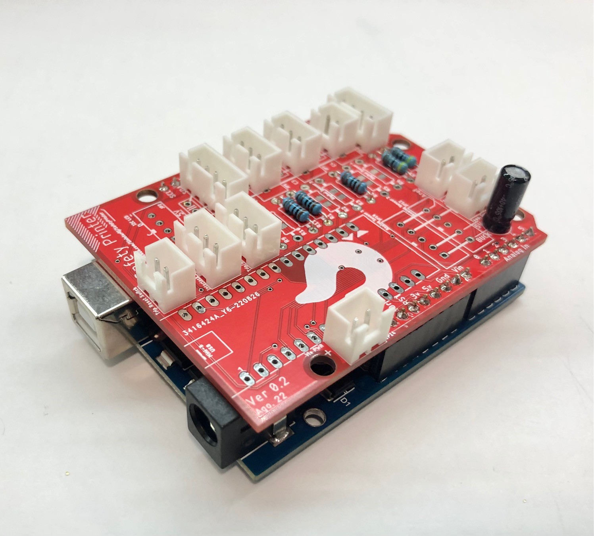

# SafetyPrinter Mod
[Safety Printer](https://github.com/SinisterRj/SafetyPrinter) is a great project to improve the safety of your printer. The project aims to improve the safety of 3D FDM Printers by adding an external MCU (an Arduino) which increases your chance of preventing or mitigating a fire at your home. 

This mod includes all 3D parts to be printed to assemble the Safety Printer MCU and its sensors to a Voron 2.4 printer.

More information about the project can be found at:
[https://github.com/SinisterRj/SafetyPrinter/wiki](https://github.com/SinisterRj/SafetyPrinter/wiki)

_Safety Printer MCU assembly_

_Safety Printer MCU assembled on electronics bay_

_Reset button with status LED detail_
