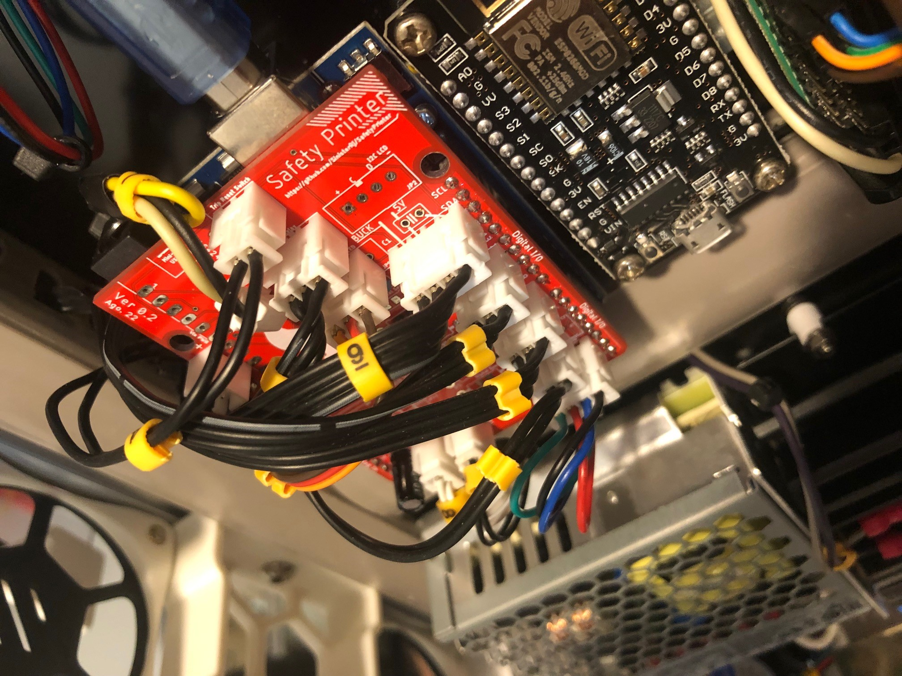

[Safety Printer](https://github.com/SinisterRj/SafetyPrinter) is a great project to improve the safety of your printer. 

This mod includes all 3D parts to be printed to assemble the Safety Printer MCU and its sensors to a Voron 2.4 printer.

\
_Safety Printer MCU assembly_

\
_Safety Printer MCU assembled on electronics bay_

\
_Reset button with status LED detail_

More information about the project can be found at:
https://github.com/SinisterRj/SafetyPrinter
