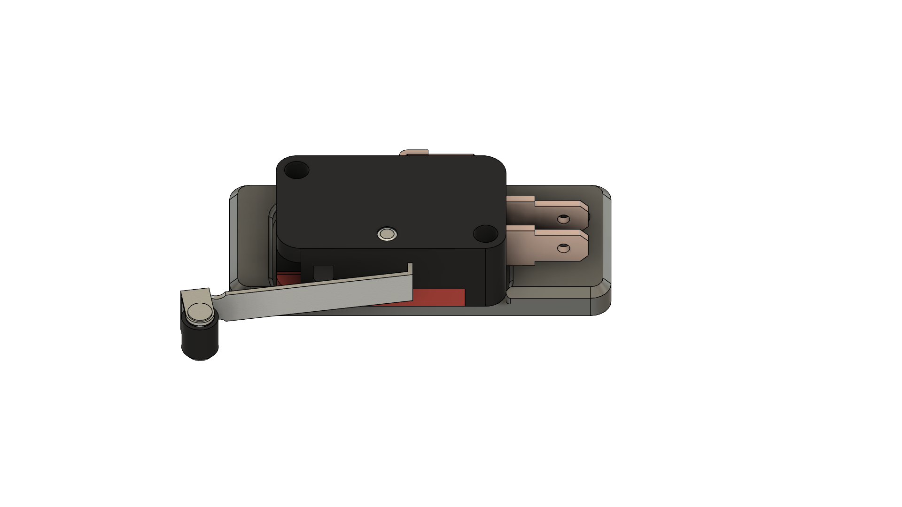
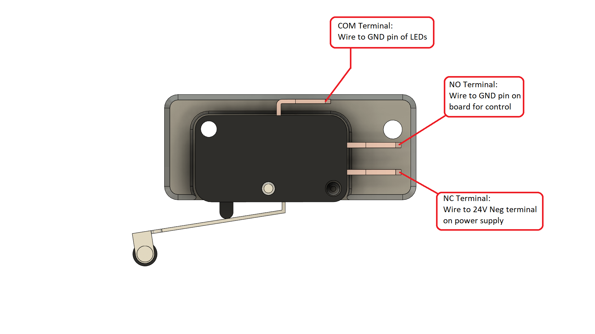
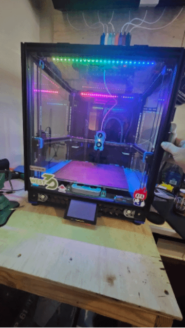
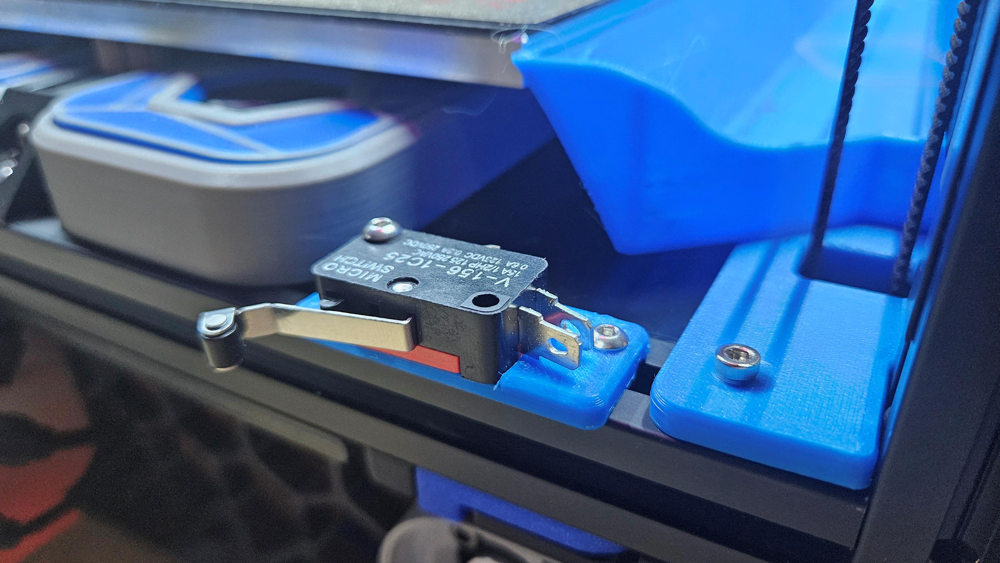
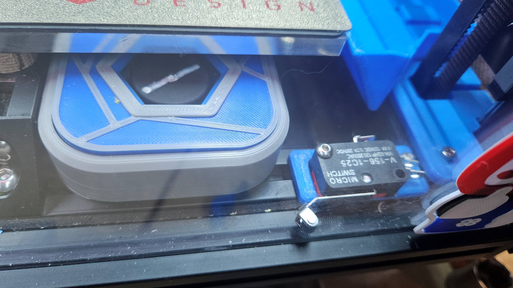
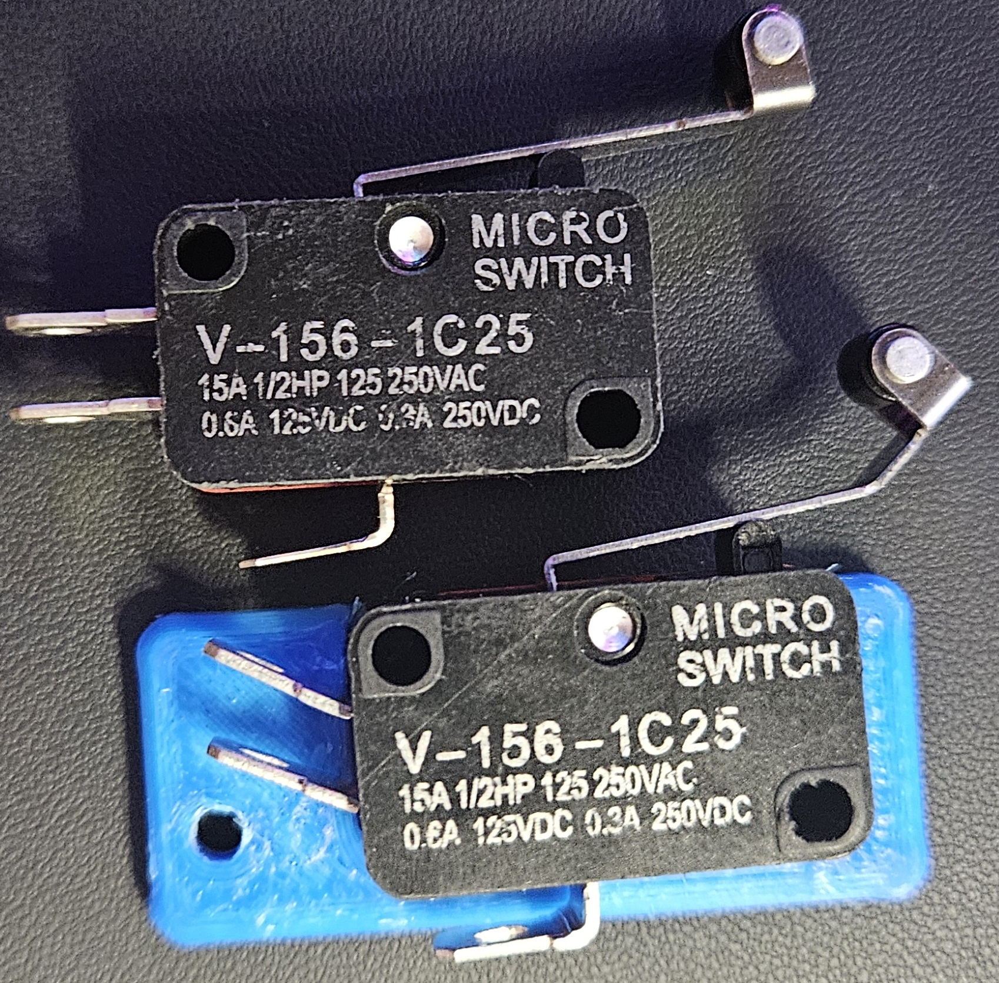
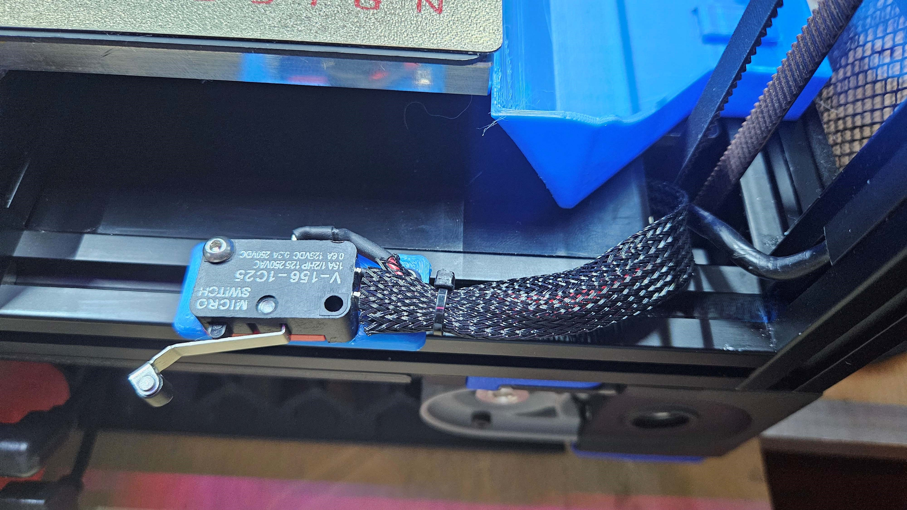

# Voron Fridge Door Light Switch

Fridges have lights right?  They turn on when you open the doors…I wanted my Fridge door mod on my Voron 2.4 to behave the same way.  

I've got two RGB led bars that are completely independent of this and are powered by 5v from the board, then I've got 2 pure white led bars that are hooked up to a spare hot end port and receive 24v from the board. These are dimmable by the software and I set them to default to 10% when the printer turns on. But I wanted them to get brighter when opening the door, so…here's my solution to that.

 
 
 
 
 

## What you'll need:

V-156-1C25 Micro switch

White LED bars

Some wire I used 16ga since we're carrying 24 volts to 50 LEDs

A Voron 2.4 or Trident with the fridge door mod

M3x14 and an M3x10 as well as two M3 hammer head nuts or T-nuts

## Printing

Use standard voron print settings. 4 walls, 5 top & bottom laters, 40% infill.
 

## Steps:

Print off the STL in this model

Then solder and heatshrink some wires to your micro switch.  We're going to be controlling the ground pin on the LED's so use Black if you want.
There should be a diagram on the back of your micro switch, the COM terminal will run to the LED's, the NC will run to your 24V- (gnd) on your power supply, and the NO terminal will run to your ground pin on the board for your LED brightness control. (See diagram in pictures)
It is worth mentioning, that I also had to bend the two lower terminals on the microswitch so that they didn't come in contact with the screw on the mount

Once you have the switch mounted and wires ran, you'll notice that the door doesn't compress the switch to allow the board to control the LEDs,
to fix this, you'll need to bend the end of the switch out and test it to see if the door activates the switch.

There you go, tuck your wiring away from the belt, ensure everything is protected from shorting out, and you're good to go.  Your printer will now go full bright whenever you open the door!

