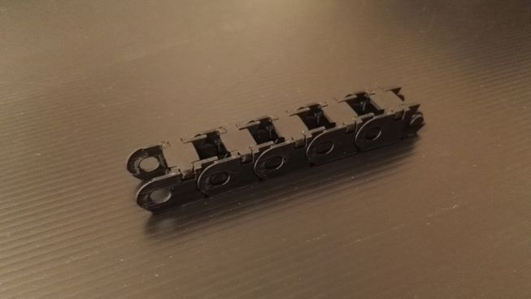
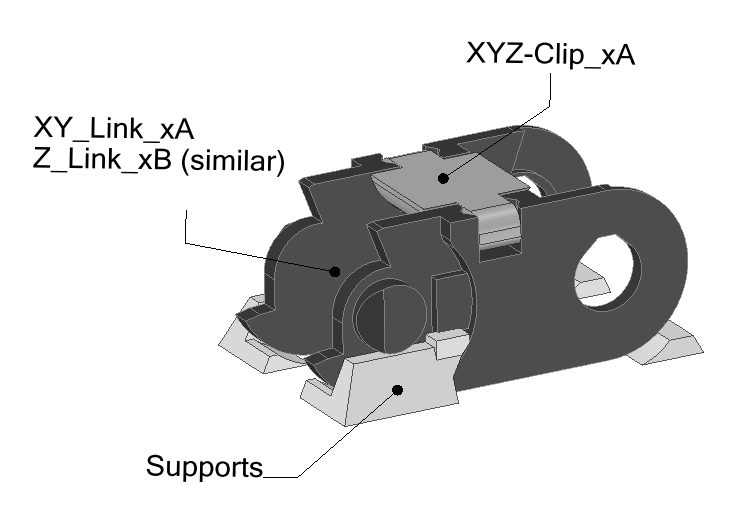
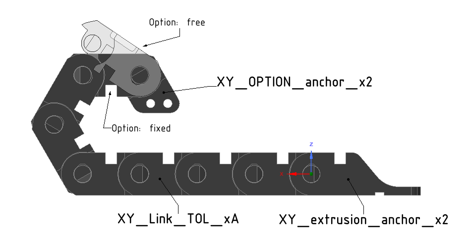
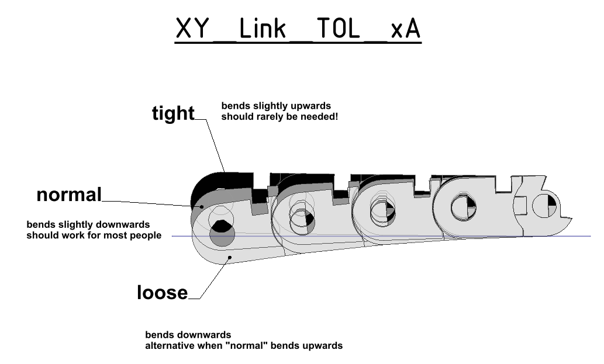
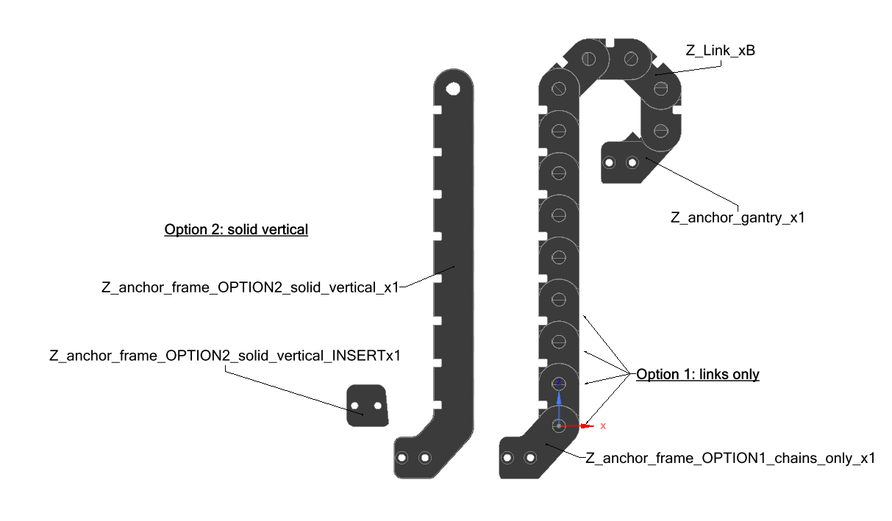

  

--------------------------------------------------------------------------------
What it is:
--------------------------------------------------------------------------------
- A custom energy chain for x/y and z axis meant to be used for Voron 2.2 & 2.4
- sometimes called 'PanzerChain'
- (Afterburner files available on request)

--------------------------------------------------------------------------------
What it is not:
--------------------------------------------------------------------------------
- an identical replacement for IGUS chain E2i.10.10.018 on XY-axis
- ...nor for the E2.15.10.028 IGUS chain on Z-axis
- a component tested for wire protection
  o 3 months of mild printing at estimated 20-30h per week:
     + no failure so far with heluflon wires
	 + chain got a little smoother
- a chain with seperate compartments for wire organization

--------------------------------------------------------------------------------
When to use?
--------------------------------------------------------------------------------
- you like to print your own stuff :-)
- you like accessible/openable links for easy maintenance
- you prefer accent colors (see folder 'themes' for ideas)
- you want save some money (it´s not a lot! Go for Igus if in doubt or some
  alternative cheap Ali-stuff)
- you don´t want to wait for your order to arrive
- you don´t like tape chains (wire failure) or zip chains (fiddly)
- you don´t care about
  o extreme noise reduction
  o a not perfect bending radius
  o or any other shortcomings due to additive manifacturing

--------------------------------------------------------------------------------
Printing Requirements:
--------------------------------------------------------------------------------
- Do A TEST PRINT OF 3-4 XY-LINKS PER TOLERANCE FIRST
  o CHECK FOR LAYER ADHESION
  o CHECK which tolerance version fits your printer filament/temperature best:
     XY_Link_tight_xA: might have slight upwards bending
     XY_Link_normal_xA: should be pretty flat (should work for most ppl!)
     XY_Link_loose_xA: should bend downwards

     If really necessary you might combine the versions in an alternating way:
     (e.g.: normal,loose,normal,loose and so on).
- esun ABS+:  feel free to experiment, but don´t blame me!
  (PETG seems to be okay or even superior based on user feedback)
- 0.2mm layer height incl. first layer:
  part is designed to be printed only with this height!
- no supports: required supports are already incorporated and easy to remove

--------------------------------------------------------------------------------
Printing Tipps:
--------------------------------------------------------------------------------
- check your slicer preview: all walls need to be filled as much as possible:
  no gaps allowed.
- tested at roughly 40mm/s - 60mm/s print speed (innerand outer shells)
  --> if in doubt: go slower 25-30mm/s should work fine!
- at least 2 links per print for cooling time or slower speed
- good layer adhesion: print slower and/or with higher temp if necessary
- Pressure Advance should be calibrated to allow for smoother kinematics
  (for example refer to Klipper documentation:
    https://github.com/KevinOConnor/klipper/blob/master/docs/Pressure_Advance.md)

--------------------------------------------------------------------------------
Assembly:
--------------------------------------------------------------------------------

  

  

  

  

- remove supports by bending the support UPWARDS. This is important, as it
  influences downwards bending of chain
- pinch the male link side with the pegs into the female side of the next link
- snap the links together without using the link clips: else the assembly
  is too stiff

Required Links/Clips:
- "A"x Links for X or Y-Direction:
  You need 17 links for a Voron 250mm plus three additional links per 50mm
  for X and the same amount for Y
  o <250 mm²: not defined
  o  250 mm²: 17 links + spare
  o  300 mm²: 20 links + spare
  o  350 mm²: 23 links + spare
  o >350 mm²: not defined

- 'B'x Links for Z Direction:
  o <250 mm²: not defined
  o 250 mm²: 22 links (option solid vertical: 14 )
  o 300 mm²: 25 links (option solid vertical: 15 )
  o 350 mm²: 28 links (option solid vertical: 16 )
  o >350 mm²: not defined

- you will need Clips C = 2*A+B + spare
  o use option 1 as tight clips
  o or option 2 which should be easier to open (marked with a dot)

- please print 2-3 spare links and clips

Please provide feedback via discord:
Slidr#4412
#landofschnitzel-DE

--------------------------------------------------------------------------------
UPDATES
--------------------------------------------------------------------------------
2020-04-12: release 4
- added chain ends for V2.4 as BETA (bowden and direct drive, feedback needed)
- sorted file structure by Voron revision (currently supported 2.2, 2.2 with Afterburner Beta, 2.4)
- z chain solid vertical
  o added sizes 150 and 200
- added image folder gallery_printer_examples: [discord user]_[filament].[jpg|png|...]
- added xyz clip options
  o XYZ-Clip_Option1_Tight_xA1: default tight clipping behaviour for normal safe usage
  o XYZ-Clip_Option2_EasyOpen_xA1: easer to open on one side for those "rewiring guys" out there
    (might become default but it is untested)
- changed XY_anchor
  o Voron 2.2:
    + split in half for less destructive assembly
    + correct some minor errors
- updated printing tips: USE PA!
- renamed SlidrChain to its street name Panzerchain (credits to Calozor)

2020-01-24: release 3 (on github soonish)
- added XY-Link tolerances: XY_Link_TOL_xA where
  TOL = loose (chain should bend downwards)
  TOL = normal (chain should be pretty straight)
  TOL = tight (chain bends upwards, previously default)
- added explanation picture for XY-Link tolerance

2020-01-19: release 2 (not on github)
- reduced some tolerances of pegs
- tested at 60mm/s printspeed: Fine on Voron 2.1
- moved all supports below rounds at bed 0.1mm to the part for better
  surface quality and less sagging
- minor readme correction
- naming correction at z chain: mixed up 'frame' / 'gantry'

2020-01-18: release 1 on github (not yet approved)
- added solid vertical z-chain for common Voron sizes
- decreased XY-chain end hole diameter to be tight enough for screws

2020-01-15: PreRelease 4
- Tweaked some Tolerances for easyer print (chain is a little wobblier now,
  but should resolve several issues)
- Added thicker outer walls (increases footprint, but still smaller chan zipchain)
- Planned for PreRelease5 (hopefully the last one before release):
  o Z: Solid Vertical Part

2020-01-14: PreRelease 3
- Added Z-Chain (Link, Connection to Frame and Gantry)
- Added Subfolders for Clarity
- Renamed Files with XY/Z/XYZ-Prefix depending on Purpose

2020-01-11: PreRelease 2b
- Fixed an error with extrusion_anchor

2020-01-11: PreRelease 2
- Added more supports to reduce inaccuracy due to sagging
- Corrected Bending Radius: more like to be 18 instead of 19mm
- Slightly increased Hole Diameter to reduce layer seperation due to
  forcing pegs into the holes
- Added proper ends based of Voron zip chain