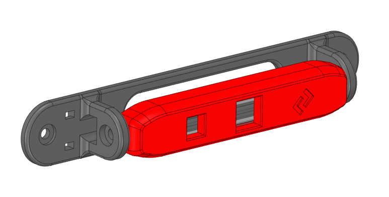

  

What is PanzerObserver?
- A mount for the Waveshare 15301 OV5648 5MP USB Camera
- ...to mount it on the upper front extrusion above the doors (and probably on the back gantry extrusion)

Why do they exist?
- i ran out of cheap Logitech C270 and needed a mount for that new cam... yeah that is it.

What do i need to build it?
- Waveshare 15301 OV5648 5MP USB Camera (A)
  - german source: https://www.welectron.com/Waveshare-15301-OV5648-5MP-USB-Camera-A
- 4x M3x8 Socket Head Screws
- 2x M3 Heat Inserts (low profile)
- Printed Parts

How do i install PanzerObserver?
- In Order:
  - Insert heat inserts to the sides of Body_x1.stl
  - Pull USB Cable through side of Mount_x1.stl
  - Pull USB Cable through Body_x1.stl from back to front
  - Plug USB Cable into Camera
  - Press Camera into Body_x1.stl
  - Fit Cover_x1.stl over Body_x1.stl and Camera
  - Clamp assembly into Mount_x1.stl and screw the screws in (first side tight, second slightly loose)
  - Move the camera up and down a few times, retighten the screws and make sure the cable sits well
  - zip tie the cable in place
  - Mount everything into your Voron with the remaining two screws.  
 
 Enjoy!