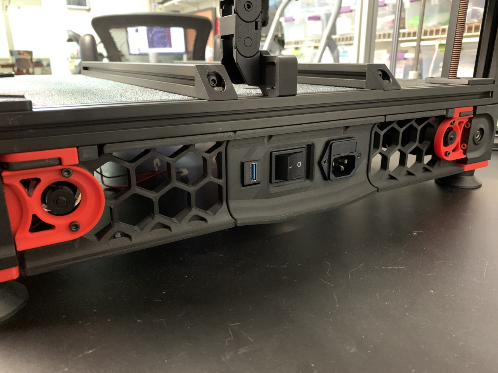

<B>Add a Keystone Jack to the Filtered Mains Panel</B>

Modified rear skirt files necessary to add a keystone jack to your filtered mains plug panel.  

Files provided for 250, 300, 320 and 350mm builds.

Print the panel along with rear_skirt a and b that corresponds with your build size.

