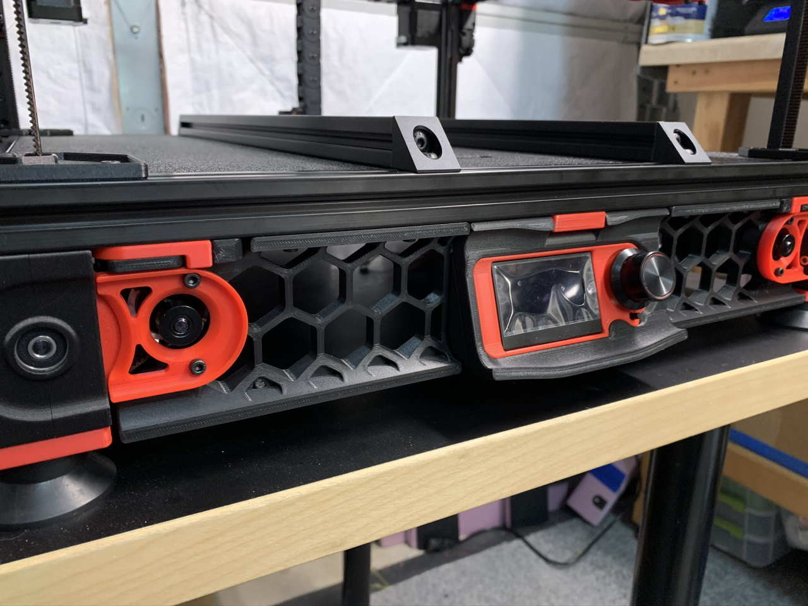
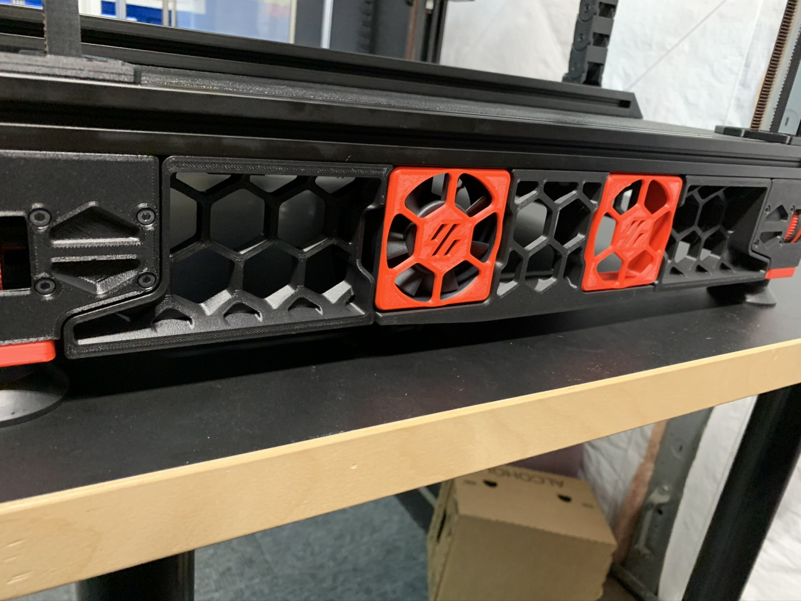
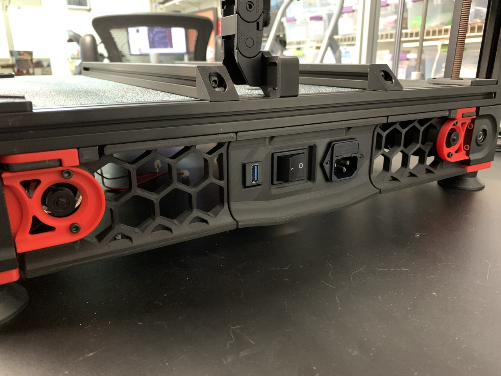

<B>Voron 2.4 Bottom Skirts for a 320mm build frame.</B>

These bottom skirts have been modified to fit a 320mm build (frame footprint of 480mm x 480mm).

If you use the standard rear plug panels (filtered mains or regular) then print the skirts as provided.

However, if you want to add a keystone jack to the filtered mains rear panel then print one each of the front skirt and head over to my other [mod for the rear skirts.](../Keystone_Jack_Filtered_Mains_Panel)

Front View (the awesome accented front panel by <a href="https://github.com/VoronDesign/VoronUsers/tree/master/printer_mods/mjoaris/Mini12864_LCD_Mount_for_V2.4">Mjoaris</a> is shown but this works with the standard panel as well)

Side View

Rear View

