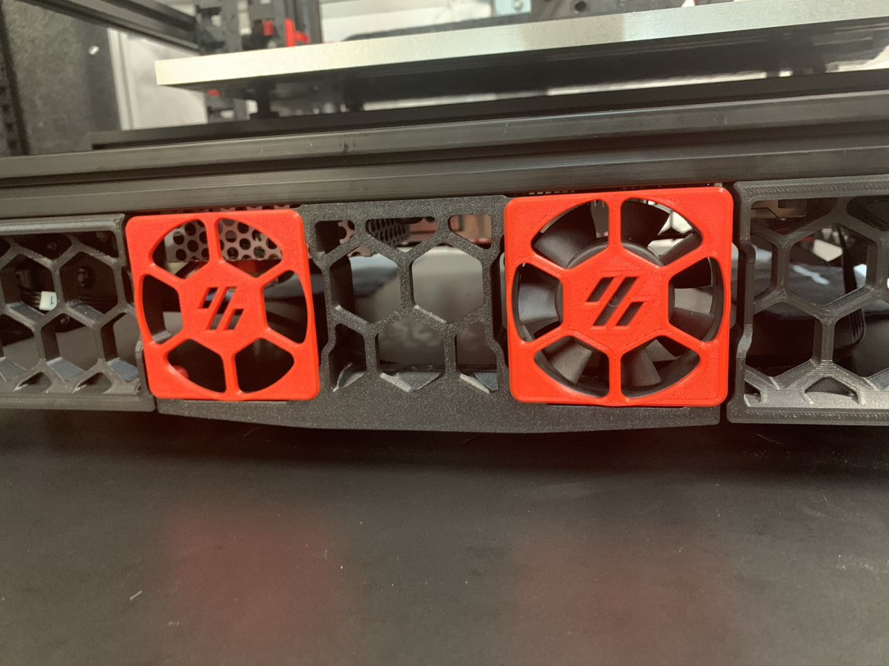
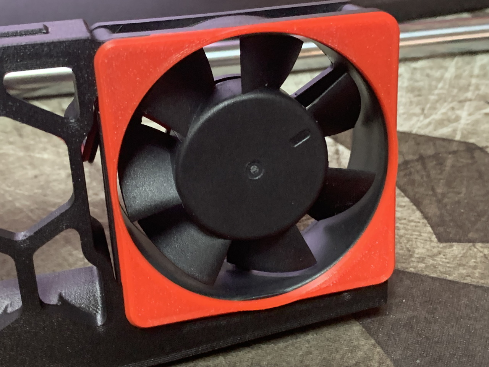
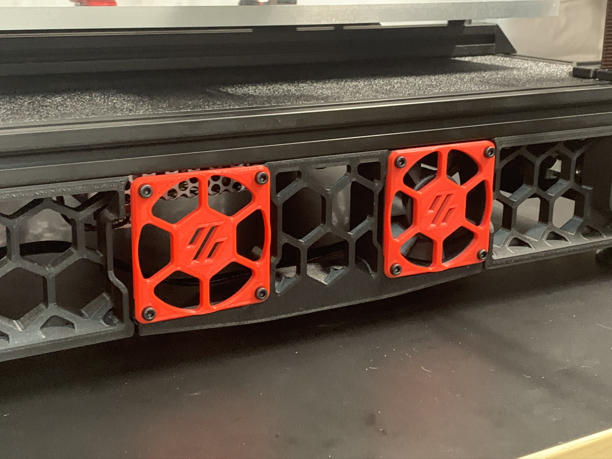
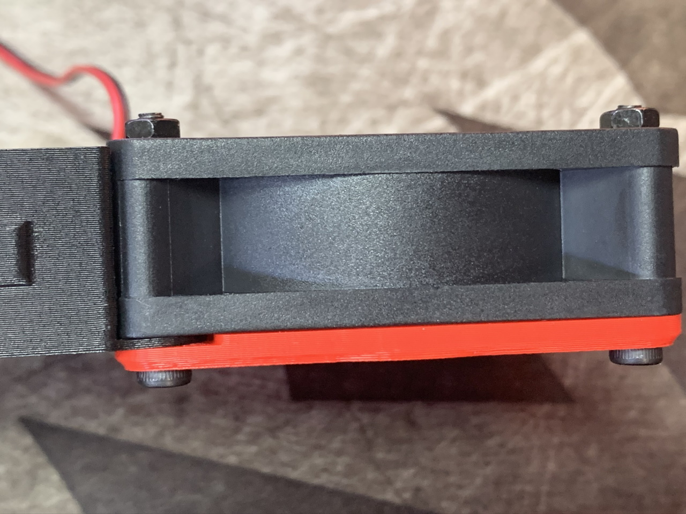
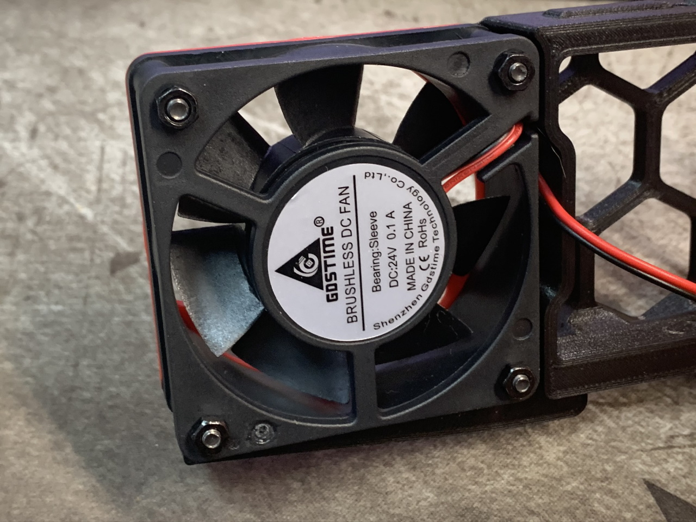
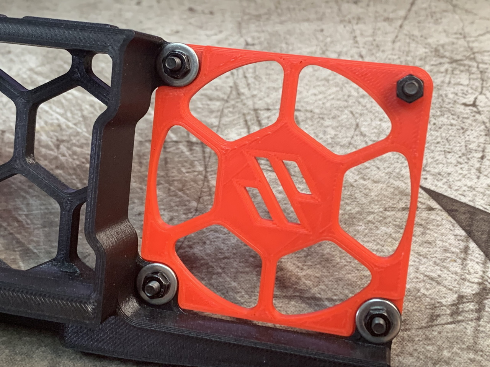
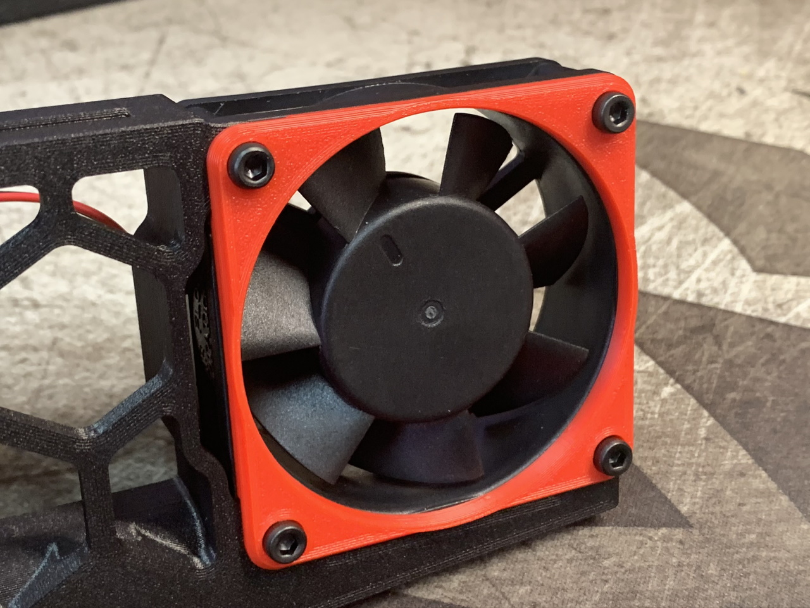

<B>Side Fan Supports with Integrated Fan Mounting</B>

Without deviating from the original design this is what I came up with as an alternative to mounting the side fans with tape. 

Instructions for flush front using M2 hardware: 
Hardware required: 4x M2x16mm screws per fan and 3x M2x6mm per blank insert.

To mount a 60mm fan sandwich the mounting tabs on the side_fan_support between the fan_grill and fan.  Note the orientation of the grill, there are recesses for the mounting tabs.  Use fan_grill_washer with M2x16mm screws to secure the fan in place.  Take care not to overtighten or it will strip. Warning, these do break easily, I'd rather avoid using through bolts instead.  If you are gentle, this works. :)

To mount a blank insert sandwich the mounting tabs between the 60mm_fan_grill and fan_grill_retainer using M2x6mm screws.

60mm_fan_emptygrill provided for those who prefer an unobstructed fan.

Instructions for more sturdy install using M3 hardware: 
Hardware required: 4x M3x25mm screw and 4x M3 hex nuts per fan and 4x M3x6mm screw, 3x M5 washer or 1mm shim, and 4x M3 hex nut per insert.

To mount a 60mm fan sandwich the mounting tabs on the side_fan_support between the 60mm_fan_grill_M3 and fan.  Note the orientation of the grill, there are recesses for the mounting tabs.  Use either a socket head or button head M3x25mm screw and M3 hex nut to hold in place.  Take care that the grill sets into the holes in the fan.

To mount a blank insert sandwich the mounting tabs between the 60mm_fan_grill_M3 and an M5 washer or 1mm shim using either a socket head or button head M3x6mm screw and M3 hex nut.  If you use a washer it may be necessary to use two depending on how thick they are.

60mm_fan_emptygrill_M3 provided for those who prefer an unobstructed fan.

<b>Note:</b> For those using the bottom panel a very slight trimming may be necessary around the fan locations.  They are shifted over by 1mm so depending on how well your panels fit it may or may not be necessary.
