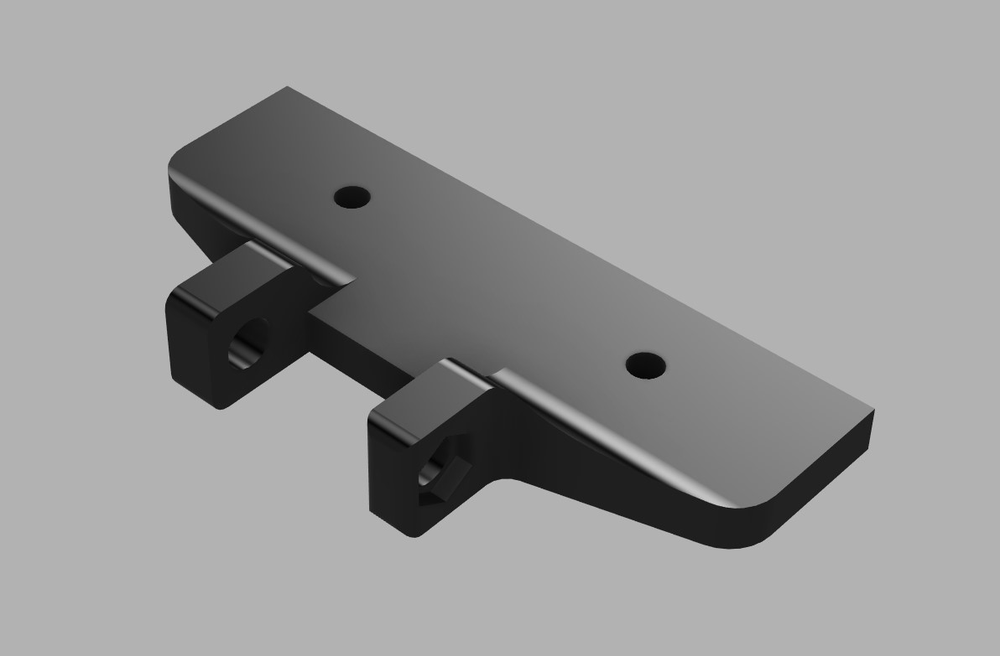

This is my contribution to the awesome Voron Community!

It's a camera mount for a WANSVIEW 1080p USB Camera.
The distance between the screw holes is 15mm so if you have a camera that has this kind of mounting solution then it might work out for you

Items needed:
* 2 M3x8 Bolts
* 2 M3 Slide-in Nuts / T-nuts

Assembly:
1. Print part
2. Remove stock mount from camera
3. Install camera on mount
4. Put nuts into the frame slots
5. Screw on the mount
6. Route the wire through the frame
7. Plug into RPi
8. Enjoy!
