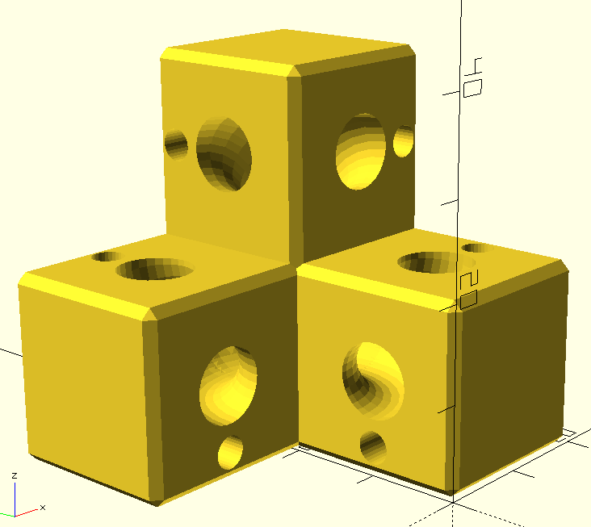
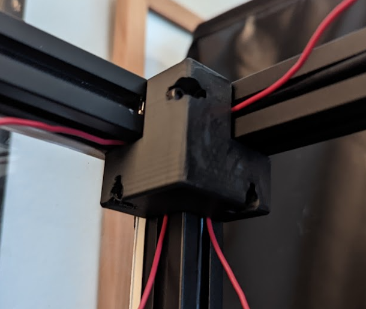

Purpose:
I love to run as many wires as I can through my 2020 extrusion channels, and sometimes I need to route the wires around corners.  Rather than having the wires visible at the corner, I made a piece that "merges" the channels, giving you a way to route wires through the piece from the channel on one extrusion face to any other internal face on the joint.

Why:
Purely for aesthetics, this mod doesn't really serve a functional purpose.  I guess it could be claimed that exposed wires are more likely to be damaged, and the strain from jumping from channel to channel, unsupported, could be a failure point.  That's a long shot though.

BOM:

* m3 x 16
* Your choice of m3 hammer nut or m3roll in t nut

How:

There is a mount hole to match up with every face in the corner, so you can pick which one you use.  Note that the one you use will probably be blocked off from feeding wires through.  Since this is not a structural piece, you should be fine with just one mount point.

Compatibility:  

The 2020 version is tested to work with any 2020 blind joints.  The 1515 version is just a .75 scaled version of the 2020, so you may need to do some adjusting with a drill to get the m3 screws seated.

I welcome requests for changes or enhancements, ping me in Discord!