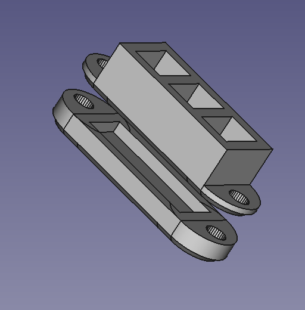
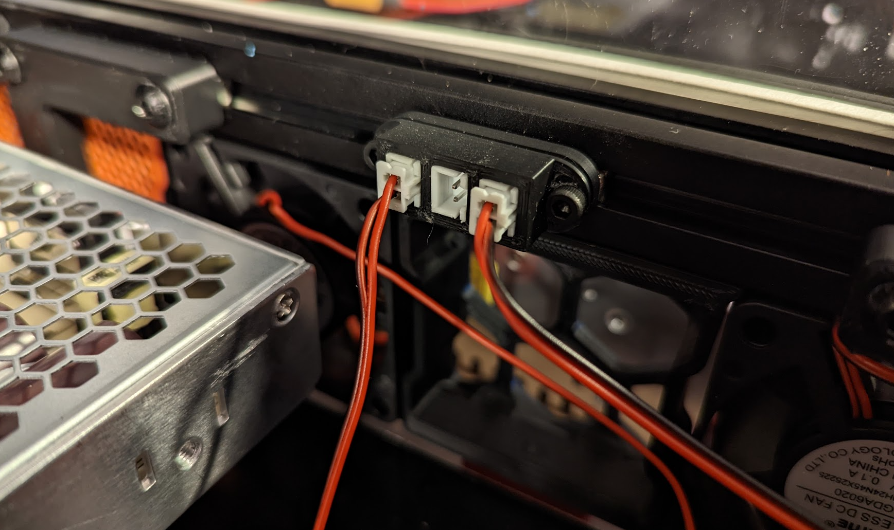
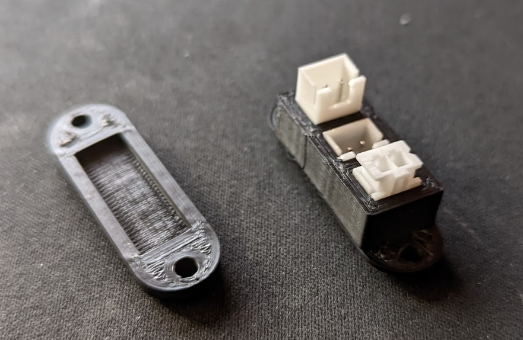
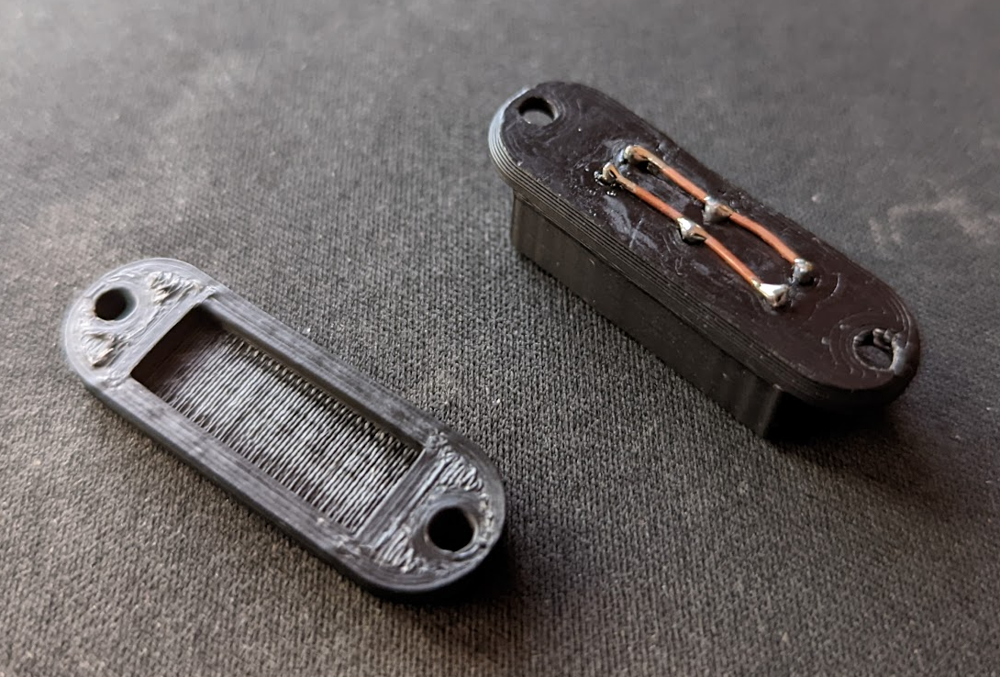

# Case Fan Splicer

**Purpose:**

An alternative to a PCB for wiring 2 pin JST-XH connectors in parallel.

**Why:**

Didn't feel like waiting for a PCB to be made and shipped to me, and I'd likely end up making a container for the PCB to go into anyways.

**BOM:**

* 2x m3 x 12-ish
* 2x Your choice of m3 hammer nut or m3roll in t nut
* 3 JST-XH female connectors

**How:**

The connectors should fit just barely into the holes, you may need to use pliars to fully seat them.  They won't be going anywhere.  

Then, just solder wires parallel down the pins.

Mount with m3 SHCS and your choice of extrusion nuts.

**Printing:**

Use standard Voron part settings

I welcome requests for changes or enhancements, ping me in Discord!