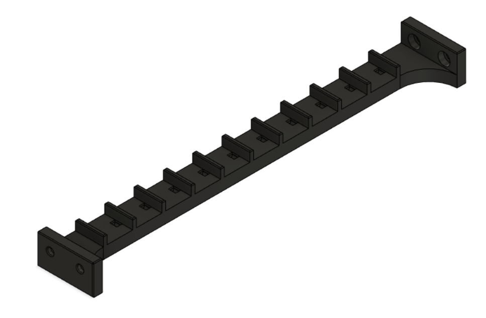
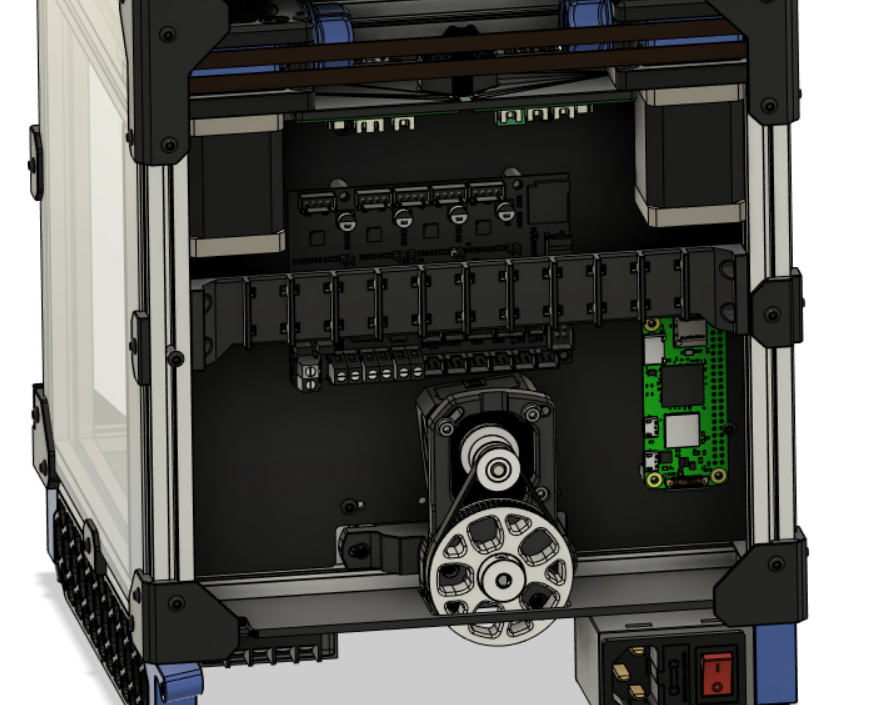
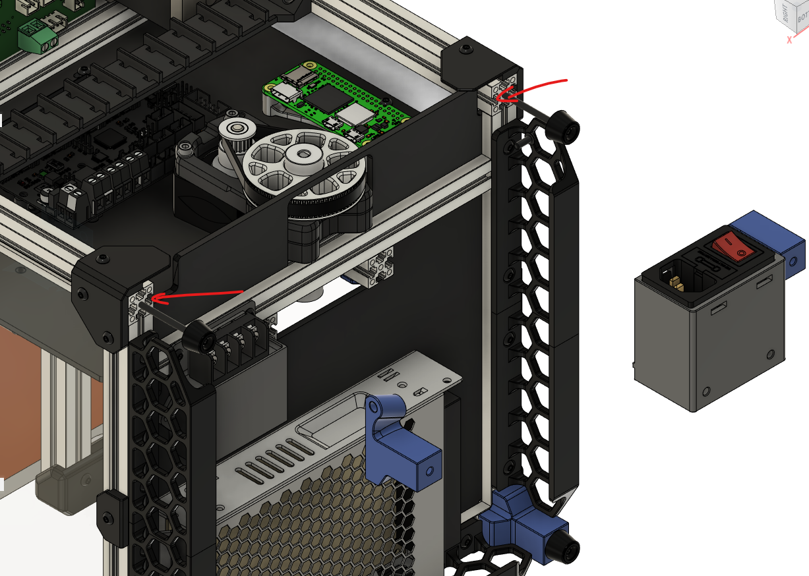
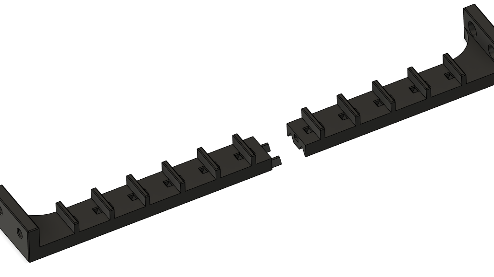
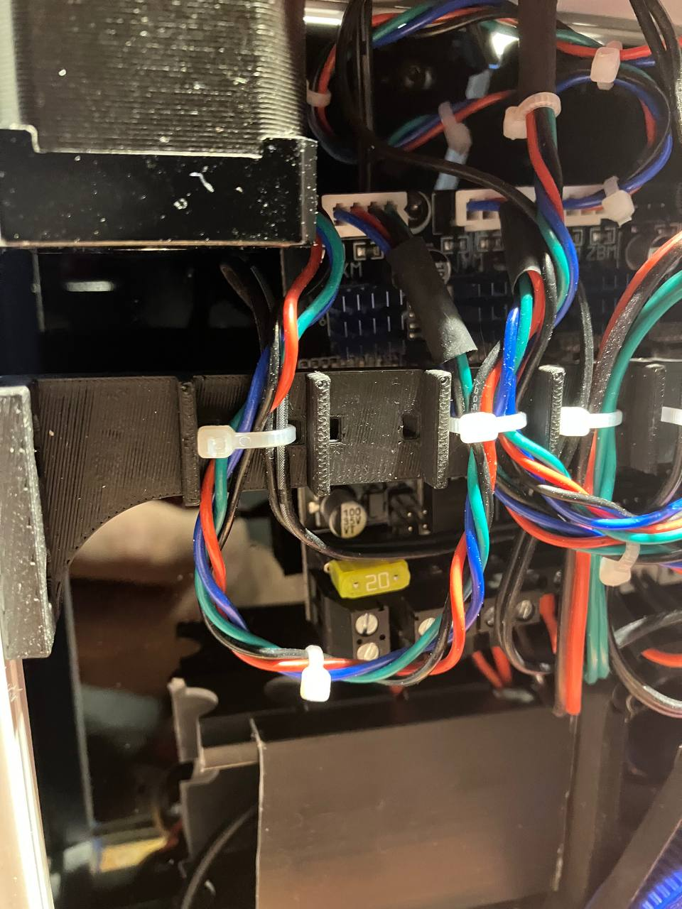
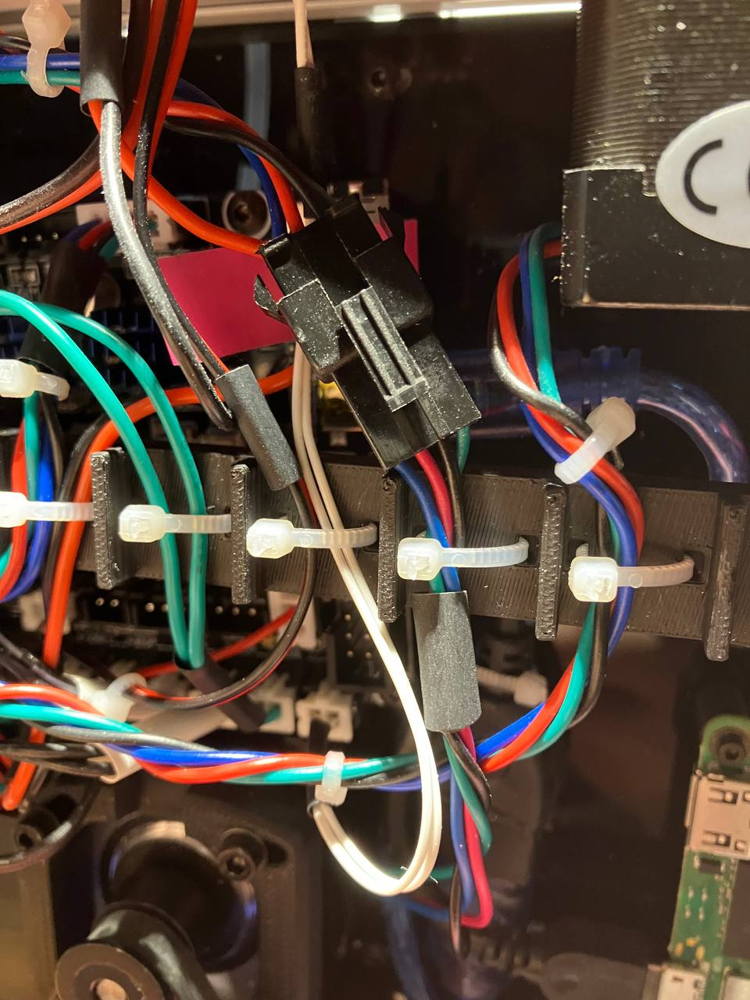
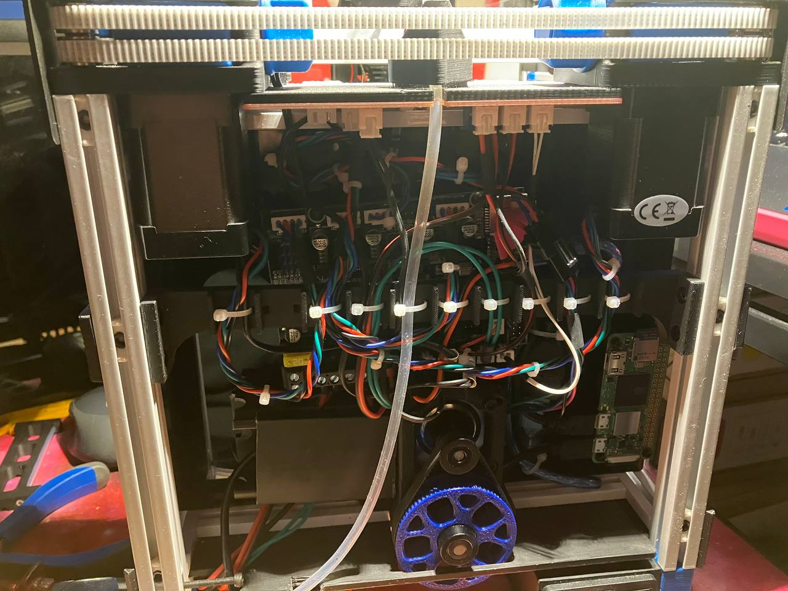

Wirings bar
===========

&nbsp;

The purpose of this mod it's to ease the printer wirings organization in the back panel.

&nbsp;

&nbsp;

&nbsp;

&nbsp;

Usage
=====

Print and install through the extrusion bars over the MCU and RPI boards to use as wirings organizer. You will need 4x m3 nuts and 4x M3x6 screws to install the wiring bar.
Additional m3 nuts can be easily added removing rear feets and power inlet.

&nbsp;

&nbsp;

I suggest you to keep screws a bit loose to allow to slide the wiring bar at your convenience.

&nbsp;

&nbsp;

Two parts version available to be printed with a V0 directly. Print them and super glue them toghether.

&nbsp;

&nbsp;

&nbsp;

Use zip ties up to 3mm wide to secure wires and achieve a neat wiring.

&nbsp;

&nbsp;

&nbsp;

