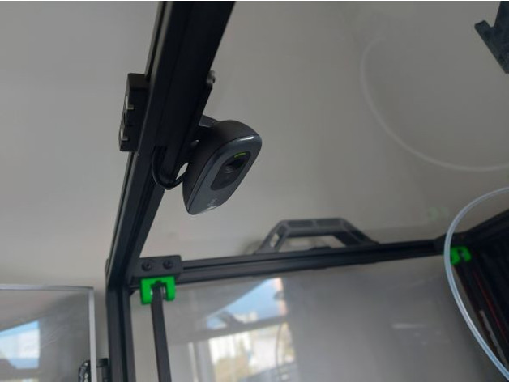
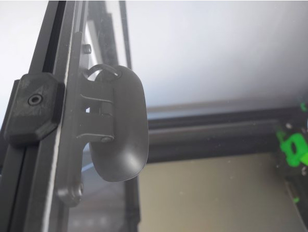
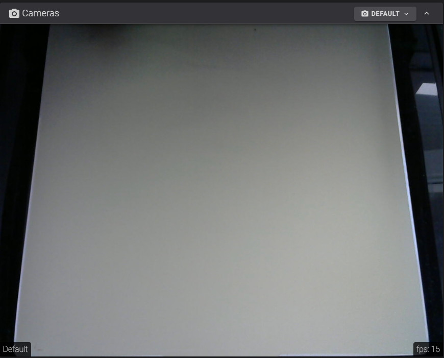

<b>Overview</b>

These part is to mount the Logitech C270 webcam to the top center of the frame.

I use this extrusion profile cover to hide the cable (https://www.thingiverse.com/thing:1478147).

<b>Requirements</b>

1x C270/C310 Webcam

2x M3x8 SHCS

2x M3 T-nut

<b>Screenshots</b>

