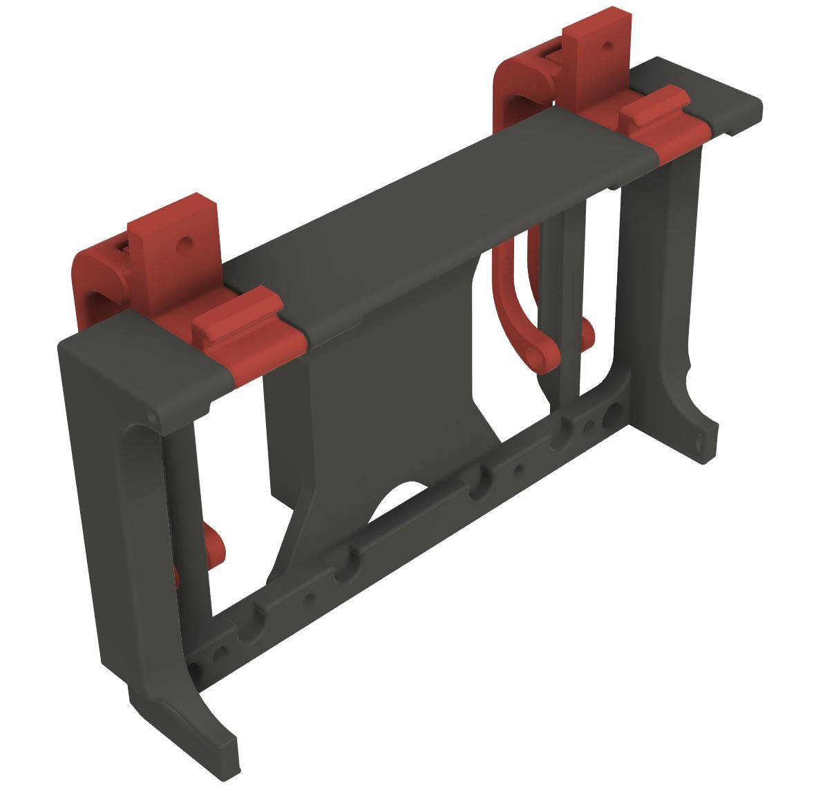
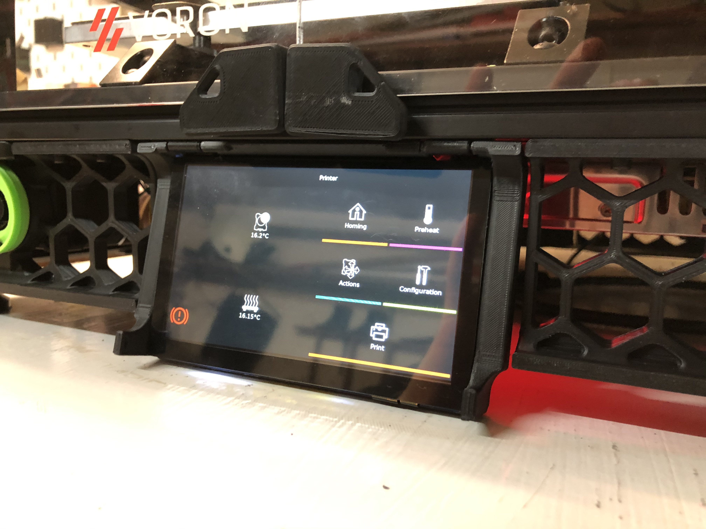
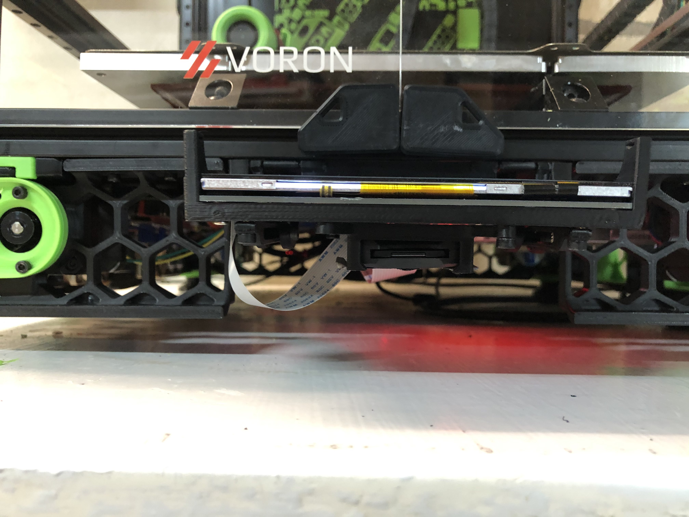
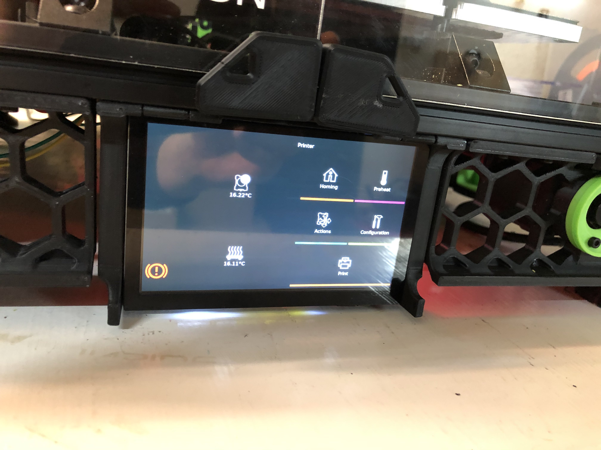

# Voron 2.4 5" display tilting support
**Many thanks to Jo_Thingiverse for having tested this mount.**

### Bill Of Materials
* Screen 5" 800*480 IPS TFT MIPI DSI Multi-Touch Capacitive Touch Panel LCD Module Display Monitor Screen for Raspberry Pi
* optional SD extender or microSD extender
* 2 M3x15
* 6(+4) M3x8
* 6 M3 threaded inserts
* 2 M3 hammered nuts

### Instruction
1. Put one M3 threaded insert in each arm end.
2. Put four M3 threaded insert in the back of the screen case.
3. Install the two slides with M3x8.
4. Use two pieces of filament as hinges.
5. Adjust the tension of the screws that pass through the slides to keep the position.
6. The optional installation of the SD extender requires four self tapping M3x8.

**Since the screen is larger than the original piece you will have to replace your sides skirts. These are included too.**

