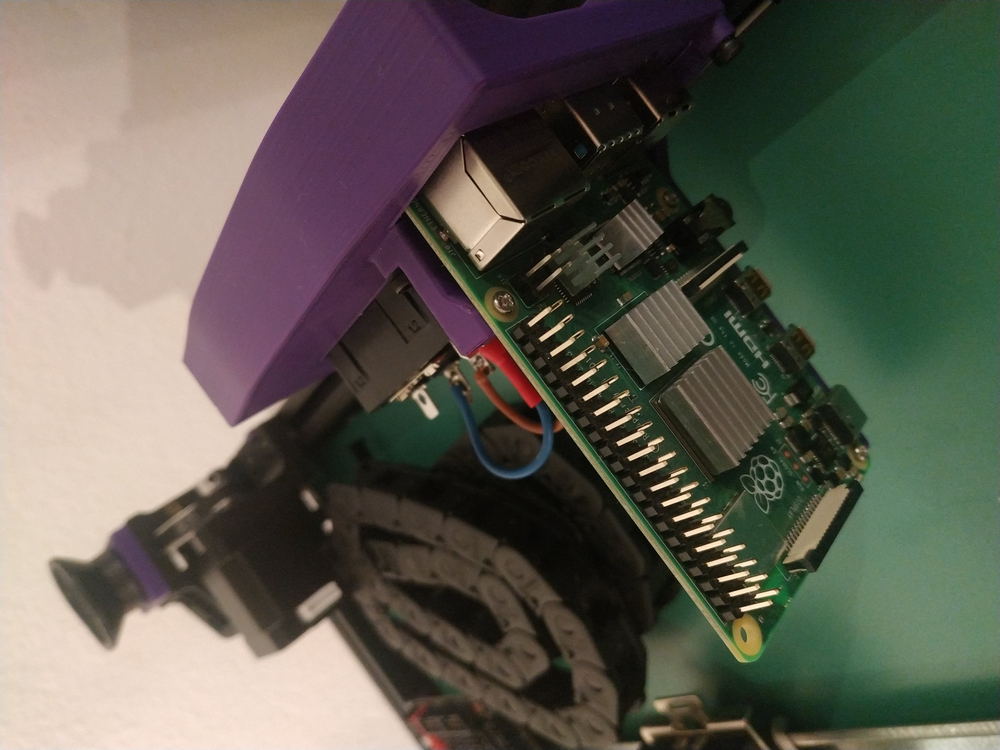
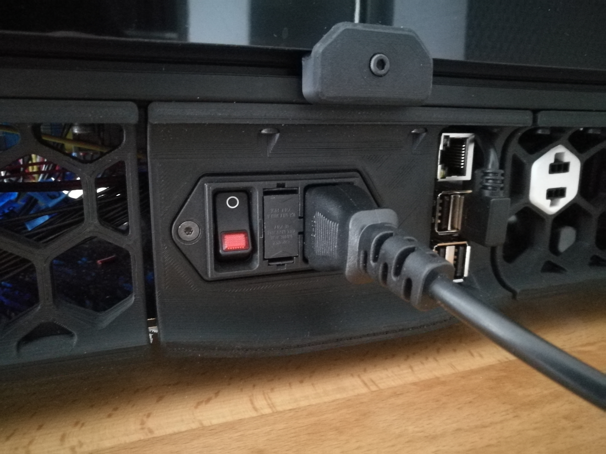
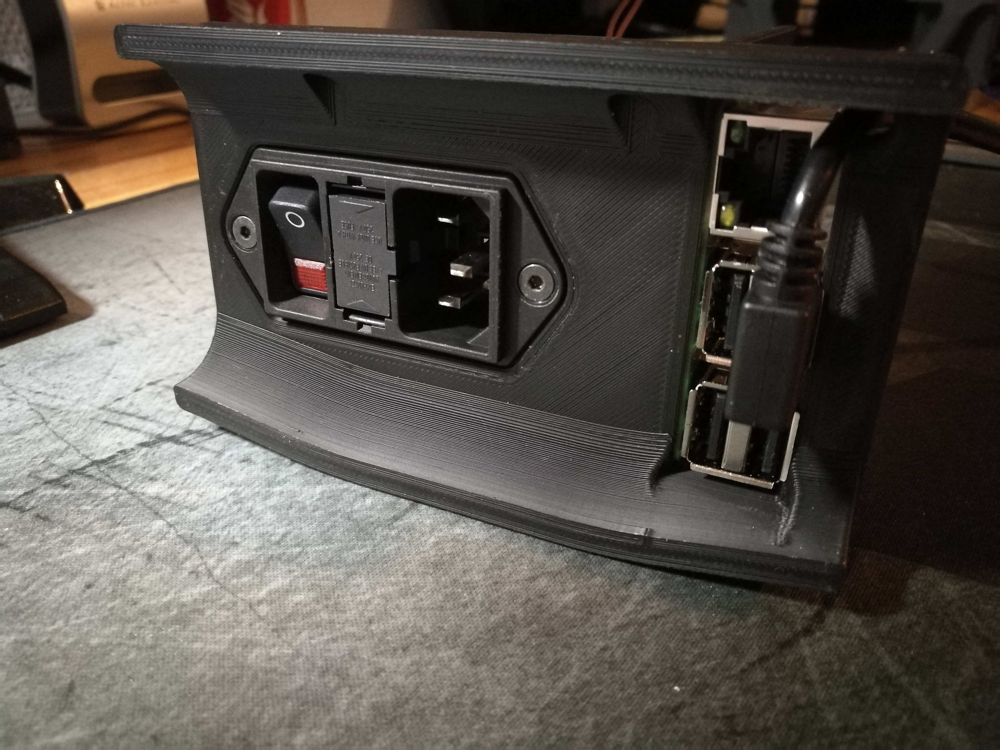

# Voron 2.4 Raspberry vertically installed in plug panel

For the DD11 version I used this reference: SCHURTER DD11.0113.1111
Many other versions of SHURTER DDXX plugs are compatible. Check out sizes on datasheet.

### Instructions
1. Put three M3 threaded inserts in the back of the panel.
2. Install the pi on the bracket with three M2x10 self tapping screws.
3. Pass the USB cable(s) for inner components such as SKR before attaching the bracket to the panel.
 There is a notch on the side of the opening for the raspberry to that purpose.
4. Use three M3x8 to attach the bracket to the raspberry.
The rest of the installation is pretty similar to the original bracket: check the official manual.

