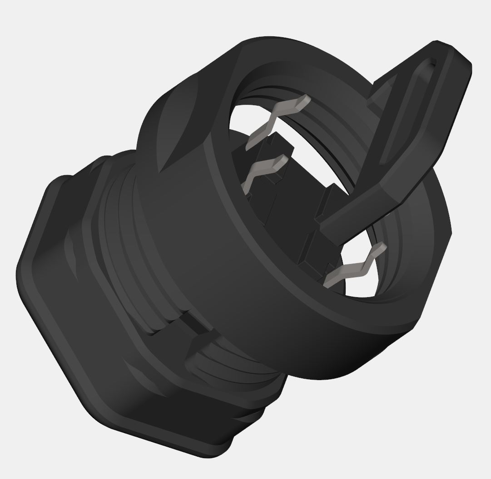
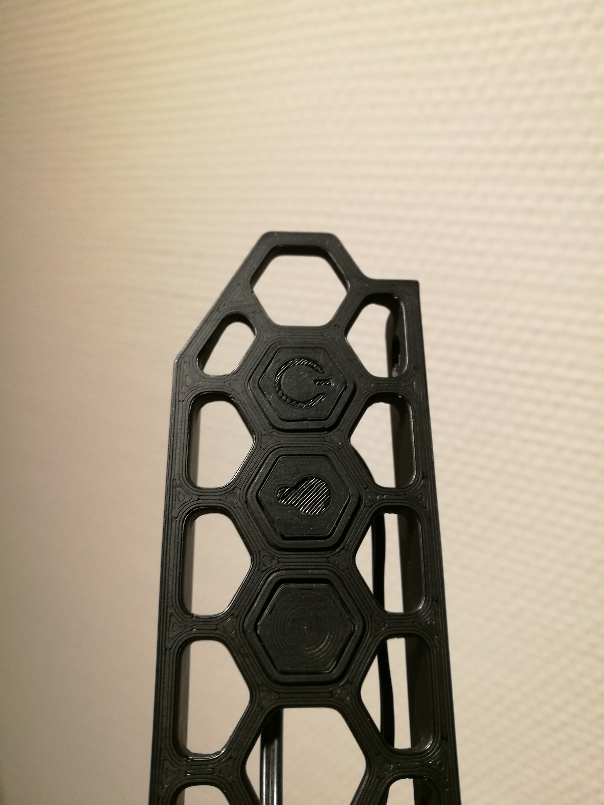
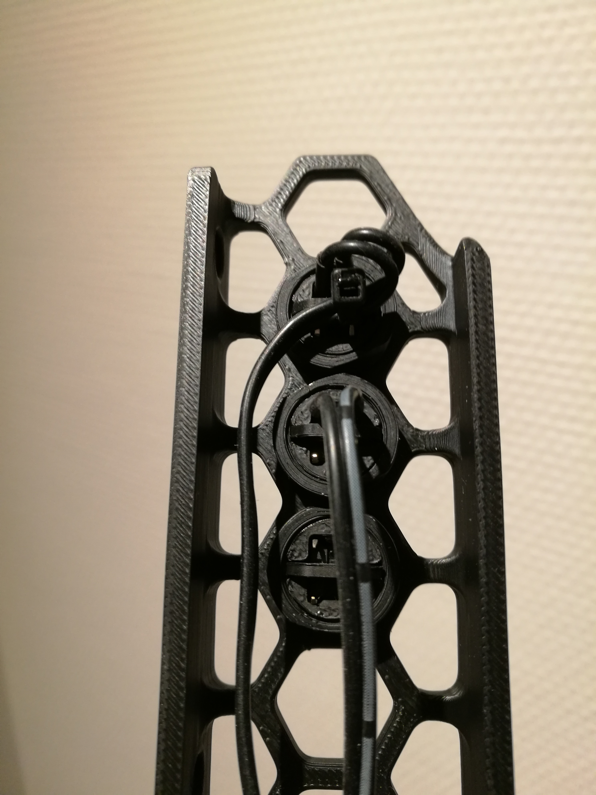

# Voron 0.1 skirt buttons

### Instructions
For each button you will need to print: 1x *Nut.stl*, 1x *Lock.stl*, 1x *Button-\<name\>.stl*
1. Print with a 0.1mm layer_height (after the first layer) to improve the quality of the threads,
2. Solder two wires toward the inside of the legs of a 5mm tactile switch, add some heatshrink,
3. Push the 5mm tactile switch into the button housing and snap the locking piece behind,
4. Install the button throught a hexagonal hole in the skirt and screw the printed nut behind,
5. Optional, use the hole in the locking piece and a ziptie for attaching the cables (strain relief).

