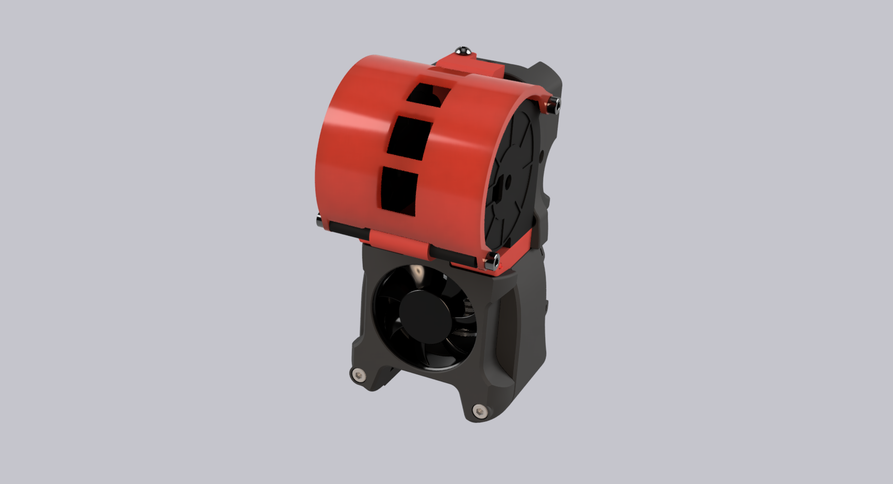
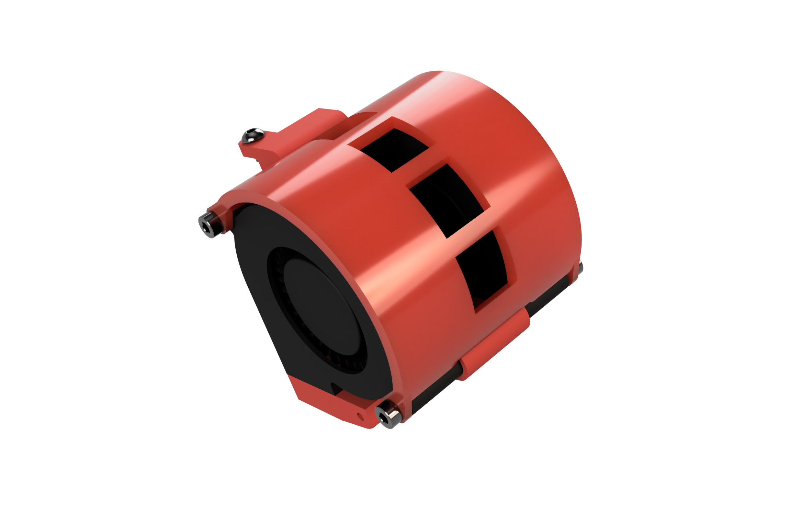
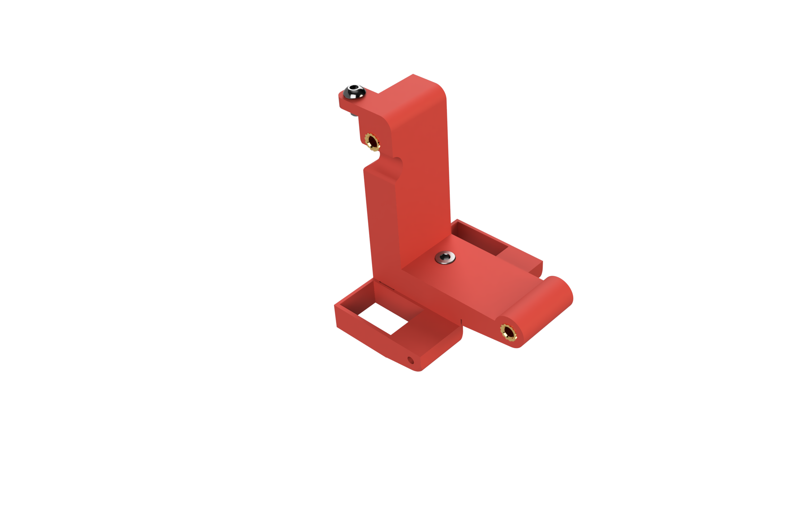
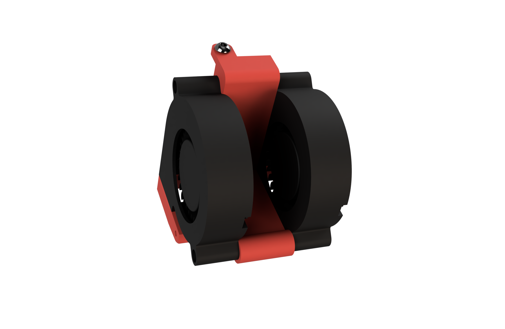
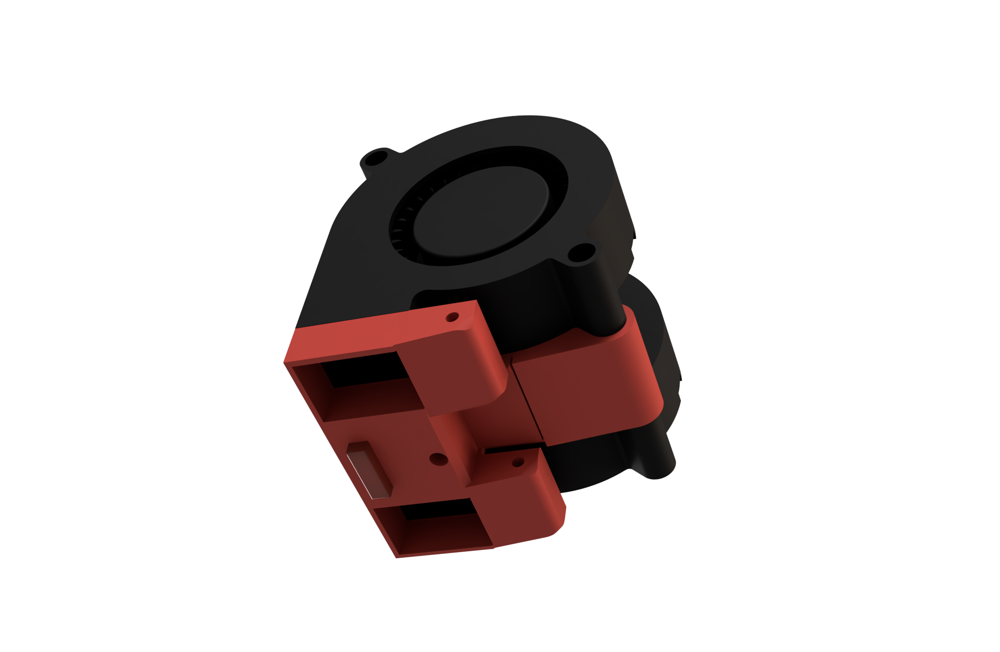
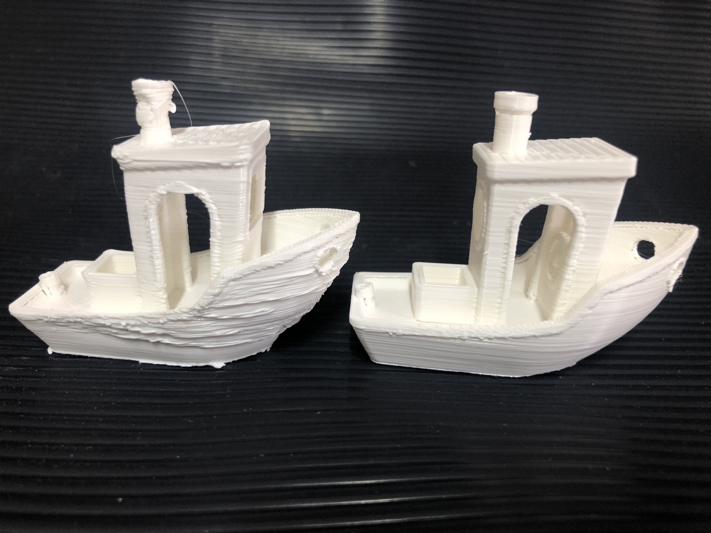
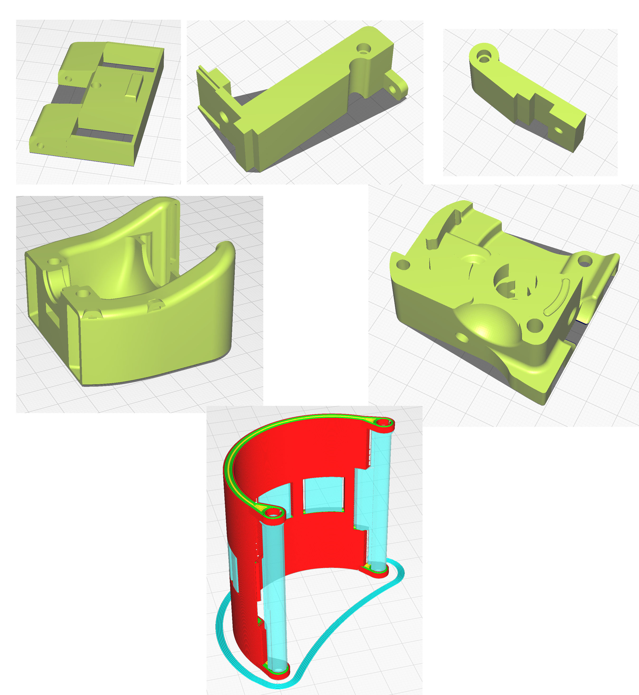

<H1>TORNADO AIR FLOW for AfterBurner</H1> 
  
  
  
  
  
  Using two 5015 fans to get very powerful workpiece cooling air flow and necessary to get quality prints when using PLA material which needs strong air flow to cool immediately.
  
  
  
  
  
  
  
## IMPROVING PLA PRINT QUALITY

First one printed with low air flow, second one using Tornado Air Flow at 100% power
  
## Printing

Tested with recommended settings for Voron parts:Layer 0.2 - ABS, 4 perimeters, 5 tops/bottoms, 40% infill.
Only the Cover (COPERTURA.stl) need supports, print the others without supports.
STL were tested by printing and assembling !!!
  
## Printing Orientation
   

  ## Hardware
  
Qty | Item
:-- | :--
5 | M3 Threaded Insert
4 | M3x20 SHCS
1 | M3x8 SHCS
1 | M3x6 BHCS
2 | 5015 FAN

